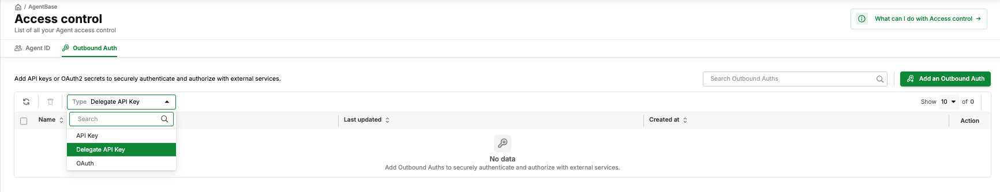

# Access Control

> Access Control is the foundation of AgentBase. It covers two closely related concerns: **Agent Identity** (registering your agent on the platform) and **Auth & Secrets** (storing and injecting credentials your agent needs to call external services).

* **Portal:** https://aiplatform.console.vngcloud.vn/access-control
* **API Base URL:** `https://agentbase.api.vngcloud.vn/identity/api/v1`

***

## Core Concepts

### What Is an Identity?

In AgentBase, an **Identity** is a named, platform-managed record that uniquely represents your agent within the organization. Think of it as the agent's "account" — the foundation on which everything else is built. An identity must exist before a Runtime can be created for that agent, and before any auth credentials can be retrieved.

**An identity has:**

* A **unique name** (scoped to the organization)
* An optional **description** and metadata
* A list of **associated auth configurations** (the credentials this identity can retrieve)

**Identity naming rules:**

* 3–50 characters
* Alphanumeric, underscore `_`, and hyphen `-` only (`^[a-zA-Z0-9_-]+$`)
* Must be unique within the organization

### Identity vs. Runtime

An Identity is persistent and environment-agnostic. A Runtime is tied to a specific container image and compute configuration. Multiple runtimes (for example, `staging` and `production`) can share the same identity.

```
Identity: my-order-agent (persistent)
     │
     ├─── Runtime: my-order-agent-staging  (environment-specific)
     └─── Runtime: my-order-agent-prod     (environment-specific)
```

### Outbound Authentication

When your agent calls external services (OpenAI, Google, Slack, internal APIs), it needs credentials. AgentBase's Auth system lets you store these credentials centrally and have them automatically delivered to your agent at runtime — without hardcoding them.

The auth system supports three credential types:

* **Static API Key** — A fixed string (such as an API key) associated with an identity. Use when the external service issues a long-lived API key and you want centralized management.
* **Delegated API Key** — A credential that is scoped and potentially short-lived, useful for multi-tenant scenarios where different agents should get different scoped keys.
* **OAuth2 Provider** — For services that use OAuth2 (Google, Slack, and others). AgentBase stores the client credentials and refresh token, and handles token refresh automatically.

| Provider Type         | Use Case                                           | Storage                   |
| --------------------- | -------------------------------------------------- | ------------------------- |
| **Static API Key**    | Long-lived keys (OpenAI, AIP, etc.)                | Encrypted at rest         |
| **Delegated API Key** | End-user federated keys                            | Per-user, federated       |
| **OAuth2**            | Third-party services (Google, GitHub, Slack, etc.) | Encrypted, auto-refreshed |

**Security model:** Credentials are stored in HashiCorp Vault.

***

## Agent Identity

### Portal

#### Create an Identity

1. Open https://aiplatform.console.vngcloud.vn/access-control
2. Click **"Create Identity"**
3. Fill in:
   * **Name** (required): e.g., `my-order-agent` — lowercase, alphanumeric and hyphens
   * **Description** (optional): e.g., `Handles order inquiries`
   * **Allowed Return URLs** (optional): OAuth2 callback URLs for this identity
4. Click **Create**
5. The new identity appears in the list with status `ACTIVE`

#### List Identities

1. Open https://aiplatform.console.vngcloud.vn/access-control
2. All identities are shown in a paginated list

#### Get Identity Details

1. Open https://aiplatform.console.vngcloud.vn/access-control
2. Click on the identity name

#### Update an Identity

1. Open https://aiplatform.console.vngcloud.vn/access-control
2. Click on the identity name → **"Edit"**
3. Update description or allowed return URLs → **Save**

#### Delete an Identity

> **Warning:** Deleting an identity is **irreversible**. Stop all associated runtimes and remove all auth configurations before deleting.

1. Open https://aiplatform.console.vngcloud.vn/access-control
2. Find the identity → **Delete** → confirm

***

### RESTful API

> **Prerequisite:** All API examples below use `$TOKEN` — an IAM bearer token. See [Configure Authentication](../getting-started.md#configure-authentication) for how to obtain it.

#### Create an Identity

```bash
curl -s -X POST "https://agentbase.api.vngcloud.vn/identity/api/v1/agent-identities" \
  -H "Authorization: Bearer $TOKEN" \
  -H "Content-Type: application/json" \
  -d '{
    "name": "my-order-agent",
    "description": "Handles order inquiries via Salesforce",
    "allowedReturnUrls": []
  }' | jq .
```

**Example response:**

```json
{
  "id": "a1b2c3d4-e5f6-7890-abcd-ef1234567890",
  "name": "my-order-agent",
  "description": "Handles order inquiries via Salesforce",
  "allowedReturnUrls": [],
  "createdAt": "2026-03-18T09:00:00Z",
  "updatedAt": "2026-03-18T09:00:00Z"
}
```

**Error: 409 Conflict** — name already exists. Choose a different name or use the existing identity.

#### List Identities

```bash
curl -s "https://agentbase.api.vngcloud.vn/identity/api/v1/agent-identities?page=0&size=20" \
  -H "Authorization: Bearer $TOKEN" | jq .
```

**Response shape:**

```json
{
  "content": [...],
  "totalElements": 3,
  "totalPages": 1,
  "size": 20,
  "number": 0
}
```

#### Get Identity Details

```bash
curl -s "https://agentbase.api.vngcloud.vn/identity/api/v1/agent-identities/my-order-agent" \
  -H "Authorization: Bearer $TOKEN" | jq .
```

#### Update an Identity

You can update the description and allowed return URLs. The **name and ID are immutable**.

```bash
curl -s -X PUT "https://agentbase.api.vngcloud.vn/identity/api/v1/agent-identities/my-order-agent" \
  -H "Authorization: Bearer $TOKEN" \
  -H "Content-Type: application/json" \
  -d '{
    "description": "Handles order + returns inquiries via Salesforce",
    "allowedReturnUrls": ["https://myapp.com/callback"]
  }' | jq .
```

#### Delete an Identity

> **Warning:** Deleting an identity is **irreversible**.

```bash
curl -s -X DELETE "https://agentbase.api.vngcloud.vn/identity/api/v1/agent-identities/my-order-agent" \
  -H "Authorization: Bearer $TOKEN"
```

***

### SDK

#### Create an Identity

```python
from greennode_agentbase import IdentityClient, IAMCredentials
from greennode_agentbase.identity import CreateAgentIdentityRequest
import asyncio

client = IdentityClient(iam_credentials=IAMCredentials())

identity = asyncio.run(client.create_agent_identity_async(
    request=CreateAgentIdentityRequest(
        name="my-order-agent",
        description="Handles order inquiries via Salesforce",
        allowed_return_urls=[],
    )
))
print(f"Name: {identity.name}, ID: {identity.id}")
```

> **Note:** `IAMCredentials()` with no args auto-loads from `GREENNODE_CLIENT_ID` / `GREENNODE_CLIENT_SECRET` environment variables or `.greennode.json`.

#### List Identities

```python
result = asyncio.run(client.list_agent_identities_async(page=0, size=20))
for identity in result.content:
    print(f"{identity.name} (id: {identity.id})")
print(f"Total: {result.total_elements}")
```

#### Get Identity Details

```python
identity = asyncio.run(client.get_agent_identity_async(name="my-order-agent"))
print(f"Name: {identity.name}, ID: {identity.id}")
```

#### Update an Identity

```python
from greennode_agentbase.identity import UpdateAgentIdentityRequest

identity = asyncio.run(client.update_agent_identity_async(
    name="my-order-agent",
    request=UpdateAgentIdentityRequest(
        description="Handles order + returns inquiries via Salesforce",
        allowed_return_urls=["https://myapp.com/callback"],
    )
))
```

#### Delete an Identity

```python
asyncio.run(client.delete_agent_identity_async(name="my-order-agent"))
```

***

## Auth & Secrets

An **agent identity** must exist before creating auth providers. If you haven't created one yet, see [Agent Identity](./#agent-identity) above.

### Portal

#### Static API Key Provider

1. Open https://aiplatform.console.vngcloud.vn/access-control → **"Auth Providers"**
2. Click **"Create Provider"** → select **"Static API Key"**
3. Fill in **Name** (e.g., `openai-key`) and **API Key value**
4. Click **Create**

#### Delegated API Key Provider

1. Open https://aiplatform.console.vngcloud.vn/access-control → **Auth Providers**
2. Click **"Create Provider"** → select **"Delegated API Key"**
3. Enter a **Name** (e.g., `user-openai-key`) → **Create**

#### OAuth2 Provider

1. Open https://aiplatform.console.vngcloud.vn/access-control → **Auth Providers**
2. Click **"Create Provider"** → select **"OAuth2"**
3. Fill in: **Name**, **Client ID**, **Client Secret**, **Authorization URL**, **Token URL**
4. Click **Create** — the response includes a **Callback URL** to register in your OAuth2 app



***

### RESTful API

#### Static API Key Provider

**Create:**

```bash
curl -s -X POST "https://agentbase.api.vngcloud.vn/identity/api/v1/outbound-auth/api-key-providers" \
  -H "Authorization: Bearer $TOKEN" \
  -H "Content-Type: application/json" \
  -d '{
    "name": "openai-key",
    "apikey": "sk-proj-xxxxxxxxxxxxxxxxxxxx"
  }' | jq .
```

**List:**

```bash
curl -s "https://agentbase.api.vngcloud.vn/identity/api/v1/outbound-auth/api-key-providers?page=0&size=20" \
  -H "Authorization: Bearer $TOKEN" | jq .
```

**Get:**

```bash
curl -s "https://agentbase.api.vngcloud.vn/identity/api/v1/outbound-auth/api-key-providers/openai-key" \
  -H "Authorization: Bearer $TOKEN" | jq .
```

**Update (key rotation):**

```bash
curl -s -X PUT "https://agentbase.api.vngcloud.vn/identity/api/v1/outbound-auth/api-key-providers/openai-key" \
  -H "Authorization: Bearer $TOKEN" \
  -H "Content-Type: application/json" \
  -d '{"apikey": "sk-proj-new-key-value"}' | jq .
```

**Delete:**

```bash
curl -s -X DELETE "https://agentbase.api.vngcloud.vn/identity/api/v1/outbound-auth/api-key-providers/openai-key" \
  -H "Authorization: Bearer $TOKEN"
```

> **Warning:** Deleting a provider immediately revokes access for all running agents using it.

#### Delegated API Key Provider

**Create:**

```bash
curl -s -X POST "https://agentbase.api.vngcloud.vn/identity/api/v1/outbound-auth/delegated-api-key-providers" \
  -H "Authorization: Bearer $TOKEN" \
  -H "Content-Type: application/json" \
  -d '{"name": "user-openai-key"}' | jq .
```

**List:**

```bash
curl -s "https://agentbase.api.vngcloud.vn/identity/api/v1/outbound-auth/delegated-api-key-providers?page=0&size=20" \
  -H "Authorization: Bearer $TOKEN" | jq .
```

**Get:**

```bash
curl -s "https://agentbase.api.vngcloud.vn/identity/api/v1/outbound-auth/delegated-api-key-providers/user-openai-key" \
  -H "Authorization: Bearer $TOKEN" | jq .
```

**Delete:**

```bash
curl -s -X DELETE "https://agentbase.api.vngcloud.vn/identity/api/v1/outbound-auth/delegated-api-key-providers/user-openai-key" \
  -H "Authorization: Bearer $TOKEN"
```

#### OAuth2 Provider

**Create:**

```bash
curl -s -X POST "https://agentbase.api.vngcloud.vn/identity/api/v1/outbound-auth/oauth2-providers" \
  -H "Authorization: Bearer $TOKEN" \
  -H "Content-Type: application/json" \
  -d '{
    "name": "google-oauth",
    "clientId": "812345678901-abcdefg.apps.googleusercontent.com",
    "clientSecret": "GOCSPX-xxxxxxxxxxxx",
    "authorizationUrl": "https://accounts.google.com/o/oauth2/v2/auth",
    "tokenUrl": "https://oauth2.googleapis.com/token"
  }' | jq .
```

**Response includes `callbackUrl` — register this in your OAuth2 app.**

**List:**

```bash
curl -s "https://agentbase.api.vngcloud.vn/identity/api/v1/outbound-auth/oauth2-providers?page=0&size=20" \
  -H "Authorization: Bearer $TOKEN" | jq .
```

**Get:**

```bash
curl -s "https://agentbase.api.vngcloud.vn/identity/api/v1/outbound-auth/oauth2-providers/google-oauth" \
  -H "Authorization: Bearer $TOKEN" | jq .
```

**Update:**

```bash
curl -s -X PUT "https://agentbase.api.vngcloud.vn/identity/api/v1/outbound-auth/oauth2-providers/google-oauth" \
  -H "Authorization: Bearer $TOKEN" \
  -H "Content-Type: application/json" \
  -d '{
    "clientId": "new-client-id.apps.googleusercontent.com",
    "clientSecret": "GOCSPX-new-secret",
    "authorizationUrl": "https://accounts.google.com/o/oauth2/v2/auth",
    "tokenUrl": "https://oauth2.googleapis.com/token"
  }' | jq .
```

**Delete:**

```bash
curl -s -X DELETE "https://agentbase.api.vngcloud.vn/identity/api/v1/outbound-auth/oauth2-providers/google-oauth" \
  -H "Authorization: Bearer $TOKEN"
```

**Get OAuth2 Token (M2M):**

```bash
curl -s -X POST "https://agentbase.api.vngcloud.vn/identity/api/v1/outbound-auth/oauth2-providers/google-oauth/agent-identities/my-order-agent/tokens/m2m" \
  -H "Authorization: Bearer $TOKEN" \
  -H "Content-Type: application/json" \
  -d '{}' | jq .
```

***

### SDK

#### Static API Key Provider

```python
from greennode_agentbase.identity import CreateApikeyProviderRequest

provider = asyncio.run(client.create_api_key_provider_async(
    request=CreateApikeyProviderRequest(
        name="openai-key",
        apikey="sk-proj-xxxxxxxxxxxxxxxxxxxx"
    )
))
print(f"Created: {provider.name} (status: {provider.status})")
```

#### Delegated API Key Provider

```python
from greennode_agentbase.identity import CreateDelegatedApiKeyProviderRequest

provider = asyncio.run(client.create_delegated_api_key_provider_async(
    request=CreateDelegatedApiKeyProviderRequest(name="user-openai-key")
))
```

#### OAuth2 Provider

**Create:**

```python
from greennode_agentbase.identity import CreateOauth2ProviderRequest

provider = asyncio.run(client.create_oauth2_provider_async(
    request=CreateOauth2ProviderRequest(
        name="google-oauth",
        client_id="812345678901-abcdefg.apps.googleusercontent.com",
        client_secret="GOCSPX-xxxxxxxxxxxx",
        authorization_url="https://accounts.google.com/o/oauth2/v2/auth",
        token_url="https://oauth2.googleapis.com/token",
    )
))
print(f"Callback URL: {provider.callback_url}")
```

**Get OAuth2 Token (M2M):**

```python
from greennode_agentbase.identity import GetM2mTokenRequest

result = asyncio.run(client.get_m2m_token_async(
    provider_name="google-oauth",
    agent_identity_name="my-order-agent",
    request=GetM2mTokenRequest()
))
print(f"Access Token: {result.access_token}")
```

#### Retrieve Credentials at Runtime

When your agent is deployed on AgentBase Runtime, the runtime automatically injects `GREENNODE_CLIENT_ID`, `GREENNODE_CLIENT_SECRET`, and `GREENNODE_AGENT_IDENTITY` as environment variables. The SDK uses these automatically.

**Inject static API key:**

```python
from greennode_agentbase import (
    GreenNodeAgentBaseApp, RequestContext, PingStatus,
    requires_api_key, requires_access_token,
)

app = GreenNodeAgentBaseApp()

@app.ping
def health() -> PingStatus:
    return PingStatus.HEALTHY

@app.entrypoint
@requires_api_key(provider_name="openai-key")
def handler(payload: dict, context: RequestContext, openai_key: str) -> dict:
    from openai import OpenAI
    client = OpenAI(api_key=openai_key)
    response = client.chat.completions.create(
        model="gpt-4o",
        messages=[{"role": "user", "content": payload.get("input", "")}]
    )
    return {"output": response.choices[0].message.content}
```

**Inject OAuth2 access token:**

```python
@app.entrypoint
@requires_access_token(provider_name="google-oauth")
def handler(payload: dict, context: RequestContext, google_token: str) -> dict:
    import httpx
    resp = httpx.get(
        "https://www.googleapis.com/calendar/v3/calendars/primary/events",
        headers={"Authorization": f"Bearer {google_token}"},
    )
    return {"events": resp.json().get("items", [])}
```

***

## Response Models

**AgentIdentityResponse** fields:

| Field                 | Type          | Description                              |
| --------------------- | ------------- | ---------------------------------------- |
| `id`                  | string        | Unique UUID identifier                   |
| `name`                | string        | Identity name (immutable after creation) |
| `description`         | string        | Optional description                     |
| `allowed_return_urls` | list\[string] | OAuth2 callback URLs                     |
| `created_at`          | datetime      | Creation timestamp                       |
| `updated_at`          | datetime      | Last update timestamp                    |

***

## Troubleshooting

| Error                           | Cause                                    | Fix                                                             |
| ------------------------------- | ---------------------------------------- | --------------------------------------------------------------- |
| 401 Unauthorized                | Expired or invalid IAM token             | Re-obtain token with valid credentials                          |
| 403 Forbidden                   | Service account lacks permissions        | Attach `AgentBaseFullAccess` at https://iam.console.vngcloud.vn |
| 409 Conflict                    | Identity or provider name already exists | Choose a different name                                         |
| Name validation error           | Name doesn't match `^[a-zA-Z0-9_-]+$`    | Use only alphanumeric, underscore, and hyphen. 3–50 chars       |
| 404 Not Found                   | Provider name does not exist             | Verify with a `list` operation                                  |
| Agent can't retrieve credential | Identity name missing                    | Ensure `GREENNODE_AGENT_IDENTITY` env var is set in the runtime |

***
