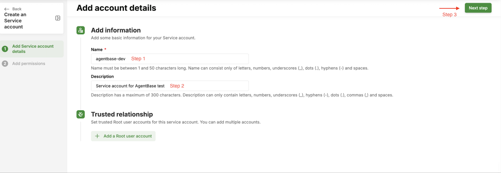

# Getting Started

> Complete these prerequisites before using any AgentBase service. Once done, follow the reading path to start building.

***

## Prerequisites

### Create a GreenNode Account

1. Navigate to https://console.vngcloud.vn and sign up or log in.
2. Complete account verification.
3. Create or join an **Organization**. All AgentBase resources are scoped to an organization.

> **Note:** If your company already has a GreenNode organization, ask your administrator to invite you before creating a separate account.

### Install Required Tools

#### Python SDK

```bash
pip install greennode-agentbase
```

For LangGraph and LangChain integration:

```bash
pip install "greennode-agent-bridge[langgraph]"
```

#### curl and jq (for RESTful API examples)

```bash
# macOS
brew install jq

# Ubuntu / Debian
apt-get install -y curl jq

# Windows — use WSL or Git Bash with jq from https://jqlang.github.io/jq/
```

### Set Up an IAM Service Account

All AgentBase API calls (Portal, RESTful API, and SDK) require a GreenNode IAM bearer token obtained from a Service Account. Follow these steps once to create your service account.

#### Portal (GUI)

**Step 1 — Navigate to IAM Service Accounts**

1. Open: https://iam.console.vngcloud.vn/service-accounts
2. If prompted, log in with your GreenNode account.

**Step 2 — Create a New Service Account**

1. Click **"Create a Service Account"**.
2. Fill in:
   * **Name**: e.g., `agentbase-dev`
   * **Description**: e.g., `Service account for AgentBase test`
3. Click **"Next Step"**.



**Step 3 — Attach Policies**

1. On the Permissions tab, click **"Attach Policies"**.
2. Search for and attach each of these policies:
   * `AgentBaseFullAccess` — access to Identity, Runtime, and Memory services
   * `vcrFullAccess` — access to the Container Registry (for image push/pull)
   * `AiPlatformFullAccess` — access to LLM models and API keys
3. Click **"Create Service Account"**.

**Step 4 — Copy the Client Secret (one-time only)**

> **Warning:** The Client Secret is shown **only once** at creation time. Copy and save it immediately — it cannot be retrieved later. If lost, you must reset it (which invalidates the old one).

1. A popup appears with your credentials. Copy the **Client Secret** and save it securely.
2. Click **"Back to list"**.
3. Find your new service account, click it, go to **"Security credentials"** tab.
4. Copy the **Client ID**.

### Configure Authentication

Now that you have a **Client ID** and **Client Secret**, configure them so that all API calls and SDK operations can authenticate automatically.

#### Option A — Environment Variables

```bash
export GREENNODE_CLIENT_ID="your-client-id"
export GREENNODE_CLIENT_SECRET="your-client-secret"
```

#### Option B — Config File

Create a `.greennode.json` file in your project root:

```json
{
  "client_id": "your-client-id",
  "client_secret": "your-client-secret"
}
```

> **Warning:** Do not commit `.greennode.json` to version control. Add it to `.gitignore`.

#### Get an IAM Token (`$TOKEN`)

All RESTful API examples in this guide use `$TOKEN`. Obtain it with:

```bash
TOKEN=$(curl -s -X POST "https://iam.api.vngcloud.vn/accounts-api/v2/auth/token" \
  -u "$GREENNODE_CLIENT_ID:$GREENNODE_CLIENT_SECRET" \
  -d "grant_type=client_credentials" \
  -H "Content-Type: application/x-www-form-urlencoded" | jq -r '.access_token')
```

Then use it in API calls:

```bash
curl -s -X GET "https://agentbase.api.vngcloud.vn/..." \
  -H "Authorization: Bearer $TOKEN"
```

**Token expiry:** Tokens are short-lived. If you receive a `401 Unauthorized` response, re-run the command above to obtain a fresh token.

> **Note (SDK users):** The Python SDK handles token management automatically — just ensure your credentials are configured via environment variables or `.greennode.json`. No manual token fetching needed.

***

## What's Next?

Once prerequisites are complete, follow the chapters in order for your first deployment, or jump to a specific topic:

| I want to...                           | Go to                                                                                     |
| -------------------------------------- | ----------------------------------------------------------------------------------------- |
| Register my agent on the platform      | [Access Control](access-control/#agent-identity)                                          |
| Store API keys for external services   | [Access Control — Auth & Secrets](access-control/#auth--secrets)                          |
| Push a Docker image                    | [Supporting Services — Container Registry](supporting-services.md#container-registry-vcr) |
| Deploy and run my agent                | [Runtime](runtime/)                                                                       |
| Add conversation memory                | [Memory](memory/)                                                                         |
| Monitor and debug                      | [Insight](insight/)                                                                       |
| Get an LLM API key (OpenAI-compatible) | [Supporting Services — AI Platform](supporting-services.md#ai-platform-aip--llm-access)   |
| Use the Python SDK                     | [Supporting Services — SDK & Integration](supporting-services.md#sdk--integration)        |

> **First time?** Start with [Access Control](access-control/) → [Supporting Services (vCR)](supporting-services.md#container-registry-vcr) → [Runtime](runtime/) to go from zero to a running agent.

***

## Charging & Fees

> Billing details will be updated in a future revision.

***
