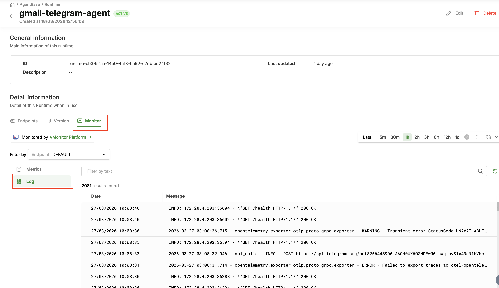
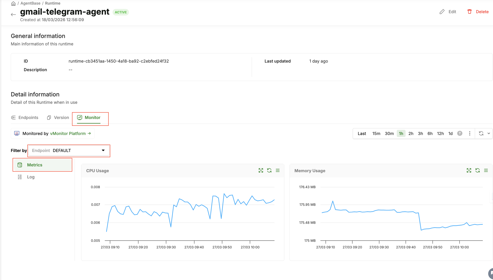

# Insight

> Monitor and debug your deployed agents using runtime logs, endpoint logs, and resource metrics (CPU/RAM). All Insight operations use the Runtime API.

---


## Overview

AgentBase Insight provides three read-only data sources:

| Data Source             | Description                               | API                                                         |
| ----------------------- | ----------------------------------------- | ----------------------------------------------------------- |
| **Runtime Logs**  | Container stdout/stderr from all replicas | `POST /agent-runtimes/{id}/logs`                          |
| **Endpoint Logs** | Logs scoped to a specific endpoint        | `POST /agent-runtimes/{id}/endpoints/{endpointId}/logs`   |
| **Metrics**       | Point-in-time CPU and RAM usage           | `GET /agent-runtimes/{id}/endpoints/{endpointId}/metrics` |

---

## Prerequisites

You need the runtime ID and (for endpoint logs/metrics) the endpoint ID.

```bash
TOKEN=$(bash .claude/skills/agentbase/scripts/get_token.sh)

# List runtimes to get IDs
curl -s "https://agentbase.api.vngcloud.vn/runtime/agent-runtimes?page=1&size=20" \
  -H "Authorization: Bearer $TOKEN" | jq '.listData[] | {id, name, status}'

# Get endpoints for a runtime
curl -s "https://agentbase.api.vngcloud.vn/runtime/agent-runtimes/$RUNTIME_ID/endpoints?page=1&size=10" \
  -H "Authorization: Bearer $TOKEN" | jq '.listData[] | {id, name, url, status}'
```

---

## Runtime Logs

Fetch container logs from all replicas of a runtime. Uses offset-based pagination (`from`/`limit`).

### Portal (GUI)

1. Open https://aiplatform.console.vngcloud.vn/runtime
2. Open the runtime detail page → **"Monitor"** tab → click an endpoint → **"Log"** section



---

### RESTful API

> **Prerequisite:** All API examples below use `$TOKEN` — an IAM bearer token. See [Configure Authentication](../getting-started.md#configure-authentication) for how to obtain it.

```bash
RUNTIME_ID="<your-runtime-id>"

# Fetch first 100 log lines
curl -s -X POST "https://agentbase.api.vngcloud.vn/runtime/agent-runtimes/$RUNTIME_ID/logs" \
  -H "Authorization: Bearer $TOKEN" \
  -H "Content-Type: application/json" \
  -d '{"from": 0, "limit": 100}' | jq .
```

**Response:**

```json
{
  "totalCount": 342,
  "logs": [
    "2026-03-18T09:01:00Z INFO  Starting agent on port 8080",
    "2026-03-18T09:01:02Z INFO  Health check passed",
    "2026-03-18T09:05:33Z INFO  Received request"
  ]
}
```

**Paginate with `from`:**

```bash
curl -s -X POST "https://agentbase.api.vngcloud.vn/runtime/agent-runtimes/$RUNTIME_ID/logs" \
  -H "Authorization: Bearer $TOKEN" \
  -H "Content-Type: application/json" \
  -d '{"from": 100, "limit": 100}' | jq .
```

**Fetch all logs:**

```bash
OFFSET=0; LIMIT=500
while true; do
  RESULT=$(curl -s -X POST "https://agentbase.api.vngcloud.vn/runtime/agent-runtimes/$RUNTIME_ID/logs" \
    -H "Authorization: Bearer $TOKEN" -H "Content-Type: application/json" \
    -d "{\"from\": $OFFSET, \"limit\": $LIMIT}")
  TOTAL=$(echo "$RESULT" | jq '.totalCount')
  echo "$RESULT" | jq -r '.logs[]'
  OFFSET=$((OFFSET + LIMIT))
  [ "$OFFSET" -ge "$TOTAL" ] && break
done
```

**Filter errors locally:**

```bash
curl -s -X POST "https://agentbase.api.vngcloud.vn/runtime/agent-runtimes/$RUNTIME_ID/logs" \
  -H "Authorization: Bearer $TOKEN" -H "Content-Type: application/json" \
  -d '{"from": 0, "limit": 1000}' | jq -r '.logs[]' | grep -i "error\|traceback\|exception\|failed"
```

**Limits:** `from` max = 5000, `limit` max = 1000

---

## Resource Metrics (CPU / RAM)

Get point-in-time CPU and RAM usage for a specific endpoint.

### Portal (GUI)

Open the runtime detail page → **"Monitor"** tab → click an endpoint → **"Metrics"** section



---

### RESTful API

```bash
curl -s "https://agentbase.api.vngcloud.vn/runtime/agent-runtimes/$RUNTIME_ID/endpoints/$ENDPOINT_ID/metrics" \
  -H "Authorization: Bearer $TOKEN" | jq .
```

**Response fields:** `cpuCores` (double), `memoryBytes` (int64)

```json
{
  "cpuCores": 0.42,
  "memoryBytes": 536870912
}
```

**Convert to human-readable:**

```bash
curl -s "https://agentbase.api.vngcloud.vn/runtime/agent-runtimes/$RUNTIME_ID/endpoints/$ENDPOINT_ID/metrics" \
  -H "Authorization: Bearer $TOKEN" | jq '{
    cpu_cores: .cpuCores,
    memory_mb: (.memoryBytes / 1048576 | floor),
    memory_gb: (.memoryBytes / 1073741824 | . * 100 | floor / 100)
  }'
```

---

### Pseudo-Tailing (Poll Pattern)

Log streaming is not supported — use polling to approximate tailing:

```bash
OFFSET=0
while true; do
  RESULT=$(curl -s -X POST "https://agentbase.api.vngcloud.vn/runtime/agent-runtimes/$RUNTIME_ID/logs" \
    -H "Authorization: Bearer $TOKEN" -H "Content-Type: application/json" \
    -d "{\"from\": $OFFSET, \"limit\": 50}")
  COUNT=$(echo "$RESULT" | jq '.totalCount')
  echo "$RESULT" | jq -r '.logs[]'
  OFFSET=$COUNT
  sleep 5
done
```

> **Caution:** Frequent polling generates many API calls. Avoid polling for extended periods.

---

## Log Analysis Guide

### Common Error Signatures

| Pattern                                          | Meaning                       | Next Step                                     |
| ------------------------------------------------ | ----------------------------- | --------------------------------------------- |
| `Traceback (most recent call last)`            | Python exception              | Read the last line for the actual error       |
| `ModuleNotFoundError: No module named '...'`   | Missing dependency            | Add to `requirements.txt` and rebuild image |
| `ImportError: cannot import name '...'`        | Wrong package version         | Check package version compatibility           |
| `ConnectionRefusedError` / `ConnectionError` | Cannot reach external service | Verify service URL and auth credentials       |
| `401 Unauthorized` / `403 Forbidden`         | Auth failure                  | Check IAM token and outbound auth config      |
| `OSError: [Errno 98] Address already in use`   | Port 8080 conflict            | Ensure only one process binds port 8080       |
| `MemoryError` / `Killed`                     | Out of memory                 | Upgrade flavor or optimize memory usage       |
| `TimeoutError` / `ReadTimeout`               | External API timed out        | Increase timeout, check LLM endpoint health   |
| `Health check failed`                          | `/health` not returning 200 | Fix health endpoint                           |

---

### Correlating Logs with Metrics

| CPU       | RAM    | Diagnosis                                                                    |
| --------- | ------ | ---------------------------------------------------------------------------- |
| High      | Normal | CPU-bound workload — scale up or optimize                                   |
| Normal    | High   | Memory leak or large data structures — scale up or fix leak                 |
| Both high | —     | Resource exhaustion — scale up flavor                                       |
| Both low  | —     | External bottleneck (LLM API latency, network) — add request timing in logs |

---

## What's Supported

- **Log time range filter** — Filter logs by a specific time window (start/end timestamp), so you can narrow down exactly when an issue occurred without fetching the entire log history.
- **Log keyword search** — Search logs by keyword or phrase directly in the query, returning only matching entries without needing to grep locally after fetching.
- **Historical metrics** — Query CPU and RAM usage over a time range, not just the current point-in-time snapshot. Useful for spotting resource trends, spikes, and patterns leading up to an incident.

---

## Troubleshooting

| Error                | Cause                        | Fix                                               |
| -------------------- | ---------------------------- | ------------------------------------------------- |
| 401 Unauthorized     | Expired IAM token            | Re-obtain token                                   |
| 404 Not Found        | Wrong runtime or endpoint ID | Verify IDs with list operations                   |
| Empty logs           | Container never started      | Check runtime status; verify image pull succeeded |
| Logs cut off at 5000 | Max offset limit reached     | Logs older than 5000 entries are not accessible   |

---

