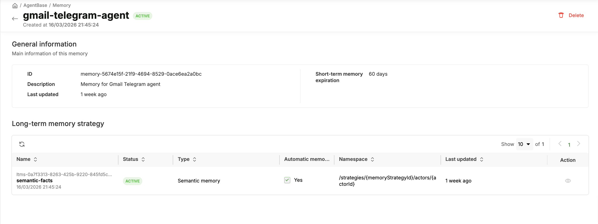
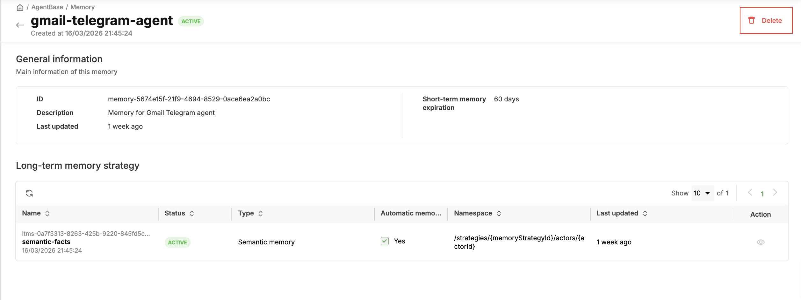

# Memory

> The Memory service gives agents the ability to remember — across turns in a conversation (short-term via events) and across sessions and time (long-term via memory records with semantic search).

---


## Core Concepts

LLMs are stateless by nature — each API call is independent. For an agent to maintain context across a conversation or across sessions, it needs an external memory store. AgentBase's Memory module provides this as a managed service with two memory layers:

### Short-Term Memory (Conversation History)

Short-term memory stores the **ordered sequence of messages** in a conversation session. It is scoped to a session identifier.

```
Session 1: user 1
─────────────────────────────────────────────────────────
Role        Content
human       "What's the weather like in Hanoi today?"
assistant   "Currently 28°C, partly cloudy in Hanoi."
human       "What about tomorrow?"
assistant   "Tomorrow: 31°C, sunny with light winds."
```

**Key characteristics:**

- Stored as an ordered list of role/content pairs
- Indexed by session ID
- Persists across container restarts (stored in the Memory Service, not in the container)
- Supports configurable maximum history length

### Long-Term Memory (Semantic Facts)

Long-term memory stores **persistent facts about entities** — users, products, preferences, past interactions — and retrieves them via **semantic similarity search** against the current query.

```
User ID - Namespace
───────────────────────────────────────────────────────────────────────
fact_001   "User prefers delivery to home address"
fact_002   "User has a premium subscription"
fact_003   "User frequently orders electronics"
```

When an agent receives a new query, it:

1. Searches long-term memory for the most similar facts to the current query
2. Injects those facts into the prompt as context

**Key characteristics:**

- Stored as embedding vectors plus raw text plus optional metadata
- Scoped by namespace (for example, user ID, entity ID)
- Retrieved via semantic similarity search

Facts are extracted from conversation events using a **Long-Term Memory Strategy (LTMS)**. Three strategy types are supported:

| Type                | Description                                               | Best For                                        |
| ------------------- | --------------------------------------------------------- | ----------------------------------------------- |
| `SEMANTIC`        | Extracts general facts from conversations                 | Broad knowledge about users or domain           |
| `USER_PREFERENCE` | Focused extraction of preferences and behavioral patterns | Delivery preferences, product interests, habits |
| `CUSTOM`          | User-defined extraction logic via a custom prompt         | Full control over what gets remembered and how  |

### Data Model

| Concept                                    | Description                                                       | Lifetime                                   |
| ------------------------------------------ | ----------------------------------------------------------------- | ------------------------------------------ |
| **Memory**                           | Top-level container (memory store) holding events and records     | Permanent until deleted                    |
| **Event**                            | Single conversation turn (role + message)                         | Expires after `eventExpiryDuration` days |
| **Actor**                            | Participant identifier — represents the end-user (not the agent) | Created on first event                     |
| **Session**                          | Conversation thread within an actor                               | Created on first event                     |
| **Memory Record**                    | Distilled long-term fact extracted from events                    | Permanent until deleted                    |
| **Long-Term Memory Strategy (LTMS)** | Extraction rules for generating memory records                    | Configured at memory creation              |

### Namespace Template

Controls how memory records are partitioned. Default: `/strategies/{memoryStrategyId}/actors/{actorId}`

Available variables: `{memoryStrategyId}`, `{actorId}`, `{sessionId}`

> **Note on `actorId`:** Represents the **end-user** (e.g., `alice`, `user-123`), not the agent itself. This partitions facts per user.

---

## Setup — Create Memory Store

Before using short-term or long-term memory, you must create a **Memory store** — the top-level container that holds all events and memory records for your agent.

### Portal

#### Create a Memory Store

1. Open https://aiplatform.console.vngcloud.vn/memory
2. Click **"Create Memory"**
3. Fill in:
   - **Name**: e.g., `customer-support-memory` (0–50 chars, `^[a-zA-Z0-9._-]*$`)
   - **Description**: optional
4. Configure **Short-Term Memory**:
   - **Event Expiry Duration**: number of days before conversation events are automatically deleted (1–365), e.g., `30` days
5. Add one or more **Long-Term Memory Strategies** (optional, for long-term memory):
   - **Strategy Name**: e.g., `semantic-facts`
   - **Type**: `SEMANTIC`, `USER_PREFERENCE`, or `CUSTOM`
   - **Namespace Template**: default is `/strategies/{memoryStrategyId}/actors/{actorId}`
   - **Auto-generate records**: toggle on/off
   - **Custom Prompt** (only for `CUSTOM` type): your extraction prompt
6. Click **Create**

#### List Memory Stores

1. Open https://aiplatform.console.vngcloud.vn/memory
2. All memory stores shown with: Name, Status, Descriptopn, Event Expiry, Lated updated


#### Get Memory Store Details

From the memory list page → click a memory name



#### Delete a Memory Store

> **Warning:** Deletion is irreversible. All events, actors, sessions, and memory records are permanently removed.

1. From memory detailed page → **Delete** → confirm



---

### RESTful API

> **Prerequisite:** All API examples below use `$TOKEN` — an IAM bearer token. See [Configure Authentication](../getting-started.md#configure-authentication) for how to obtain it.

#### Create a Memory Store

**With SEMANTIC strategy:**

```bash
curl -s -X POST "https://agentbase.api.vngcloud.vn/memory/memories" \
  -H "Authorization: Bearer $TOKEN" \
  -H "Content-Type: application/json" \
  -d '{
    "name": "customer-support-memory",
    "description": "Memory for customer support agent",
    "eventExpiryDuration": 30,
    "longTermMemoryStrategies": [
      {
        "name": "semantic-facts",
        "type": "SEMANTIC",
        "namespaceTemplate": "/strategies/{memoryStrategyId}/actors/{actorId}",
        "enableAutomaticMemoryRecordGeneration": true
      }
    ]
  }' | jq .
```

**With multiple strategies:**

```bash
curl -s -X POST "https://agentbase.api.vngcloud.vn/memory/memories" \
  -H "Authorization: Bearer $TOKEN" \
  -H "Content-Type: application/json" \
  -d '{
    "name": "customer-support-memory",
    "description": "Memory for customer support agent",
    "eventExpiryDuration": 30,
    "longTermMemoryStrategies": [
      {
        "name": "semantic-facts",
        "type": "SEMANTIC",
        "namespaceTemplate": "/strategies/{memoryStrategyId}/actors/{actorId}",
        "enableAutomaticMemoryRecordGeneration": true
      },
      {
        "name": "user-preferences",
        "type": "USER_PREFERENCE",
        "namespaceTemplate": "/strategies/{memoryStrategyId}/actors/{actorId}",
        "enableAutomaticMemoryRecordGeneration": true
      },
      {
        "name": "custom-orders",
        "type": "CUSTOM",
        "namespaceTemplate": "/strategies/{memoryStrategyId}/actors/{actorId}",
        "enableAutomaticMemoryRecordGeneration": false,
        "customFactExtractionPrompt": "Extract facts about customer orders, shipping preferences, and complaint history."
      }
    ]
  }' | jq .
```

**Example response:**

```json
{
  "id": "mem-uuid-here",
  "name": "customer-support-memory",
  "status": "ACTIVE",
  "eventExpiryDuration": 30,
  "createdAt": "2026-03-18T09:00:00Z"
}
```

#### List Memory Stores

```bash
curl -s "https://agentbase.api.vngcloud.vn/memory/memories?page=1&size=10" \
  -H "Authorization: Bearer $TOKEN" | jq .
```

#### Get Memory Store Details

```bash
MEMORY_ID="<memory-id>"

curl -s "https://agentbase.api.vngcloud.vn/memory/memories/$MEMORY_ID" \
  -H "Authorization: Bearer $TOKEN" | jq .

# Get long-term memory strategies
curl -s "https://agentbase.api.vngcloud.vn/memory/memories/$MEMORY_ID/long-term-memory-strategies" \
  -H "Authorization: Bearer $TOKEN" | jq .
```

#### Delete a Memory Store

```bash
curl -s -X DELETE "https://agentbase.api.vngcloud.vn/memory/memories/$MEMORY_ID" \
  -H "Authorization: Bearer $TOKEN"
```

---

### SDK

#### Create a Memory Store

```python
from greennode_agentbase.memory import MemoryClient
from greennode_agentbase.memory.models import MemoryCreateRequest, LongTermMemoryStrategy
import asyncio

client = MemoryClient()

memory = asyncio.run(client.create_async(
    request=MemoryCreateRequest(
        name="customer-support-memory",
        description="Memory for customer support agent",
        eventExpiryDuration=30,
        longTermMemoryStrategies=[
            LongTermMemoryStrategy(
                name="semantic-facts",
                type="SEMANTIC",
                namespaceTemplate="/strategies/{memoryStrategyId}/actors/{actorId}",
                enableAutomaticMemoryRecordGeneration=True,
            ),
        ],
    )
))
print(f"Memory ID: {memory.id}, Status: {memory.status}")
```

#### List Memory Stores

```python
result = asyncio.run(client.list_async(page=1, size=10))
for memory in result.list_data:
    print(f"{memory.id}: {memory.name} (status: {memory.status})")
```

#### Get Memory Store Details

```python
memory, strategies = asyncio.run(asyncio.gather(
    client.get_async(id=MEMORY_ID),
    client.listLongTermMemoryStrategies_async(id=MEMORY_ID),
))

print(f"Name: {memory.name}, Status: {memory.status}")
for s in strategies:
    print(f"  {s.get('name')} — Type: {s['type']}")
```

#### Delete a Memory Store

```python
asyncio.run(client.delete_async(id=MEMORY_ID))
```

---

## Step 2 — Use Memory in Your Agent

Once your Memory Store is created, your agent reads and writes memory at runtime. Choose the approach that fits your stack.

| Approach                           | When to use                                                                                            |
| ---------------------------------- | ------------------------------------------------------------------------------------------------------ |
| **A: Agentic Frameworks**    | Building with LangGraph or LangChain — use built-in checkpointer for short-term + tools for long-term |
| **B: Direct SDK / REST API** | Any other stack, or when you need full control over when and how memory is read and written            |

> **Required headers:** Your agent receives `X-GreenNode-AgentBase-User-Id` (maps to `actor_id`) and `X-GreenNode-AgentBase-Session-Id` (maps to `thread_id` / `session_id`) on every request from the Runtime. Always validate them before performing memory operations — never fall back to defaults, as silent defaults cause data mixing between users.

```python
@app.entrypoint
def handler(payload: dict, context: RequestContext) -> dict:
    if not context.user_id or not context.session_id:
        return {
            "status": "error",
            "error": "Missing required headers: X-GreenNode-AgentBase-User-Id and X-GreenNode-AgentBase-Session-Id"
        }
    # proceed ...
```

---

### Approach A: Agentic Frameworks (LangGraph / LangChain)

```bash
pip install "greennode-agent-bridge[langgraph]"
```

#### Short-Term Memory — LangGraph Checkpointer

Pass `AgentBaseMemoryEvents` as the checkpointer when compiling your graph. LangGraph automatically writes and loads conversation history using the `thread_id` (mapped from `session_id`).

```python
from greennode_agent_bridge import AgentBaseMemoryEvents

checkpointer = AgentBaseMemoryEvents(memory_id="<memory-id>")

graph = builder.compile(checkpointer=checkpointer)

result = graph.invoke(
    {"messages": [("human", "What is my order status?")]},
    config={
        "configurable": {
            "thread_id": context.session_id,
	    "actor_id": context.user_id,
        }
    }
)
```

#### Long-Term Memory — Tool-Based Approach

Define `remember` and `recall` as agent tools backed by `MemoryClient`. The `actor_id` and `strategy_id` are resolved from runtime config — they must **not** be exposed as LLM-accessible parameters.

```python
from greennode_agentbase.memory import MemoryClient
from greennode_agentbase.memory.models import MemoryRecordSearchRequest
from langchain_core.tools import tool
from langgraph.config import get_config
import asyncio, os

MEMORY_ID = os.environ["MEMORY_ID"]
MEMORY_STRATEGY_ID = os.environ["MEMORY_STRATEGY_ID"]
memory_client = MemoryClient()

@tool
def remember(fact: str) -> str:
    """Store a fact directly into long-term memory."""
    config = get_config()
    actor_id = config["configurable"]["actor_id"]
    namespace = f"/strategies/{MEMORY_STRATEGY_ID}/actors/{actor_id}"

    asyncio.run(memory_client.insertMemoryRecordsDirectly_async(
        id=MEMORY_ID,
        namespace=namespace,
        body=[fact],
    ))
    return f"Stored: {fact}"

@tool
def recall(query: str) -> str:
    """Search long-term memory for facts relevant to the query."""
    config = get_config()
    actor_id = config["configurable"]["actor_id"]
    namespace = f"/strategies/{MEMORY_STRATEGY_ID}/actors/{actor_id}"

    results = asyncio.run(memory_client.searchMemoryRecords_async(
        id=MEMORY_ID,
        namespace=namespace,
        request=MemoryRecordSearchRequest(query=query, limit=5, scoreThreshold=0.5),
    ))
    return "\n".join(f"- {r.memory}" for r in results) if results else "No relevant memories found."
```

Pass `actor_id` via `configurable` so tools can retrieve it from `get_config()`. Never expose `actor_id` or `strategy_id` as LLM-accessible tool parameters.

#### Full Example: LangGraph Agent with Both Memory Types

```python
import os
from greennode_agentbase import GreenNodeAgentBaseApp, RequestContext, PingStatus, requires_api_key
from greennode_agent_bridge import AgentBaseMemoryEvents
from langgraph.prebuilt import create_react_agent
from langchain_openai import ChatOpenAI

MEMORY_ID = os.environ["MEMORY_ID"]

app = GreenNodeAgentBaseApp()
checkpointer = AgentBaseMemoryEvents(memory_id=MEMORY_ID)

@app.ping
def health() -> PingStatus:
    return PingStatus.HEALTHY

@app.entrypoint
@requires_api_key(provider_name="aip-key")
def handler(payload: dict, context: RequestContext, aip_key: str) -> dict:
    if not context.user_id or not context.session_id:
        return {
            "status": "error",
            "error": "Missing required headers: X-GreenNode-AgentBase-User-Id and X-GreenNode-AgentBase-Session-Id",
        }

    llm = ChatOpenAI(
        api_key=aip_key,
        base_url="https://maas-llm-aiplatform-hcm.api.vngcloud.vn/v1",
        model=os.environ.get("LLM_MODEL", "<model-path>"),
    )

    agent = create_react_agent(llm, tools=[remember, recall], checkpointer=checkpointer)

    result = agent.invoke(
        {"messages": [("human", payload.get("input", ""))]},
        config={
            "configurable": {
                "thread_id": context.session_id,
                "actor_id": context.user_id,
            }
        },
    )

    return {"output": result["messages"][-1].content}

if __name__ == "__main__":
    app.run(host="0.0.0.0", port=int(os.environ.get("PORT", "8080")))
```

---

### Approach B: Direct SDK / REST API

#### Short-Term Memory

Write and read conversation events directly via the API at runtime. Each event represents one conversation turn.

**Write an event (RESTful API):**

```bash
MEMORY_ID="<memory-id>"
ACTOR_ID="user-123"
SESSION_ID="session-abc"

curl -s -X POST "https://agentbase.api.vngcloud.vn/memory/memories/$MEMORY_ID/actors/$ACTOR_ID/sessions/$SESSION_ID/events" \
  -H "Authorization: Bearer $TOKEN" \
  -H "Content-Type: application/json" \
  -d '{
    "payload": {
      "type": "CONVERSATIONAL",
      "role": "user",
      "message": "I need help with my order #12345"
    }
  }' | jq .
```

**Load conversation history (RESTful API):**

```bash
curl -s "https://agentbase.api.vngcloud.vn/memory/memories/$MEMORY_ID/actors/$ACTOR_ID/sessions/$SESSION_ID/events?page=1&size=20" \
  -H "Authorization: Bearer $TOKEN" | jq .
```

#### Long-Term Memory

Long-term records are generated from conversation events, then retrieved via semantic search at runtime.

**Generate records from a session (RESTful API):**

```bash
STRATEGY_ID="<strategy-id-from-memory-detail>"

curl -s -X POST "https://agentbase.api.vngcloud.vn/memory/memories/$MEMORY_ID/memory-records:generate-from-session?actorId=$ACTOR_ID&sessionId=$SESSION_ID&longTermMemoryStrategyId=$STRATEGY_ID" \
  -H "Authorization: Bearer $TOKEN" | jq .
```

**Semantic search (RESTful API):**

```bash
NAMESPACE_ENCODED="%2Fstrategies%2F${STRATEGY_ID}%2Factors%2F${ACTOR_ID}"

curl -s -X POST "https://agentbase.api.vngcloud.vn/memory/memories/$MEMORY_ID/memory-records:search?namespace=$NAMESPACE_ENCODED" \
  -H "Authorization: Bearer $TOKEN" \
  -H "Content-Type: application/json" \
  -d '{
    "query": "customer shipping preferences",
    "limit": 10,
    "scoreThreshold": 0.5
  }' | jq .
```

**Example response:**

```json
[
  {"score": 0.92, "memory": "Customer prefers delivery to office address"},
  {"score": 0.85, "memory": "Customer has complained about delayed shipments twice"}
]
```

**Generate records from a session (SDK):**

```python
asyncio.run(client.generateMemoryRecordsFromSession_async(
    id=MEMORY_ID,
    actorId=ACTOR_ID,
    sessionId=SESSION_ID,
    longTermMemoryStrategyId=STRATEGY_ID,
))
```

**Semantic search (SDK):**

```python
from greennode_agentbase.memory.models import MemoryRecordSearchRequest

results = asyncio.run(client.searchMemoryRecords_async(
    id=MEMORY_ID,
    namespace=f"/strategies/{STRATEGY_ID}/actors/{ACTOR_ID}",
    request=MemoryRecordSearchRequest(
        query="customer shipping preferences",
        limit=10,
        scoreThreshold=0.5,
    ),
))

for record in results:
    print(f"[{record.score:.2f}] {record.memory}")
```

---

## Reference: Browse and Manage Memory Data

Use these operations to inspect memory data — useful for debugging, auditing, or building admin tooling.

### List Actors

```bash
curl -s "https://agentbase.api.vngcloud.vn/memory/memories/$MEMORY_ID/actors?page=1&size=10" \
  -H "Authorization: Bearer $TOKEN" | jq .
```

### Browse Memory Records

```bash
NAMESPACE_ENCODED="%2Fstrategies%2F${STRATEGY_ID}%2Factors%2F${ACTOR_ID}"

curl -s "https://agentbase.api.vngcloud.vn/memory/memories/$MEMORY_ID/memory-records?namespace=$NAMESPACE_ENCODED&limit=100" \
  -H "Authorization: Bearer $TOKEN" | jq .
```

---

## Memory Service Limits

| Parameter                          | Value       | Notes                           |
| ---------------------------------- | ----------- | ------------------------------- |
| `eventExpiryDuration` range      | 1–365 days | Set at memory store creation    |
| Memory name max length             | 50 chars    | Pattern:`^[a-zA-Z0-9._-]*$`   |
| Semantic search `limit` range    | 5–200      | Per search request              |
| Semantic search `scoreThreshold` | 0–1 float  | Higher = more strict similarity |
| Max `from` for event pagination  | 5000        | Offset-based                    |

---

## Troubleshooting

| Error                       | Cause                                 | Fix                                                    |
| --------------------------- | ------------------------------------- | ------------------------------------------------------ |
| 401 Unauthorized            | Expired IAM token                     | Re-obtain token                                        |
| Memory not found            | Wrong memory ID                       | Verify with `GET /memories` list                     |
| No records returned         | Namespace mismatch or async delay     | Records generated asynchronously — wait and retry     |
| Events not appearing        | Events expired                        | Check `eventExpiryDuration`                          |
| Auto-generation not working | Strategy misconfigured                | Verify `enableAutomaticMemoryRecordGeneration: true` |
| "Missing required headers"  | Request missing User-Id or Session-Id | Include both headers in every request that uses memory |

---

