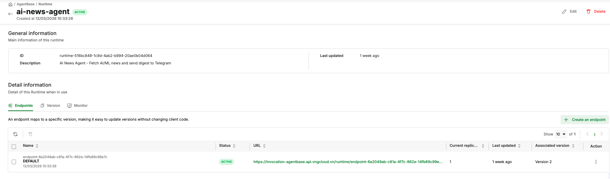

# Runtime

> The Runtime manages the full lifecycle of your agent's compute environment — container deployment, autoscaling, versioning, and endpoints.

---


## Core Concepts

### Runtime

A **Runtime** is the managed compute environment that runs your containerized agent. It abstracts container scheduling, health checks, autoscaling, and HTTP routing.

**Runtime states:**

| State        | Description                                                   |
| ------------ | ------------------------------------------------------------- |
| `CREATING` | Runtime is being created; containers are starting             |
| `ACTIVE`   | All minimum replicas are healthy; endpoint is serving traffic |
| `UPDATING` | A new version deployment is in progress                       |
| `ERROR`    | One or more required replicas could not start (check logs)    |
| `DELETING` | Runtime is being deleted                                      |

### Versions

Every time you deploy a new container image to a runtime, AgentBase creates a new **Version**. Versions are immutable — a version's image and configuration never change after creation.

### Endpoint

An **Endpoint** is the URL that clients call to interact with your agent. A runtime can have multiple endpoints and multiple versions — these are independent concepts. The **default** endpoint automatically tracks the latest version whenever a new version is deployed. You can designate any endpoint as the default, and create additional endpoints pinned to specific versions (for example, for canary or staging traffic).

### Compute Flavors

A **Compute Flavor** defines the CPU and RAM allocated to each replica of your agent.

### Autoscaling

The Runtime Service supports autoscaling based on CPU or RAM utilization. You define:

- `minReplicas`: The floor — always running (range: 1–10)
- `maxReplicas`: The ceiling — caps resource usage (range: 1–10)
- `cpuUtilization` and `memoryUtilization`: Thresholds (25–75%) that trigger scale-out

When load drops, AgentBase scales replicas back down to `minReplicas`.

### Service Contract

Your agent container must satisfy these requirements to work correctly with the Runtime Service:

1. **Listen on port 8080** — the required port; `app.run(host="0.0.0.0", port=8080)`
2. **Health check endpoint**: `GET /health` must return HTTP 200 to pass readiness checks
3. **Stateless**: Do not store session state in process memory — use the Memory Service instead

**Auto-injected environment variables** (available in all deployed agent containers):

| Variable                     | Description                       |
| ---------------------------- | --------------------------------- |
| `GREENNODE_CLIENT_ID`      | IAM service account client ID     |
| `GREENNODE_CLIENT_SECRET`  | IAM service account client secret |
| `GREENNODE_AGENT_IDENTITY` | Agent identity name               |

---

## Overview

**Runtime topology:**

```
Runtime: my-order-agent
│
├── Versions
│   ├── Version 1  (image: my-agent:v1.0.0)
│   └── Version 2  (image: my-agent:v2.0.0)  ← latest
│
├── Endpoints
│   ├── DEFAULT  → https://<default-url>   (auto-tracks latest version)
│   └── canary   → https://<canary-url>    (pinned to Version 1)
│
└── Autoscaling: min=1, max=3, CPU threshold=50%
```

**Key facts:**

- Each `PATCH /agent-runtimes/{id}` creates a new **version** — versions and endpoints are independent concepts under a runtime
- The **default** endpoint automatically tracks the latest version whenever a new version is deployed
- A runtime can have multiple endpoints — you choose which one is the default
- You have full control over all endpoints — create, update, or delete

---

## Manage Runtimes

### Portal

#### Create a Runtime

1. Open https://aiplatform.console.vngcloud.vn/runtime
2. Click **"Create Runtime"**
3. Fill information

| Field                           | Example Value                          | Notes                                      |
| ------------------------------- | -------------------------------------- | ------------------------------------------ |
| **Name**                  | `my-order-agent`                     | Unique, lowercase, hyphens allowed         |
| **Description**           | `Production order agent`             | Optional                                   |
| **Image URL**             | `vcr.vngcloud.vn/<repo>/my-agent:v1` | Full image path including tag              |
| **Flavor**                | `1x1-general`                        | 1 CPU, 1 GB RAM                            |
| **Min Replicas**          | `1`                                  | Range: 1–10                               |
| **Max Replicas**          | `1`                                  | Set >1 to enable autoscaling               |
| **CPU Threshold**         | `50`                                 | Scale out when CPU exceeds this % (25–75) |
| **Memory Threshold**      | `50`                                 | Scale out when RAM exceeds this % (25–75) |
| **Registry Auth**         | Enable if private                      | Username = robot account `backendName` (see [Supporting Services — Robot Accounts](../supporting-services.md#create-a-robot-account)) |
| **Environment Variables** | `KEY=value`                          | Non-sensitive config only                  |

5. Click **Create**
6. Runtime appears with status `CREATING`, then transitions to `ACTIVE`

#### List Runtimes

All runtimes are shown in a paginated table with: Name, Status, Description, Last version, Last updated

#### Get Runtime Details

Click a runtime name to view: status, image, flavor, autoscaling, environment variables, endpoints



#### Update a Runtime

1. Open the runtime detail page → **"Edit"**
2. Modify image URL, flavor, autoscaling, or env vars → **Save**

#### Delete a Runtime

> **Warning:** Deletion is irreversible. This permanently removes the runtime and all its endpoints.

In Runtime detail page, find the runtime → **Delete** → confirm

---

### RESTful API

> **Prerequisite:** All API examples below use `$TOKEN` — an IAM bearer token. See [Configure Authentication](../getting-started.md#configure-authentication) for how to obtain it.

#### Create a Runtime

**Public registry image:**

```bash
curl -s -X POST "https://agentbase.api.vngcloud.vn/runtime/agent-runtimes" \
  -H "Authorization: Bearer $TOKEN" \
  -H "Content-Type: application/json" \
  -d '{
    "name": "my-order-agent",
    "description": "Production order agent",
    "imageUrl": "vcr.vngcloud.vn/<repo-backendName>/my-agent:v1.0.0",
    "command": [],
    "args": [],
    "environmentVariables": {
      "LOG_LEVEL": "info"
    },
    "flavorId": "1x1-general",
    "autoscaling": {
      "minReplicas": 1,
      "maxReplicas": 3,
      "cpuUtilization": 50,
      "memoryUtilization": 50
    }
  }' | jq .
```

**Private registry image (imageAuth required):**

```bash
curl -s -X POST "https://agentbase.api.vngcloud.vn/runtime/agent-runtimes" \
  -H "Authorization: Bearer $TOKEN" \
  -H "Content-Type: application/json" \
  -d '{
    "name": "my-order-agent",
    "imageUrl": "vcr.vngcloud.vn/<repo-backendName>/my-agent:v1.0.0",
    "imageAuth": {
      "enabled": true,
      "username": "<robot-account-backendName>",
      "password": "<robot-account-secret>"
    },
    "command": [],
    "args": [],
    "environmentVariables": {},
    "flavorId": "1x1-general",
    "autoscaling": {
      "minReplicas": 1,
      "maxReplicas": 1,
      "cpuUtilization": 50,
      "memoryUtilization": 50
    }
  }' | jq .
```

**Poll until ACTIVE:**

```bash
RUNTIME_ID="<id-from-response>"
while true; do
  STATUS=$(curl -s "https://agentbase.api.vngcloud.vn/runtime/agent-runtimes/$RUNTIME_ID" \
    -H "Authorization: Bearer $TOKEN" | jq -r '.status')
  echo "Status: $STATUS"
  [ "$STATUS" = "ACTIVE" ] && break
  sleep 10
done
```

**Possible statuses:** `CREATING` → `ACTIVE` (success) or `ERROR` (failed)

#### List Runtimes

```bash
curl -s "https://agentbase.api.vngcloud.vn/runtime/agent-runtimes?page=1&size=20" \
  -H "Authorization: Bearer $TOKEN" | jq .
```

**Response shape:**

```json
{
  "listData": [...],
  "page": 1,
  "pageSize": 20,
  "totalPage": 1,
  "totalItem": 3
}
```

#### Get Runtime Details

```bash
curl -s "https://agentbase.api.vngcloud.vn/runtime/agent-runtimes/$RUNTIME_ID" \
  -H "Authorization: Bearer $TOKEN" | jq .
```

#### Update a Runtime

Each update creates a new **version**. The `DEFAULT` endpoint automatically points to the latest version.

> **Note:** All fields (except `imageAuth`) are required in the PATCH body.

```bash
curl -s -X PATCH "https://agentbase.api.vngcloud.vn/runtime/agent-runtimes/$RUNTIME_ID" \
  -H "Authorization: Bearer $TOKEN" \
  -H "Content-Type: application/json" \
  -d '{
    "description": "Production order agent v2",
    "imageUrl": "vcr.vngcloud.vn/<repo-backendName>/my-agent:v2.0.0",
    "imageAuth": {
      "enabled": true,
      "username": "<robot-backendName>",
      "password": "<robot-secret>"
    },
    "command": [],
    "args": [],
    "environmentVariables": {"LOG_LEVEL": "info"},
    "flavorId": "1x1-general",
    "autoscaling": {
      "minReplicas": 1,
      "maxReplicas": 3,
      "cpuUtilization": 50,
      "memoryUtilization": 50
    }
  }' | jq .
```

#### Delete a Runtime

> **Warning:** Deletion is irreversible.

```bash
curl -s -X DELETE "https://agentbase.api.vngcloud.vn/runtime/agent-runtimes/$RUNTIME_ID" \
  -H "Authorization: Bearer $TOKEN"
```

#### Reset Service Account

If IAM service account credentials are changed or revoked, reset them to recover the runtime:

```bash
curl -s -X PATCH "https://agentbase.api.vngcloud.vn/runtime/agent-runtimes/$RUNTIME_ID/reset-service-account" \
  -H "Authorization: Bearer $TOKEN" | jq .
```

> **Warning:** This regenerates `GREENNODE_CLIENT_ID` and `GREENNODE_CLIENT_SECRET`. The runtime restarts with new credentials.

---

## Manage Endpoints

Each runtime has a `DEFAULT` endpoint created automatically. You can create additional endpoints pointing to specific versions.

### Portal

#### List Endpoints

1. Open the runtime detail page → **"Endpoints"** tab

#### Create Endpoint

1. On the runtime detail page → **"Endpoints"** tab → **"Create Endpoint"**
2. Fill in **Name** and **Version** → **Create**

#### Update Endpoint Version

1. On the **"Endpoints"** tab → click an endpoint → **"Edit"**
2. Change **Version** → **Save**

---

### RESTful API

#### List Endpoints

```bash
curl -s "https://agentbase.api.vngcloud.vn/runtime/agent-runtimes/$RUNTIME_ID/endpoints?page=1&size=20" \
  -H "Authorization: Bearer $TOKEN" | jq .
```

**Endpoint fields:** `id`, `agentRuntimeId`, `name`, `version`, `url`, `status`, `createdAt`, `updatedAt`

#### Create Endpoint

```bash
curl -s -X POST "https://agentbase.api.vngcloud.vn/runtime/agent-runtimes/$RUNTIME_ID/endpoints" \
  -H "Authorization: Bearer $TOKEN" \
  -H "Content-Type: application/json" \
  -d '{"name": "canary", "version": 2}' | jq .
```

#### Update Endpoint Version

```bash
curl -s -X PATCH "https://agentbase.api.vngcloud.vn/runtime/agent-runtimes/$RUNTIME_ID/endpoints/$ENDPOINT_ID?version=3" \
  -H "Authorization: Bearer $TOKEN" | jq .
```

#### Delete Endpoint

```bash
curl -s -X DELETE "https://agentbase.api.vngcloud.vn/runtime/agent-runtimes/$RUNTIME_ID/endpoints/$ENDPOINT_ID" \
  -H "Authorization: Bearer $TOKEN"
```

---

## Runtime Versions

Each `PATCH` on a runtime creates a new immutable version. Use versions to roll back by pointing an endpoint to an older version number.

### Portal

1. Open the runtime detail page → **"Versions"** tab


---

### RESTful API

#### List Versions

```bash
curl -s "https://agentbase.api.vngcloud.vn/runtime/agent-runtimes/$RUNTIME_ID/versions?page=1&size=20" \
  -H "Authorization: Bearer $TOKEN" | jq .
```

**Version fields:** `agentRuntimeId`, `version` (integer), `imageUrl`, `flavorId`, `autoscaling`, `createdAt`

#### Rollback

Point the `DEFAULT` endpoint to an older version:

```bash
ENDPOINT_ID=$(curl -s "https://agentbase.api.vngcloud.vn/runtime/agent-runtimes/$RUNTIME_ID/endpoints?page=1&size=10" \
  -H "Authorization: Bearer $TOKEN" | jq -r '.listData[] | select(.name=="DEFAULT") | .id')

curl -s -X PATCH "https://agentbase.api.vngcloud.vn/runtime/agent-runtimes/$RUNTIME_ID/endpoints/$ENDPOINT_ID?version=1" \
  -H "Authorization: Bearer $TOKEN" | jq .
```

---

## Runtime Service Contract

Your agent container must fulfill these requirements:

### Port and Health Check

| Requirement       | Value           | Notes                        |
| ----------------- | --------------- | ---------------------------- |
| Listen port       | `8080`        | Required — not configurable |
| Health check path | `GET /health` | Must return HTTP 200         |

**Using the greennode-agentbase SDK (recommended):**

```python
from greennode_agentbase import GreenNodeAgentBaseApp, RequestContext, PingStatus

app = GreenNodeAgentBaseApp()

@app.entrypoint
def handler(payload: dict, context: RequestContext) -> dict:
    return {"output": "Hello!"}

if __name__ == "__main__":
    import os
    app.run(host="0.0.0.0", port=int(os.environ.get("PORT", "8080")))
```

**Without the SDK (FastAPI example):**

```python
from fastapi import FastAPI

app = FastAPI()

@app.get("/health")
def health():
    return {"status": "ok"}

@app.post("/invoke")
def invoke(body: dict):
    return {"output": f"Echo: {body.get('input', '')}"}
```

### Auto-Injected Environment Variables

The Runtime automatically injects these into every container:

| Variable                     | Description                                   |
| ---------------------------- | --------------------------------------------- |
| `GREENNODE_CLIENT_ID`      | IAM service account client ID for the runtime |
| `GREENNODE_CLIENT_SECRET`  | IAM service account client secret             |
| `GREENNODE_AGENT_IDENTITY` | The agent identity name                       |

### Request Headers

Incoming requests to your agent include:

| Header                               | Description                                                   |
| ------------------------------------ | ------------------------------------------------------------- |
| `X-GreenNode-AgentBase-User-Id`    | End-user ID (use as `actorId` for memory operations)        |
| `X-GreenNode-AgentBase-Session-Id` | Session ID (use as `thread_id` for LangGraph checkpointing) |

> **Important:** If your agent uses memory, validate that these headers are present and return an error if missing. Do not fall back to default values — silent defaults cause data mixing between users.

---

