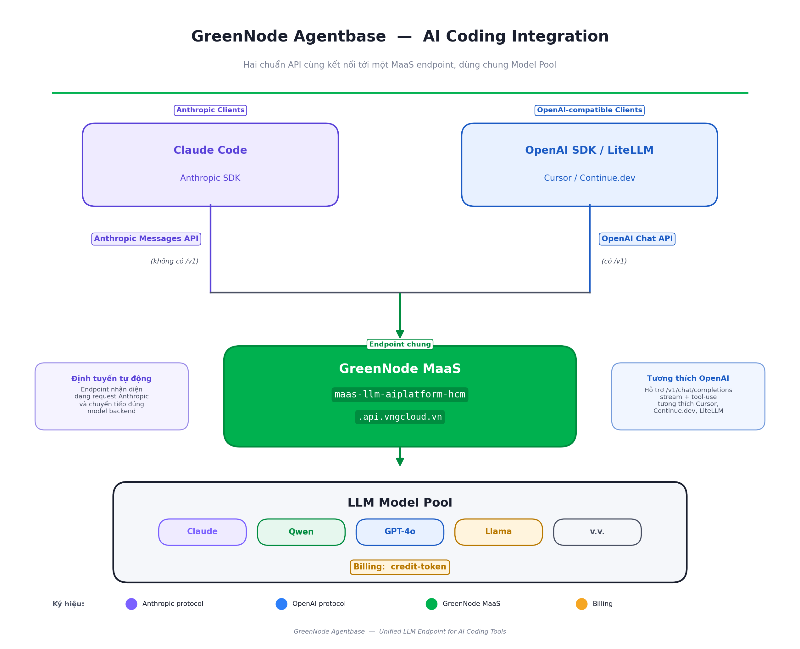

# AI Coding

AI Coding lets you connect popular AI coding tools — Claude Code, OpenAI SDK, IDE extensions — directly to GreenNode MaaS, using cloud models without managing API keys from external providers.

---

## Architecture

Requests from your tool are redirected to the GreenNode MaaS endpoint. MaaS exposes two protocols in parallel to support all existing clients:

<figure><figcaption>
Both API protocols connect to a single MaaS endpoint sharing the same Model Pool
</figcaption></figure>

A single AI Platform API key works for both protocols.


The LLM URL differs by protocol — see the table below. Using the wrong URL causes 404 errors or malformed request parsing.


---

## Protocol and LLM URL

| Client | Protocol | LLM URL |
|---|---|---|
| Claude Code, Anthropic SDK | Anthropic Messages API | `https://maas-llm-aiplatform-hcm.api.vngcloud.vn` |
| OpenAI SDK, LiteLLM, Cursor, Continue.dev | OpenAI-compatible | `https://maas-llm-aiplatform-hcm.api.vngcloud.vn/v1` |

---

## Supported Tools

### Claude Code

Claude Code CLI supports overriding `ANTHROPIC_BASE_URL` — pointing to GreenNode MaaS instead of Anthropic directly. All sessions, tool calls, and sub-agents route through the GreenNode endpoint, with usage visible in AI Platform Console.

### OpenAI-compatible clients

Any tool that allows setting a custom `base_url` in OpenAI SDK format works out of the box — OpenAI Python/Node.js SDK, LiteLLM, Cursor, Continue.dev, and other IDE extensions. Change the base URL and API key; no logic changes needed.

---

## Billing

- **Credit-token:** 1 credit = 1 VND
- **Prepaid:** credits deducted every 5-minute collection cycle — model automatically disabled when credits run out
- **Postpaid:** usage recorded as debt with no quota limit
- View real-time usage at [AI Platform Console → Usage](https://aiplatform.console.vngcloud.vn/)

---

## Getting Started

| I want to... | Go to |
|---|---|
| Connect Claude Code to MaaS | [Connect Claude Code to GreenNode MaaS](connect-claude-code-to-maas.md) |
| Connect an OpenAI-compatible tool to MaaS | [Connect OpenAI-compatible Clients to GreenNode MaaS](connect-openai-compatible-to-maas.md) |
| Get an API key | [AI Platform Console](https://aiplatform.console.vngcloud.vn/) |
