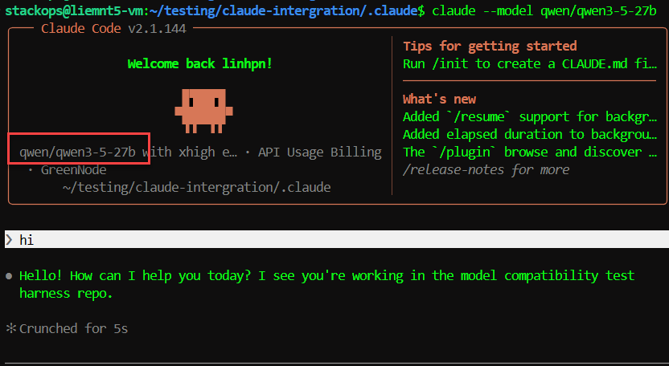

# Connect Claude Code to GreenNode MaaS

> Route Claude Code CLI requests through GreenNode MaaS instead of the Anthropic API directly — all traffic goes through GreenNode infrastructure and is billed via internal credit-tokens.

---

## Prerequisites

- An active [AI Platform](https://aiplatform.console.vngcloud.vn/) account
- Claude Code CLI installed


Claude Code uses the **Anthropic API protocol**. The LLM URL is `https://maas-llm-aiplatform-hcm.api.vngcloud.vn` (no `/v1`).


---

## Step 1 — Get an API key from AI Platform

1. Log in to [AI Platform Console](https://aiplatform.console.vngcloud.vn/)
2. Go to **API Keys** → **Create API Key**
3. Name the key using the format `claude-code-<your-name>` (5–50 chars, lowercase letters, numbers, and hyphens)
4. Copy the API key — it is shown only once


A newly created API key has status `pending`. Poll `api-keys get <name>` until the status is `ACTIVE` before using it.


---

## Step 2 — Select a model

List available Claude models:

```bash
bash .claude/skills/agentbase/scripts/aip.sh models list --providers anthropic --status ENABLED
```

Note the `path` value for the model you want (e.g., `claude-sonnet-4-6`, `claude-opus-4-7`). This value is used in the model mapping environment variables in the next step.

---

## Step 3 — Configure

Choose one of two options:

**Option A — Shell profile (system-wide)**

Add to `~/.zshrc` or `~/.bashrc`:

```bash
# GreenNode MaaS — Claude Code Integration
export ANTHROPIC_BASE_URL="https://maas-llm-aiplatform-hcm.api.vngcloud.vn"
export ANTHROPIC_AUTH_TOKEN="<your-api-key>"
export ANTHROPIC_API_KEY=""  # Must be empty — avoids routing to Anthropic directly

# Model mapping (use the path from Step 2)
export ANTHROPIC_DEFAULT_SONNET_MODEL="claude-sonnet-4-6"
export ANTHROPIC_DEFAULT_OPUS_MODEL="claude-opus-4-7"
export ANTHROPIC_DEFAULT_HAIKU_MODEL="claude-haiku-4-5-20251001"
export CLAUDE_CODE_SUBAGENT_MODEL="claude-sonnet-4-6"
```

Reload without restarting the terminal:

```bash
source ~/.zshrc
```

<figure><figcaption><p>ANTHROPIC_AUTH_TOKEN and ANTHROPIC_BASE_URL configured in shell profile</p></figcaption></figure>

**Option B — Project settings (per-project)**

Create `.claude/settings.local.json` at the project root:

```json
{
  "env": {
    "ANTHROPIC_BASE_URL": "https://maas-llm-aiplatform-hcm.api.vngcloud.vn",
    "ANTHROPIC_AUTH_TOKEN": "<your-api-key>",
    "ANTHROPIC_API_KEY": "",
    "ANTHROPIC_DEFAULT_SONNET_MODEL": "claude-sonnet-4-6",
    "ANTHROPIC_DEFAULT_OPUS_MODEL": "claude-opus-4-7",
    "ANTHROPIC_DEFAULT_HAIKU_MODEL": "claude-haiku-4-5-20251001",
    "CLAUDE_CODE_SUBAGENT_MODEL": "claude-sonnet-4-6"
  }
}
```


Claude Code does not read standard `.env` files. Use `settings.local.json` or a shell profile instead.


---

## Step 4 — Verify the connection

Open Claude Code and run:

```
/status
```

Expected result:

- Base URL points to `maas-llm-aiplatform-hcm.api.vngcloud.vn`
- Model matches your configuration

Confirm requests are recorded in [AI Platform Console → Usage](https://aiplatform.console.vngcloud.vn/).

---

## Environment Variables Reference

| Variable | Purpose | Example value |
|---|---|---|
| `ANTHROPIC_BASE_URL` | Redirect API calls to GreenNode | `https://maas-llm-aiplatform-hcm.api.vngcloud.vn` |
| `ANTHROPIC_AUTH_TOKEN` | Authentication API key | `<your-api-key>` |
| `ANTHROPIC_API_KEY` | Must be empty (avoid conflict) | `""` |
| `ANTHROPIC_DEFAULT_SONNET_MODEL` | Model for everyday coding | `claude-sonnet-4-6` |
| `ANTHROPIC_DEFAULT_OPUS_MODEL` | Model for complex reasoning | `claude-opus-4-7` |
| `ANTHROPIC_DEFAULT_HAIKU_MODEL` | Model for fast completions | `claude-haiku-4-5-20251001` |
| `CLAUDE_CODE_SUBAGENT_MODEL` | Model used when spawning sub-agents | `claude-sonnet-4-6` |

---

## Billing & Usage

- Requests through GreenNode MaaS are billed in credit-tokens (1 credit = 1 VND)
- View real-time usage on [AI Platform Console → Usage](https://aiplatform.console.vngcloud.vn/)
- **Prepaid:** credits are deducted every 5-minute collection cycle — when credits run out, the model is automatically disabled
- **Postpaid:** usage is recorded as a debt with no quota limit

---

## Troubleshooting

| Symptom | Cause | Fix |
|---|---|---|
| `401 Unauthorized` | Wrong or inactive API key | Verify the key; create a new one if needed |
| `403 Forbidden` | API key not yet ACTIVE | Poll `api-keys get <name>` until status = ACTIVE |
| Model not responding | Credits exhausted, model disabled | Add credits in AI Platform Console |
| Requests still going to Anthropic | `ANTHROPIC_API_KEY` is not empty | Set `ANTHROPIC_API_KEY=""` |
| Wrong model used | Incorrect model path | Verify the `path` field with `aip.sh models list` |
| `/status` reports URL error | Base URL has a trailing slash | Remove trailing `/` from `ANTHROPIC_BASE_URL` |

---

## Result

After completing setup, Claude Code CLI routes all requests through GreenNode MaaS. Usage is recorded in AI Platform Console and billed via internal credit-tokens.

<figure><figcaption><p>Claude Code running successfully through GreenNode MaaS endpoint</p></figcaption></figure>

| I want to... | Go to |
|---|---|
| Use an OpenAI-compatible tool with MaaS | [Connect OpenAI-compatible Clients to GreenNode MaaS](connect-openai-compatible-to-maas.md) |
| View usage and billing | [AI Platform Console](https://aiplatform.console.vngcloud.vn/) |
