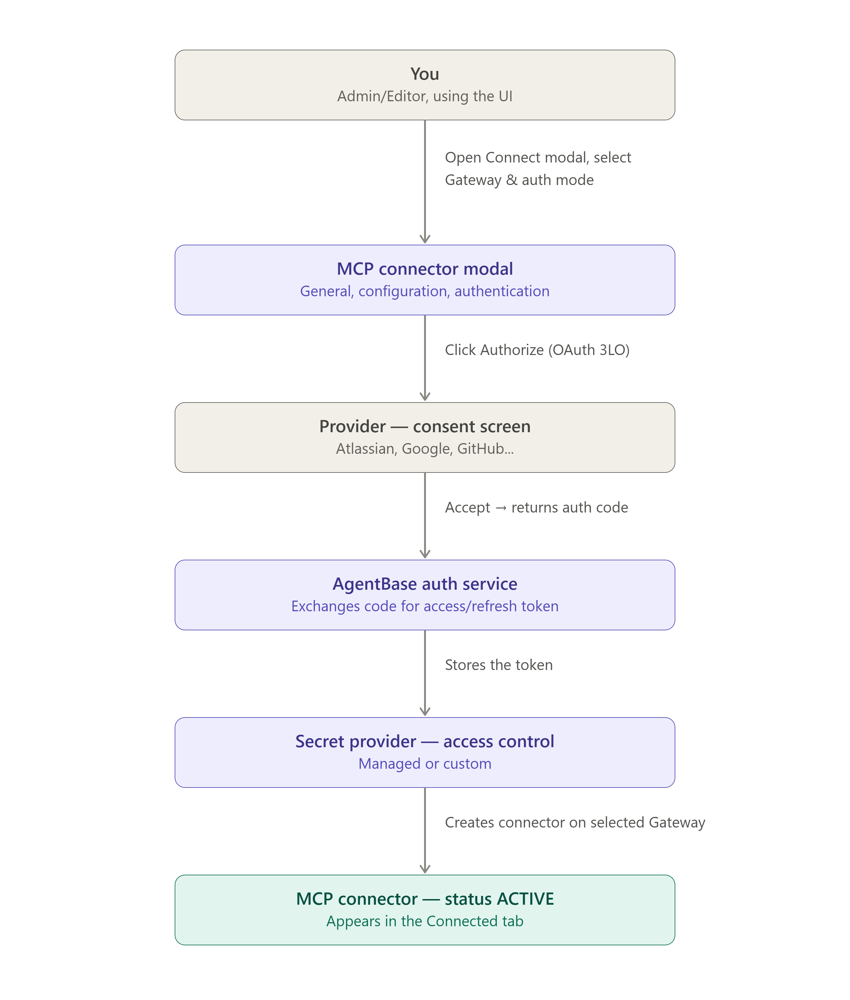

# MCP Connectors

**MCP Connectors** let you connect an agent to external services — GitHub, Slack, Microsoft 365... — in minutes, without building an MCP server or hand-coding OAuth from scratch.

---

## Architecture

A connector has 2 separate flows: the **connect flow** (a one-time OAuth/API Key setup when you click Connect) and the **runtime tool-call flow** (every time an agent calls a tool through the Gateway).

### Connect flow

You (an Admin/Editor) trigger this flow by clicking **Connect** on a connector in the Catalog — see the detailed UI steps in [Connect a Connector](connect-a-connector.md). The diagram below shows the architecture for **OAuth 3LO** — the mode with the most steps, since it requires your consent via the browser:


The diagram above illustrates OAuth 3LO. With **OAuth 2LO**, **API Key**, **Inbound forward**, or **No authorization**, there's no consent-screen step — the system stores the credential (if any) and creates the Connector as soon as you click **Connect**, without leaving the modal.



A connector is scoped to the project — any member with project access shares the same connection.


### Runtime tool-call flow

When an agent calls a tool, the request flows through the exact components you configured at Connect time — MCP Gateway (Inbound Auth) → MCP Connector (Outbound Auth) → MCP Server → Provider:

| Outbound Auth mode | Where the credential comes from |
|---|---|
| **OAuth** (2LO/3LO) | Secret Provider (Managed, created by GreenNode, or Custom, configured by you) via **Access Control** |
| **API Key** (2LO/3LO) | Secret Provider (Managed/Custom) via **Access Control**, or an API Key/Token pasted directly |
| **Inbound forward** | The same credential the agent used at the Inbound Auth step — requires the Gateway's Inbound Auth ≠ **No authorization** |
| **No authorization** | No credential attached |

---

## Connector Catalog

The catalog shows the connectors AgentBase ships prebuilt, with an **Add Custom Connector** card always at the start of the grid to add a custom MCP server. Each connector card shows its name, provider, and the supported Auth Mode badges (e.g. `OAuth 3LO`, `API Key 3LO`).


The number of prebuilt connectors changes over time as AgentBase adds new providers — check the exact count on the **Catalog** tab, under "List catalog (N)".


At the time of writing, the catalog includes the following connectors (the list is updated progressively as AgentBase adds providers):

| Connector | Provider | Note |
|---|---|---|
| GitHub | GitHub | |
| Slack | Slack | |
| M365 VNG | Microsoft | Bundles 4 Microsoft 365 services: SharePoint, Outlook Mail, Outlook Calendar, Microsoft Teams |

---

## Authentication Modes

The Connect modal is shared across every connector, with 4 authentication modes:

| Mode | Description |
|---|---|
| **OAuth** | Authenticates through the provider — has 2 sub-modes: **2LO** (server-to-server, no user consent) and **3LO** (requires user consent via the provider's consent screen) |
| **API Key** | Paste a static API Key/Token obtained from the external service |
| **Inbound forward** | Reuses the MCP Gateway's own **Inbound Auth** credential as the outbound auth — only available when the Gateway's Inbound Auth is not **No authorization** |
| **No authorization** | No authentication required |


Not every connector supports all 4 modes:
- Some connectors only allow **OAuth** or **API Key**, with **Inbound forward** and **No authorization** unsupported.
- **Inbound forward** only works when the selected MCP Gateway's **Inbound Auth** is not **No authorization** (i.e. IAM Permissions or JWT) — this mode forwards that same inbound credential as the outbound auth to the MCP server.


---

## Custom Connector

If the service you need isn't in the catalog, click the **Add Custom Connector** card (always at the start of the grid) to connect any MCP-compatible server with a custom configuration, through the same 4-mode auth modal above.

---

## Getting Started with MCP Connectors

| I want to... | Go to |
|---|---|
| Browse and find a connector in the Catalog | [Browse the Connector Catalog](browse-connector-catalog.md) |
| Connect a connector to my project | [Connect a Connector](connect-a-connector.md) |
| View, edit, or disconnect a connected connector | [Manage Connected Connectors](manage-connected-connectors.md) |
