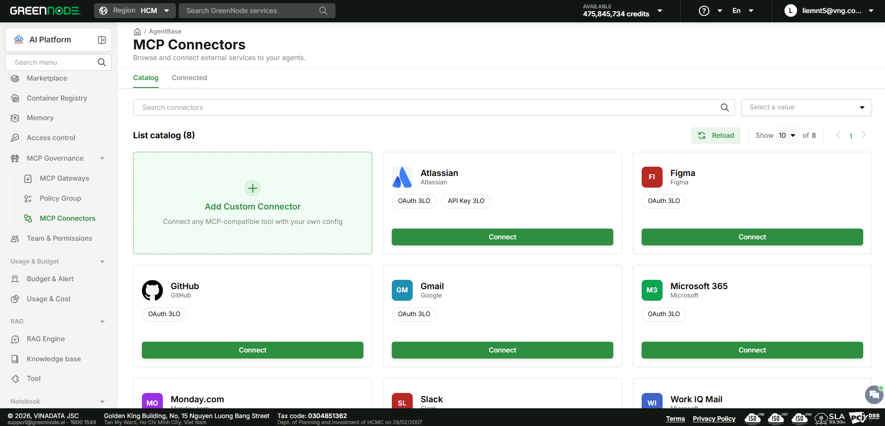

# Browse the Connector Catalog

> This guide helps you find the right connector in the Connector Catalog — search by name, filter, and start connecting it.

---

## Prerequisites

- Signed in to AgentBase with at least **Member** access on the project.

---

## Open the Connector Catalog

1. Click **AgentBase** → **MCP Connectors** in the sidebar.

The **MCP Connectors** page opens with 2 tabs: **Catalog** (active by default) and **Connected**. The **Catalog** tab shows the current connector count (e.g. "List catalog (8)"), an **Add Custom Connector** card always at the start of the grid, and the remaining prebuilt connector cards — each with an icon, name, provider, supported Auth Mode badges, and a **Connect** button.

---

## Search and filter connectors

1. Click the **Search connectors** field and type the connector name.
2. Select a value in the **Select a value** dropdown on the right to narrow the list.

Click **Reload** to refresh the list if a new connector was just added to the catalog.

---

## Result

You've found the right connector in the Catalog and are ready to connect it.

| I want to next... | Go to |
|---|---|
| Connect the connector I just found | [Connect a Connector](connect-a-connector.md) |
| Manage a connector I already connected | [Manage Connected Connectors](manage-connected-connectors.md) |
