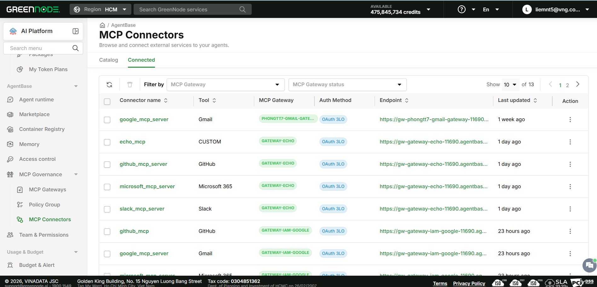

# Manage Connected Connectors

> This guide helps you view the list, inspect a connector's tools, and edit or disconnect connectors already connected in your project.

---

## Prerequisites

- The project has at least 1 connected connector.
- **Admin** or **Editor** access to edit/delete — the **Member** role can only view the list.

---

## View connected connectors

1. Click the **Connected** tab in the **MCP Connectors** page.

The table shows columns: **Connector name**, **Tool**, **MCP Gateway**, **Auth Method**, **Endpoint**, **Last updated**, **Action (Edit/Delete)**. You can filter by **MCP Gateway** or **MCP Gateway status** above the table.


For your agent to use this connector's tools, copy the connector's **Endpoint** value, then configure/point your AI agent to connect to that MCP address.


---

## View a connector's detail page

1. Click the connector's name in the **Connector name** column of the Connected table.

The detail page opens with a status badge (e.g. **ACTIVE**) next to the connector name, plus **Edit** and **Delete** buttons in the top-right corner. The **General information** section shows Connector name, Auth Method, Endpoint, MCP Gateway, and Last updated.

The **Detail information** section has a **Tools & Permissions** tab — listing every tool this connector provides, with a description and parameter list when you expand each tool. Click **Sync tools** to refresh the tool list from the MCP server.

---

## Edit or delete a connector

1. Open the detail page of the connector you want to act on (see the step above).
2. Click **Edit** to change its configuration, or click **Delete** to disconnect it.


Deleting a connector cannot be undone. Check which agents are using this connector before deleting it.


---

## Result

You have full visibility into every connector connected in the project, know exactly which tools each one provides, and can edit or disconnect them as needed.

| I want to next... | Go to |
|---|---|
| Connect another connector | [Connect a Connector](connect-a-connector.md) |
| Browse the catalog again | [Browse the Connector Catalog](browse-connector-catalog.md) |
