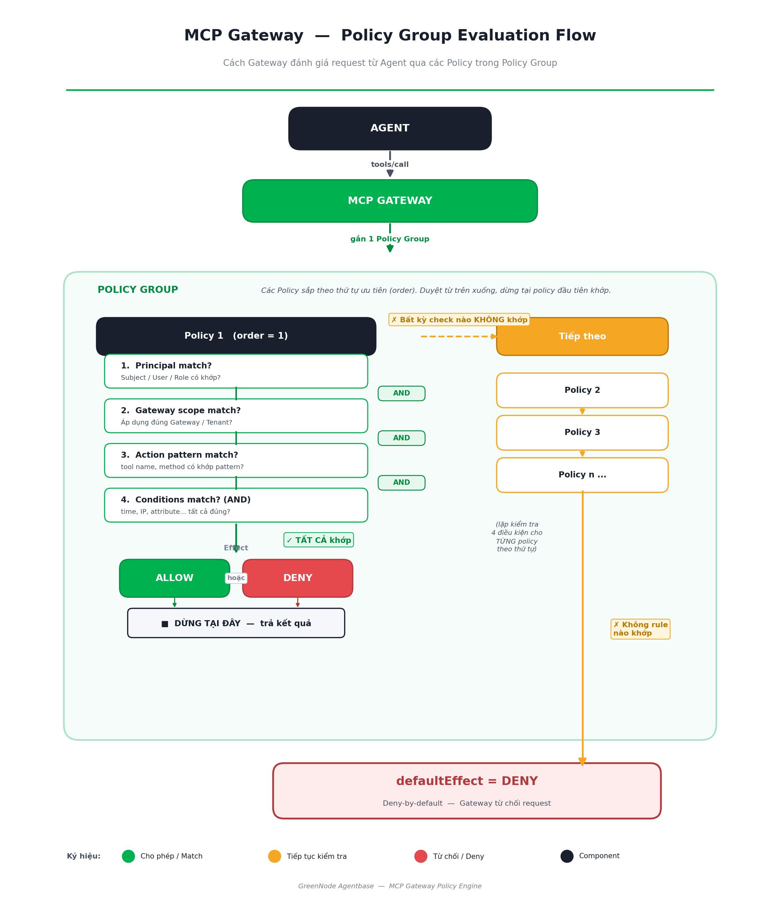

# Policy Groups

Policy Groups let you control exactly which agents can call which tools through MCP Gateway — no code changes required, effective immediately when attached to a Gateway.

---

## Architecture

Each Policy Group is a collection of **Policy rules** evaluated top-to-bottom when an agent sends a `tools/call` through MCP Gateway. The first matching rule determines the outcome (ALLOW or DENY). If no rule matches, the system defaults to **DENY by default**.



---

## Key Components

### Policy Group Status

A Policy Group has a single status: **Active** — the group exists and is ready to be attached to a Gateway.

Each individual **Policy** (rule) inside the group has its own status:

| Policy Status | Meaning |
|---|---|
| **Active** | The policy is evaluated on incoming `tools/call` requests |
| **Inactive** | The policy is temporarily disabled and skipped during evaluation |

### Policy Rule

Each Policy in a group has 5 components:

| Component | Description |
|---|---|
| **Effect** | `ALLOW` — permit the agent to execute. `DENY` — block the agent. |
| **Principal** | Who the policy applies to — `All` (everyone) or a specific user/service account. |
| **Gateway Scope** | Whether the policy enforces on all attached gateways or a specific subset. |
| **Action Pattern** | Which tool calls are evaluated — `*` (all) or exact format `targetName__toolName`. |
| **Conditions** | Additional context-based constraints: `[Operator] [Key] [Value]`, combined with AND. |

---

## Action Patterns

Action patterns identify exactly which tool calls a rule applies to. Required format: `targetName__toolName` (double underscore).

| Pattern | Valid? | Meaning |
|---|---|---|
| `*` | ✅ | All tool calls |
| `weatherTarget__getForecast` | ✅ | Only the `getForecast` tool on target `weatherTarget` |
| `paymentTarget__chargeCard` | ✅ | Only the `chargeCard` tool on target `paymentTarget` |
| `refundTarget__getAmount` | ✅ | Only the `getAmount` tool on target `refundTarget` |
| `*__chargeCard` | ❌ | Partial wildcard — not supported |
| `paymentTarget__*` | ❌ | Partial wildcard — not supported |
| `pay*__chargeCard` | ❌ | Partial wildcard — not supported |


Partial wildcards are **not supported**. Only `*` (all actions) or exact `targetName__toolName` are accepted.


---

## Principal and Wildcard Rules

When selecting **Specific principal**, specify `principalType` (`iam` or `jwt`) and optionally a `principalIdentifier`:

| Configuration | Serialized | Meaning |
|---|---|---|
| Type `iam`, no identifier | `"iam"` | Matches all IAM identities |
| Type `iam`, identifier `user-abc123` | `"iam:user-abc123"` | Matches exactly 1 IAM user |
| Type `jwt`, no identifier | `"jwt"` | Matches all JWT users |
| Type `jwt`, identifier `user-abc123` | `"jwt:user-abc123"` | Matches exactly 1 JWT user |
| Type `jwt`, identifier `*` | `"jwt:*"` | ✅ Valid wildcard — matches all JWT users |
| Type `jwt`, identifier `abc*` | `"jwt:abc*"` | ⚠️ LITERAL — matches only a user whose ID is exactly `"abc*"` |


`jwt:abc*` is **not a prefix match**. It is a literal identifier — it only matches a user whose ID is exactly `"abc*"`. Use `jwt:*` to match all JWT users.


---

## Conditions

Conditions let you restrict a policy based on request context attributes such as email, role, IP address, or time. Each condition has the structure **Operator · Key · Value**. Multiple conditions are combined with **AND** — all must be true for the policy to match.

**Example conditions:**

| Operator | Key | Value | Meaning |
|---|---|---|---|
| `equals` | `principal.role` | `Admin` | Only applies when the principal has role Admin |
| `greaterThan` | `request.timestamp.hour` | `9` | Only applies after 9 AM |
| `lessThan` | `request.timestamp.hour` | `17` | Only applies before 5 PM |
| `ipInRange` | `request.client_ip` | `10.0.0.0/8` | Only applies from internal IP range |
| `contains` | `principal.email` | `@vng.com.vn` | Only applies to VNG email addresses |
| `in` | `principal.role` | `Admin,Editor` | Only applies when role is Admin or Editor |

**Supported operators:**

| Group | Operators |
|---|---|
| Equality | `equals`, `notEquals` |
| Comparison | `lessThan`, `lessThanOrEqual`, `greaterThan`, `greaterThanOrEqual` |
| String/Pattern | `like`, `contains`, `containsAll`, `containsAny`, `startsWith`, `endsWith` |
| Membership | `in`, `has`, `hasTag`, `is`, `memberOf` |
| Network/IP | `ipInRange`, `isIpv4`, `isIpv6`, `isLoopback`, `isMulticast` |

---

## Gateway and Policy Group Relationship

One Policy Group can be attached to **multiple Gateways**, but each Gateway can only have **one Policy Group** at a time.

```
Policy Group A  ──►  MCP Gateway 1
                ──►  MCP Gateway 2
                ──►  MCP Gateway 3

Policy Group B  ──►  MCP Gateway 4
```

---

## Getting Started

| I want to... | Go to |
|---|---|
| Create a Policy Group and add policies | [Manage Policy Groups](manage-policy-groups.md) |
| Understand how MCP Gateway works | [MCP Gateway](../mcp-gateway/README.md) |
| Overview of MCP Governance | [MCP Governance](../README.md) |
