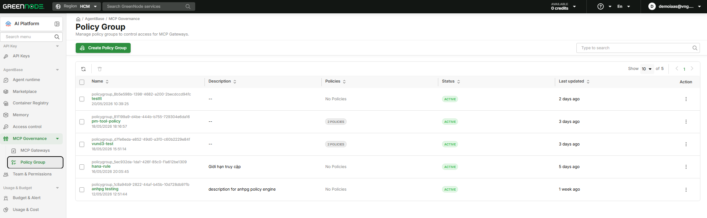
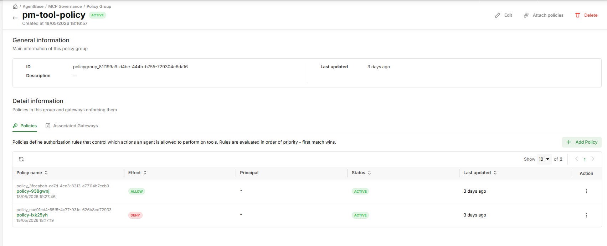
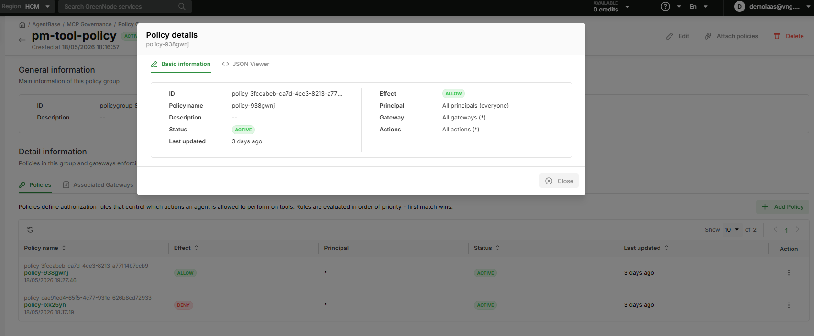

# Manage Policy Groups

> This guide walks you through creating a Policy Group, adding policies to define tool access rules, attaching the group to an MCP Gateway, and deleting groups when no longer needed.

---

## Prerequisites

- A GreenNode account with role **Root** or **Admin** (Member and Viewer have read-only access)
- At least 1 MCP Gateway created to attach the Policy Group to

---

## Create a Policy Group

**Step 1: Open the Policy Groups page**

1. Sign in to [AI Platform Console](https://aiplatform.console.vngcloud.vn)
2. Select **AgentBase** in the left menu
3. Select **MCP Governance** → **Policy Groups**



4. Click **Create Policy Group**

**Step 2: Fill in basic information (Step 1)**

1. Enter a **Name** following these rules:
   - Must start with a letter (a–z, A–Z)
   - Valid characters: letters, digits, underscore `_`
   - Minimum 5, maximum 50 characters
   - Unique within the organization

   | Example name | Valid? |
   |---|---|
   | `PolicyGroup_Prod01` | ✅ |
   | `sales_agent_policy` | ✅ |
   | `myPolicy` | ✅ |
   | `123invalid` | ❌ — starts with a digit |
   | `name with space` | ❌ — contains a space |
   | `ab` | ❌ — fewer than 5 characters |

2. Enter a **Description** (optional) — up to 4096 characters
3. Click **Create Policy Group** → the Policy Builder opens

---

## Add Policies (Policy Builder)

After creating the group, the Policy Builder opens (Step 2). You can add up to **20 policies** per group.

**Step 3: Add a new policy**

1. Click **+ Add Policy**
2. Enter a **Policy name** — up to 64 characters, unique within the group (e.g., `allow-sales-call-tool`)
3. Enter a **Policy description** (optional)

**Step 4: Choose an Effect**

| Choice | Meaning |
|---|---|
| **ALLOW** | Permit the agent to execute the action when the policy matches |
| **DENY** | Block the agent from executing the action when the policy matches |

**Step 5: Choose a Principal**

- **All principals (everyone)** — applies to all agents calling through the gateway
- **Specific principal** — applies only to a specific user or service account

  When choosing **Specific**:

  | Field | Value | Notes |
  |---|---|---|
  | Type | `iam` or `jwt` | `iam` = IAM identity; `jwt` = JWT Token |
  | Identifier | optional | Leave empty → matches all users of that type; enter an ID → matches exactly 1 user |

  Examples:
  - Type `jwt`, identifier `sales-agent-service` → serialized as `"jwt:sales-agent-service"`
  - Type `iam`, no identifier → serialized as `"iam"` (matches all IAM users)
  - Type `jwt`, identifier `*` → `"jwt:*"` (valid wildcard — matches all JWT users)

**Step 6: Choose a Gateway Scope**

- **All gateways (*)** — policy enforces on every gateway attached to this group
- **Specific gateway(s)** — select a subset from the dropdown (only gateways already attached to this group)

**Step 7: Choose an Action**

- **All actions (*)** — applies to all `tools/call` requests
- **Specific actions** — enter exact patterns in the format `targetName__toolName`

  Examples of valid action patterns:
  ```
  weatherTarget__getForecast
  paymentTarget__chargeCard
  refundTarget__getAmount
  ```


Only `*` (all) or exact `targetName__toolName` are supported. Partial wildcards like `paymentTarget__*` or `*__chargeCard` are not valid.


**Step 8: Add Conditions (optional)**

1. Enable the **Add conditions** toggle
2. Click **+ Add Condition**
3. Select an **Operator**, enter a **Key** and **Value**
4. Repeat to add more conditions — all must be true (**AND logic**)

---

## Policy Examples

### Example 1 — ALLOW all agents to call any tool

```
Policy name:  allow-all
Effect:       ALLOW
Principal:    All principals (everyone)
Gateway:      All gateways (*)
Action:       All actions (*)
Conditions:   (none)
```

Use as a baseline "permit all", combined with more specific DENY policies layered on top.

---

### Example 2 — ALLOW only a sales agent to call payment tools

```
Policy name:  allow-sales-payment
Effect:       ALLOW
Principal:    Specific — type: jwt, identifier: sales-agent-service
Gateway:      All gateways (*)
Action:       Specific — paymentTarget__chargeCard, paymentTarget__getBalance
Conditions:   equals · principal.role · sales
```

Serialized principal: `"jwt:sales-agent-service"`

Only agent `sales-agent-service` with role `sales` can call `chargeCard` and `getBalance`.

---

### Example 3 — DENY all requests outside business hours (before 8 AM)

```
Policy name:  deny-before-8am
Effect:       DENY
Principal:    All principals (everyone)
Gateway:      All gateways (*)
Action:       All actions (*)
Conditions:   lessThan · request.timestamp.hour · 8
```

Create a second policy to also block after 5 PM:

```
Policy name:  deny-after-5pm
Effect:       DENY
Principal:    All principals (everyone)
Gateway:      All gateways (*)
Action:       All actions (*)
Conditions:   greaterThan · request.timestamp.hour · 17
```

Because multiple conditions combine with AND, split into two separate policies — one for before 8 AM and one for after 5 PM.

---

### Example 4 — ALLOW only internal network traffic

```
Policy name:  allow-internal-only
Effect:       ALLOW
Principal:    All principals (everyone)
Gateway:      All gateways (*)
Action:       All actions (*)
Conditions:   ipInRange · request.client_ip · 10.0.0.0/8
```

Pair with a DENY-all policy at the bottom to block all external requests:

```
Policy name:  deny-all-fallback
Effect:       DENY
Principal:    All principals (everyone)
Gateway:      All gateways (*)
Action:       All actions (*)
Conditions:   (none)
```

Because evaluation stops at the first match, `allow-internal-only` (placed first) permits internal traffic; `deny-all-fallback` (placed last) blocks everything else.

---

**Step 9: Save**

Click **Save Changes** → the group transitions to **Active** status and the Policy Group Detail page opens.





---

## Attach a Policy Group to a Gateway

There are 3 ways to attach a group to a gateway:

**Option 1 — From Policy Group Detail**

1. Open Policy Group Detail (click the group name from the list)
2. Select the **Associated Gateways** tab
3. Click **Associate Gateway**
4. Select a gateway from the dropdown
5. Click **Confirm**

**Option 2 — From the Policy Groups list**

1. Tick the checkbox on the group row
2. Click **Associate Gateway** (green outline button on the toolbar)
3. Select a gateway and click **Confirm**

**Option 3 — From MCP Gateway Detail**

See [Manage MCP Gateway](../mcp-gateway/quan-ly-mcp-gateway.md).


Each MCP Gateway can only have **one Policy Group** at a time. If the gateway already has a group, attaching a new one **immediately replaces** the old group — policies from the old group stop being enforced.


---

## Detach a Gateway from a Policy Group

1. Open Policy Group Detail → **Associated Gateways** tab
2. Locate the gateway → click **Detach**
3. Confirm in the dialog

After detaching, the gateway has no policy control — all `tools/call` through that gateway will be denied until a new Policy Group is attached.

---

## Delete a Policy Group


Deleting a Policy Group is **irreversible**. If the group is attached to any gateways, deletion will automatically detach all of them — those gateways lose policy control immediately.


1. Go to **Policy Groups**
2. Tick the checkbox on the group row
3. Click **Delete** (red button) → review the warning and confirm

---

## Result

After completing these steps, the Policy Group is in **Active** status and attached to the gateway. Every `tools/call` through that gateway is evaluated against the group's policies in order — first-match wins, DENY by default if no rule matches.

| I want to... | Go to |
|---|---|
| Understand the evaluation flow in detail | [Policy Groups — Overview](README.md) |
| Configure an MCP Gateway | [Manage MCP Gateway](../mcp-gateway/quan-ly-mcp-gateway.md) |
