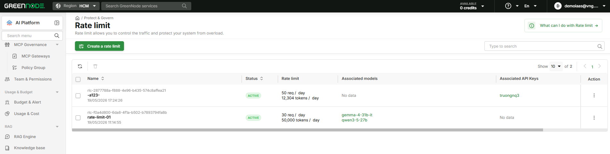
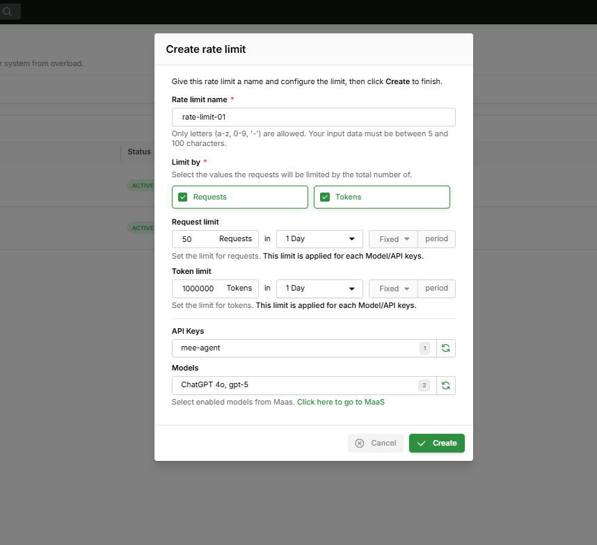

# Rate Limit

> Cap the number of Requests and Tokens per time period — protect your system from overload and control costs.

---

## Overview

Rate Limit lets you set a maximum threshold across two dimensions:

| Dimension | Description |
|---|---|
| **Requests** | Maximum number of API calls within a period |
| **Tokens** | Maximum total tokens (input + output) within a period |

Each Rate Limit is enforced independently for every **API Key** and every **Model** it is associated with:

- If the Rate Limit is attached to API Key `key-01` → `key-01` is capped at 50 req/day (totalled across all Models)
- If the Rate Limit is attached to Model `gpt-5` → `gpt-5` is capped at 50 req/day (totalled across all API Keys)
- Both caps operate in parallel and independently of each other


The ability to restrict "API Key X may only use Model Y" is coming soon.


---

## Prerequisites

- A GreenNode account with Root or Admin role
- At least one API Key created (see [Access Control](../access-control/README.md))
- At least one Model enabled in [GreenNode MaaS](https://aiplatform.console.vngcloud.vn/models)

---

## View Rate Limits

Open [Protect & Govern → Rate Limit](https://aiplatform.console.vngcloud.vn/protect-govern/rate-limit).

Each Rate Limit displays:

| Column | Description |
|---|---|
| **Name** | Rate Limit name |
| **Status** | Current state (`ACTIVE`) |
| **Rate limit** | Configured req/day and token/day thresholds |
| **Associated models** | Models the limit is applied to |
| **Associated API Keys** | API Keys the limit is applied to |
| **Action** | ⋮ menu to edit or delete |

---

## Create a Rate Limit

**Step 1:** Click **Create a rate limit**.

**Step 2:** Fill in the popup form:

| Field | Example value | Notes |
|---|---|---|
| **Rate limit name** | `rate-limit-01` | Lowercase a-z, 0-9, `-`; 5–100 characters |
| **Limit by** | Requests and/or Tokens | Select one or both |
| **Request limit** | `50` Requests / 1 Day | Applied per API Key and per Model independently |
| **Token limit** | `1000000` Tokens / 1 Day | Applied per API Key and per Model independently |
| **API Keys** | `mee-agent` | API Keys to apply this Rate Limit to |
| **Models** | `ChatGPT 4o, gpt-5` | Models to apply this Rate Limit to |


When both **Requests** and **Tokens** are enabled, the system rejects requests as soon as **either** threshold is reached — whichever occurs first.


**Step 3:** Click **Create**.

The Rate Limit appears in the list with status **ACTIVE**.

---

## Edit a Rate Limit

1. In the list, find the Rate Limit → click the **⋮** icon in the Action column
2. Select **Edit configuration**
3. Update the fields you want to change (thresholds, period, API Keys, Models) → click **Save**

Changes take effect immediately for the current period.

---

## Delete a Rate Limit

1. In the list, find the Rate Limit → click the **⋮** icon in the Action column
2. Select **Delete** → confirm


Deleting a Rate Limit removes the restriction immediately. Associated API Keys and Models will no longer be subject to the threshold.


---

## Result

After creation, every request from the associated API Keys or Models is checked against the configured thresholds each period. When a threshold is exceeded, the request receives a `429 Too Many Requests` error.

| I want to next... | Go to |
|---|---|
| View usage and cost | [Usage & Budget](../usage-budget/README.md) |
| Manage API Keys | [Access Control](../access-control/README.md) |