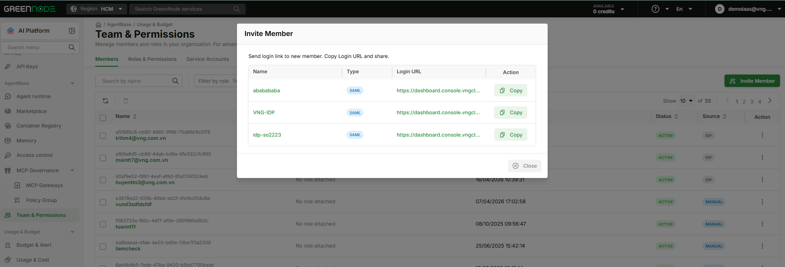
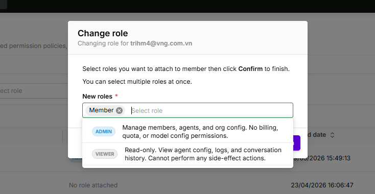

# Manage Members

> Guide for Root and Admin to view the member list, invite new members via IDP Login URL, remove members, and assign roles on the **Members** tab of **Team & Permissions**.

---

## Prerequisites

- Signed in with role **Root** or **Admin**

---

## Open the Members Tab

Go to [Team & Permissions](https://aiplatform.console.vngcloud.vn/team-permissions) — the **Members** tab opens by default.

The list shows: **Name**, **Role**, **Joined Date**, **Status**, **Source**, **Action**

| Column | Values |
|---|---|
| **Role** | Color badge: Root = purple, Admin = blue, Member = green, Viewer = gray · "No role attached" if unassigned |
| **Source** | `IDP` = logged in via Identity Provider · `MANUAL` = created manually in IAM |
| **Action** | ⋮ icon → **Change role** / **Delete** menu |

---

## Invite New Members

New members do not need a separate account — they log in via an **IDP Login URL**.

**Step 1:** Click **Invite Member** (top right)

**Step 2:** A popup shows the list of IDPs configured in IAM:

| Case | Result |
|---|---|
| **No IDP configured** | Popup notification — go to [IAM Identity Providers](https://iam.console.vngcloud.vn/identity-providers) to create an IDP first, then return to invite members |
| **IDP exists** | Popup listing IDPs: Name / Type / Login URL / **Copy** icon |

**Step 3:** Click the **Copy** icon → send the Login URL to the new member

**Step 4:** The member visits the link, authenticates via IDP → automatically added to the org with "No role attached"

**Step 5:** Root assigns a role to the newly logged-in member (see **Change Role** below)

---

## Remove a Member from the Org

**Step 1:** Find the member in the list (use the search bar or filter by role)

**Step 2:** Click the **⋮** icon on the member's row → select **Delete**

**Step 3:** Confirm the dialog → click **Confirm**


The Root Account cannot be removed. Ownership transfer is handled separately in IAM.


---

## Change a Member's Role

**Step 1:** Click the **⋮** icon on the member's row → select **Change role**

**Step 2:** The **Change role** popup appears — select one or more roles to assign:

| Role | Description |
|---|---|
| **Admin** | Manage members, agents, and org config. No billing, quota, or model config permissions. |
| **Member** | Create and run own agents. View logs & traces. |
| **Viewer** | Read-only. View agent config, logs, and conversation history. Cannot perform any side-effect actions. |

**Step 3:** Click **Confirm** — the change takes effect immediately, no logout/login required

---

## Next Steps

| I want to... | Go to |
|---|---|
| Understand permissions for each role | [Roles & Permissions](roles-and-permissions.md) |
| View Service Accounts for agents | [Manage Service Accounts](manage-service-accounts.md) |