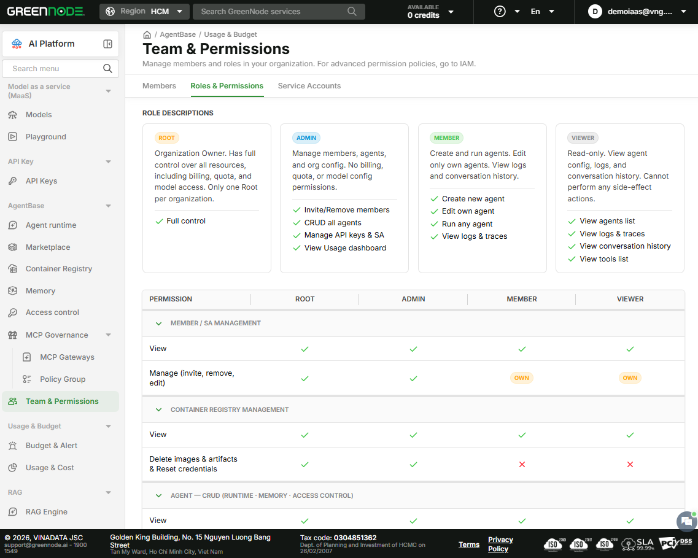

# Roles & Permissions

> Read-only permission matrix — helps Root and Admin understand what each role can do before assigning it to a member.

***

## Open the Roles & Permissions Tab

Go to [Team & Permissions](https://aiplatform.console.vngcloud.vn/team-permissions) → **Roles & Permissions** tab

***

## Role Descriptions

| Role       | Key Capabilities                                                                             |
| ---------- | -------------------------------------------------------------------------------------------- |
| **Root**   | Billing & Quota management · Model Access configuration · Full control over members & agents |
| **Admin**  | Invite/Remove members · CRUD all agents · Manage API Keys & SAs · View Usage dashboard       |
| **Member** | Create new agents · Edit own agents · Run any agent · View logs & traces                     |
| **Viewer** | View agent list · View logs & traces · View conversation history · View tool list            |

***

## Permission Matrix

> ✅ Full access  ·  🔸 Own only (own resources)  ·  ✕ No access

| Permission Group           | Permission                                   | Root | Admin | Member | Viewer |
| -------------------------- | -------------------------------------------- | :--: | :---: | :----: | :----: |
| **Member / SA Management** | View                                         |   ✅  |   ✅   |    ✅   |    ✅   |
|                            | Manage (invite, remove, edit)                |   ✅  |   ✅   |   🔸   |   🔸   |
| **Container Registry**     | View                                         |   ✅  |   ✅   |    ✅   |    ✅   |
|                            | Delete images, artifacts & reset credentials |   ✅  |   ✅   |    ✕   |    ✕   |
| **Agent — CRUD**           | View                                         |   ✅  |   ✅   |    ✅   |    ✅   |
|                            | Create & edit agents, memory, access control |   ✅  |   ✅   |    ✅   |    ✕   |
|                            | Delete agents, memory, access control        |   ✅  |   ✅   |    ✕   |    ✕   |
| **Tools & Integrations**   | View                                         |   ✅  |   ✅   |    ✅   |    ✅   |
|                            | Create, edit, delete                         |   ✅  |   ✅   |    ✕   |    ✕   |
| **API Keys**               | Create API key                               |   ✅  |   ✅   |    ✅   |    ✕   |
|                            | View & delete API key                        |   ✅  |   ✅   |    ✕   |    ✕   |
| **Usage & Budget**         | View usage & cost                            |   ✅  |   ✅   |    ✅   |    ✅   |
|                            | View & edit budget                           |   ✅  |   ✕   |    ✕   |    ✕   |
| **Rate Limit & Model**     | View                                         |   ✅  |   ✅   |    ✅   |    ✅   |
|                            | Create & edit                                |   ✅  |   ✅   |    ✕   |    ✕   |

**🔸 Own only explained:**

* **Member / SA Management — Manage**: Member and Viewer can only change their own password

_Admin can only assign roles within Workspace scope._

***

## Next Steps

| I want to...                     | Go to                                                 |
| -------------------------------- | ----------------------------------------------------- |
| Assign or change a member's role | [Manage Members](manage-members.md)                   |
| View Service Accounts for agents | [Manage Service Accounts](manage-service-accounts.md) |
