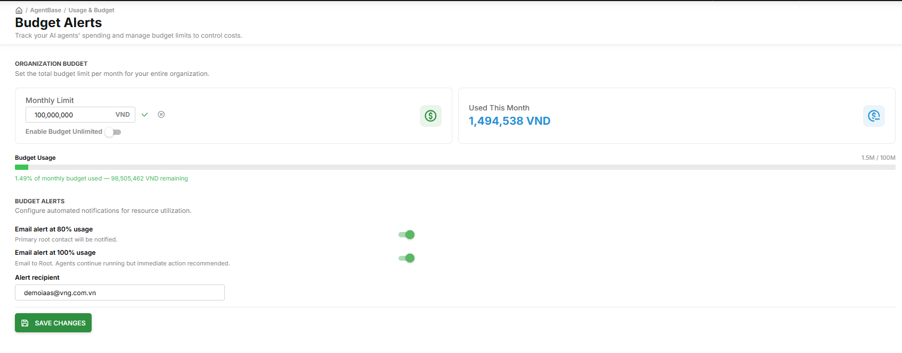

# Configure Budget & Alerts

> Guide for Root to set a monthly budget limit (VND), monitor spending, and configure automated alerts when costs approach the limit.

---

## Prerequisites

- Signed in with **Root** role (Budget & Alerts is Root-only; Admin and Member do not have access)

---

## Enable Budget Limit for the First Time

**Step 1: Open Budget & Alerts**

1. Go to **AgentBase** → sidebar → **Usage & Budget** → **Budget & Alerts**

**Step 2: Enter the limit and save**

1. Enter a value in the **Monthly Limit** field:

| Field | Example | Notes |
|---|---|---|
| **Monthly Limit** | `100,000,000` | Enter the VND amount |

> Currency is fixed at **VND** — no other currency option is available.
> **Enable Budget Unlimited** toggle: when turned ON, the system removes the monthly cap and allows unlimited spending. Leave it OFF to keep the limit active.

2. Click the confirm icon (✓) next to the input field to save

**Step 3: Confirm the budget is active**

After saving, the page shows:

- **Monthly Limit**: The VND value you set (with an edit icon)
- **Used This Month**: Current month's spending (VND)
- **Budget Usage** section: progress bar + percentage used + remaining VND
- **Budget Alerts** section: two alert toggles, both ON by default

---

## View Budget Status

When a budget is set, the **Budget Usage** section shows:

| Component | Description |
|---|---|
| **Progress bar** | Solid color bar that changes by total %: green (0–69%) / yellow (70–79%) / orange (80–99%) / red (100%+) |
| **"X.XM / XXXM" label** | Used / Limit displayed at the right of the section title |
| **MaaS legend** | MaaS — Model API calls · X,XXX,XXX VND · X% |
| **Runtime legend** | Runtime — Agent compute · X,XXX,XXX VND · X% |
| **Monthly Projection** | Estimated month-end spend (shown after ≥ 3 days have passed in the current month) |

---

## Configure Alert Thresholds

The **Budget Alerts** section shows two fixed thresholds — both are ON by default when a budget is set:

| Threshold | Action when reached |
|---|---|
| **Email alert at 80% usage** | Email sent to the configured alert recipient — primary root contact will be notified. |
| **Email alert at 100% usage** | Email sent to the alert recipient — agents continue running but immediate action is recommended. |

- **Alert recipient**: Enter the email address to receive alerts (editable field)
- Each threshold sends email only **once per month** — no repeated alerts on each cron run
- Click **Save Changes** after adjusting toggle states or updating the recipient address


Budget Alerts only **notify** — they do not automatically stop agents or block requests when the limit is exceeded. To reduce costs immediately, manually stop the Runtime.


---

## Edit Budget Limit Mid-Month

1. Click the ✏️ icon on the **MONTHLY LIMIT** KPI card
2. Enter the new value → click **Save**

**When increasing the limit:**
- `used%` recalculates immediately against the new limit
- All alert flags reset — the 80% and 100% thresholds apply to the new limit

**When decreasing the limit below current spending:**


If the new limit is lower than the amount already spent this month, a confirmation dialog appears:
> "New limit is lower than current spending (X VND). The org will immediately be in an over-budget state. Are you sure?"

Click **Confirm** to save — the system immediately sends the 100% alert email (without waiting for the cron job), and the progress bar turns red.


---

## Remove the Budget Cap

1. Turn on the **Enable Budget Unlimited** toggle
2. Confirm the dialog: "Enabling Budget Unlimited means charges will apply without a monthly cap. Continue?"
3. Click **Confirm**

After enabling:
- The Monthly Limit is disabled
- The Budget Alerts section becomes disabled (greyed out)
- The warning banner on the Usage tab in Usage & Cost disappears automatically

---

## Monthly Budget Reset

At 00:00 on the 1st of each month, the system automatically:
- Resets **Used this month** to 0
- Applies the same budget limit to the new month (always recurring)
- Resets alert flags (the 80% and 100% thresholds can trigger again in the new month)

---

## Result

| I want to... | Go to |
|---|---|
| View cost breakdown by agent / provider / model | [View Usage & Cost](view-usage-cost.md) |
| Usage & Budget overview | [Usage & Budget](README.md) |
