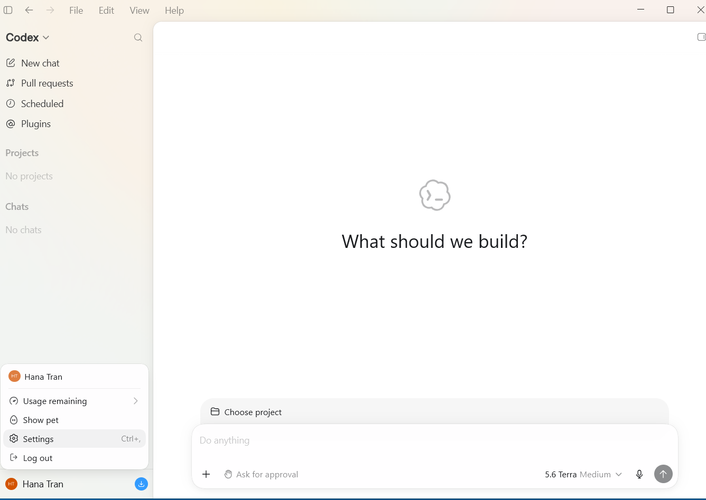
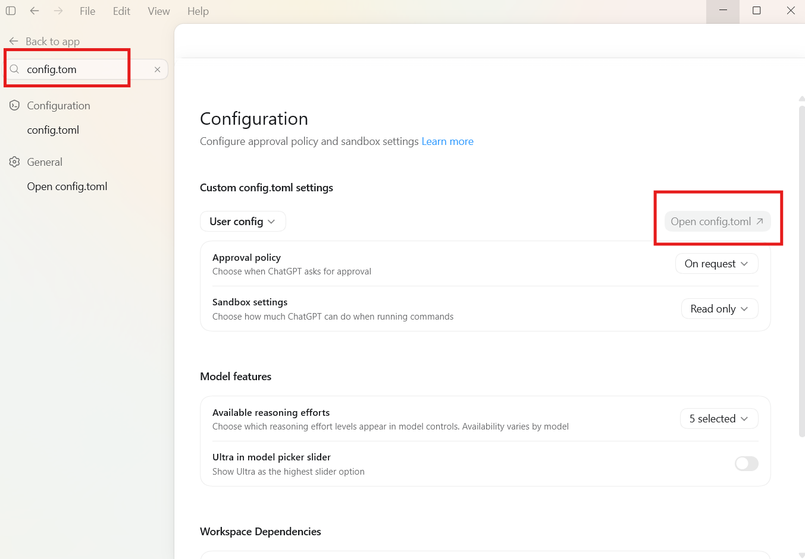
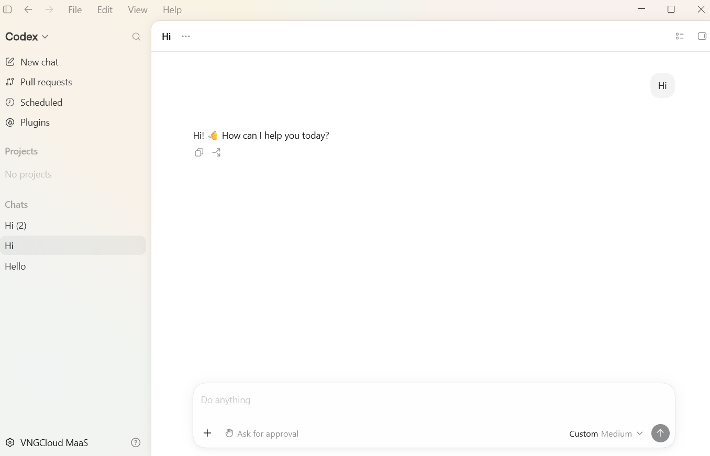

# Connect Codex Desktop to GreenNode MaaS (GLM 5.2)

> For **beginners** on macOS or Windows. Configure it by editing a `config.toml` file from Settings — you can ask an AI to help draft it, no need to know TOML syntax. Codex Desktop will use GreenNode's self-hosted **GLM 5.2** model.


**First, complete the [Prerequisites](../getting-started.md):** an **ACTIVE** API key, the Base URL, and the GLM 5.2 model **ENABLED**. This page only covers install and configuration.


You'll need these 3 values (from the Prerequisites page):

| Info                       | Value                                                                           |
| -------------------------- | ------------------------------------------------------------------------------- |
| Base URL (OpenAI standard) | `https://maas-llm-aiplatform-hcm.api.vngcloud.vn/v1` (**with** `/v1`) |
| Base URL (Token Plan / package key) | `https://tokenplan.api.greennode.ai/v1` — see [Token Plan](../../token-plan/README.md) |
| API key                    | your`vn-...` key                                                              |
| Model ID                   | `z-ai/glm-5.2`                                                                |


**GLM 5.2 is just an example model.** GreenNode offers many models — swap in whichever one you want. Each model's Model ID and Base URL are on its [model detail page](https://aiplatform.console.greennode.ai/models).


---

## Step 1 — Download and install Codex Desktop

Go to **[openai.com/index/introducing-the-codex-app](https://openai.com/index/introducing-the-codex-app/)** and download the app for your machine, then install it like a normal app.

---

## Step 2 — Open the app and log in

Open Codex and log in with your ChatGPT/OpenAI account.

<figure><figcaption><p>Codex home screen after logging in</p></figcaption></figure>

---

## Step 3 — Open the config.toml file

1. Click your avatar/account name in the bottom-left corner → **Settings**.
2. In the left search box, type **"config.toml"**.
3. Click **Open config.toml** in the top-right of the **Custom config.toml settings** section — the file opens in your machine's default editor.

<figure><figcaption><p>Find and open config.toml in Settings</p></figcaption></figure>

---

## Step 4 — Add the self-hosted model configuration

Add the following block to the **end** of `config.toml` (keep the existing content above it):

```toml
[model_providers.vngcloud-glm]
name = "VNGCloud GLM"
base_url = "https://maas-llm-aiplatform-hcm.api.vngcloud.vn/v1"
experimental_bearer_token = "vn-...your-key..."
wire_api = "responses"
stream_idle_timeout_ms = 3000000
request_max_retries = 3
supports_websockets = false

[profiles.glm]
model = "z-ai/glm-5.2"
model_provider = "vngcloud-glm"
model_context_window = 200000
model_auto_compact_token_limit = 200000
model_reasoning_effort = "medium"
model_reasoning_summary = "auto"
```

**Key fields explained:**

| Field                            | Purpose                                                                                                    |
| -------------------------------- | ---------------------------------------------------------------------------------------------------------- |
| `model_providers.vngcloud-glm` | A provider name you choose — reused in`model_provider` below                                            |
| `base_url`                     | The OpenAI-standard Base URL,**with** `/v1`                                                        |
| `experimental_bearer_token`    | Your API key, pasted directly into the file — Codex Desktop doesn't need an exported env var like the CLI |
| `wire_api`                     | Keep as`"responses"` — the Responses API standard Codex Desktop uses                                    |
| `stream_idle_timeout_ms`       | Max idle time (ms) before the stream is treated as timed out                                              |
| `request_max_retries`          | Number of retries on a failed request                                                                      |
| `supports_websockets`          | Keep as `false` — MaaS doesn't support websockets yet                                                     |
| `profiles.glm`                 | A profile name you choose — appears in the app's model picker                                             |
| `model`                        | The Model ID sent to MaaS                                                                                  |
| `model_provider`               | Points back to the provider declared above                                                                 |
| `model_context_window`         | Set manually since MaaS doesn't expose model metadata                                                      |
| `model_auto_compact_token_limit` | Token threshold at which Codex auto-compacts the context                                                 |
| `model_reasoning_effort`       | Default reasoning effort (`low` / `medium` / `high`)                                                       |
| `model_reasoning_summary`      | Keep as `"auto"` — lets Codex decide whether to summarize its reasoning                                    |


**Don't copy the environment-variable style config used for Claude Code** (`export ANTHROPIC_BASE_URL=...`, `claude --model ...`) — that syntax is specific to Claude Code CLI and **doesn't** apply to Codex. Codex Desktop reads its config from `config.toml` using `model_providers` / `profiles` as shown above.



**Not comfortable with TOML syntax?** Copy the full content of your current `config.toml`, paste it into an AI chat (Codex, ChatGPT, Claude...) along with the 3 values above (Base URL / API key / Model ID), and ask it to write the `[model_providers.*]` and `[profiles.*]` blocks in the correct Codex format, then paste the result back into the file.


---

## Step 5 — Save the file and restart Codex

1. Save `config.toml`.
2. Fully quit and reopen Codex Desktop.

---

## Step 6 — Verify

1. In the chat panel, click the model picker (bottom-right corner, e.g. **"5.6 Terra Medium"**).
2. Find the profile you just added (e.g. **glm**) in the list — select it.
3. Type a test message, e.g. *"Write a function to add two numbers in Python."* If it responds, you're set.
4. Check the **[AI Platform Console](https://aiplatform.console.greennode.ai/)** to see the call logged.

<figure><figcaption><p>Configuration succeeded — chat responds and the model picker shows "Custom" instead of the default model</p></figcaption></figure>


**Note on switching between the default model and your self-hosted model:** If you pick a default Codex model directly from the model picker (UI), the app **only overwrites the `model` field** in `config.toml` — it does **not** reset `model_provider` back to the default (`openai`) provider. If you later want to switch back to the self-hosted model, selecting it through the UI can leave `model` and `model_provider` out of sync (pointing at mismatched providers). To be safe, whenever you switch between the default model and your self-hosted model, **edit `model` / `model_provider` directly in `config.toml`** (or ask an AI to edit it for you) instead of just switching through the model picker.


---

## Troubleshooting

| Symptom                                                                             | Cause                                                                                                                               | Fix                                                                                                                                |
| ----------------------------------------------------------------------------------- | ----------------------------------------------------------------------------------------------------------------------------------- | ---------------------------------------------------------------------------------------------------------------------------------- |
| New profile doesn't show in the model picker                                        | App wasn't restarted, or the`[profiles.*]` section name is wrong                                                                  | Fully quit and reopen Codex; recheck the TOML syntax                                                                               |
| `401` / "Unauthorized"                                                            | Wrong or not-yet-ACTIVE API key                                                                                                     | Recheck your key; wait for**ACTIVE** status                                                                                  |
| `404` / "Not Found"                                                               | Wrong Base URL (missing`/v1`)                                                                                                     | Should be exactly`https://maas-llm-aiplatform-hcm.api.vngcloud.vn/v1`                                                            |
| App errors out / can't read config                                                  | Invalid TOML syntax (missing quotes, wrong indentation)                                                                             | Ask an AI to check the block you added, or compare it against the Step 4 sample                                                    |
| No response even with the right model selected                                      | Out of credit, model auto-disabled                                                                                                  | Top up credit in the AI Platform Console                                                                                           |
| Switched models via the model picker (UI) and the self-hosted model stopped working | `model` and `model_provider` in `config.toml` are out of sync — the picker only overwrites `model`, not `model_provider` | Reopen`config.toml`, fix `model` / `model_provider` back to a matching pair (see the Step 4 sample), save, and restart Codex |

---

| I want to next...     | Go to                                                          |
| --------------------- | -------------------------------------------------------------- |
| Use the CLI version   | [Codex CLI](../cli-tools/codex-cli.md)                          |
| See the prerequisites | [Getting Started with AI Coding](../getting-started.md)         |
| View usage & billing  | [AI Platform Console](https://aiplatform.console.greennode.ai/) |

---

## Need help?

If you've followed the steps and it's still not working, feel free to contact GreenNode Customer Support:

* Email: [support@greennode.ai](mailto:support@greennode.ai)
* Hotline: 19001549
* Help center: [helpdesk.greennode.ai](https://helpdesk.greennode.ai)

Thank you for using GreenNode's services.
