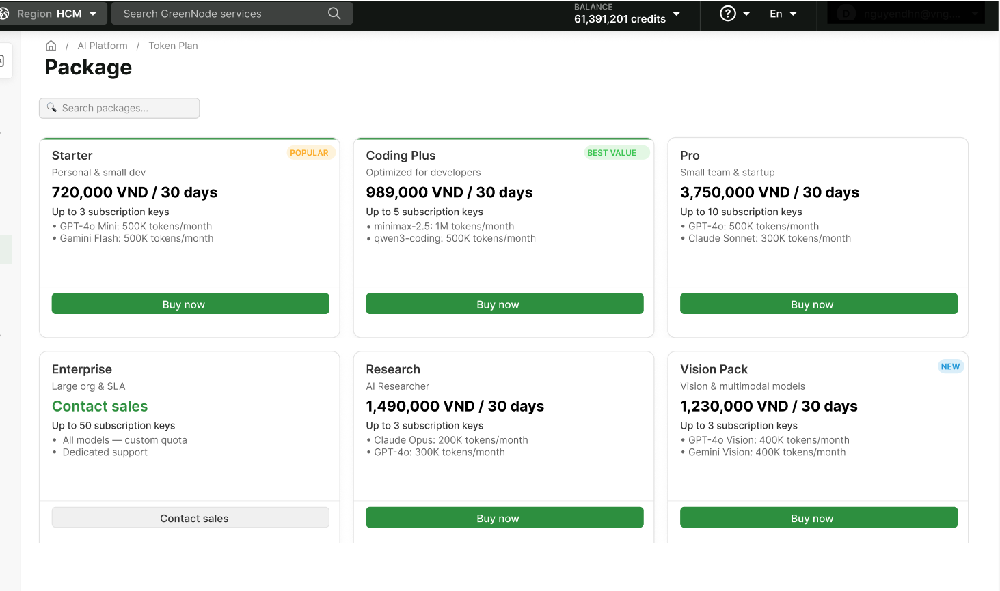

# Buy a Token Plan

> Guide to browsing the Packages catalog, viewing plan details, and buying a Token Plan.

---

## Prerequisites

- A GreenNode account with the **Root** or **Admin** role — only these 2 roles can buy plans
- The organization has enough **Credits** for the selected plan's price (billed in credits, 1 credit = 1 VND)

---

## Browse & view plan details

**Step 1: Open Packages**

1. Go to **AI Platform** → sidebar → **API Key** → **Token Plan** → **Packages**
2. The list shows each Plan Type as a card — for example **Token Plan Alpha**: `1,080,000 VND / 30 days`, included model (GLM 5.2), max subscription-key count (5 keys)

**Step 2: View details before buying**

1. Click a Plan Type to open **Package Detail**
2. Review Max keys, Model count, Duration, the token/request allowance per cycle, the **Included Models** table (Model, Status, Model code, Provider), **What happens when activated**, and the **Subscription Endpoint** (`https://tokenplan.api.greennode.ai/v1`, OpenAI SDK compatible)


Once purchased, a plan **cannot be swapped for a different Plan Type or returned on request**. To stop a plan mid-cycle, use **Delete** instead — the unused allowance for the current cycle is refunded pro rata to Credits (see [Manage Token Plan](manage-token-plan.md)).


---

## Buy a plan

**Step 1: Start the purchase**

1. Click **Buy Now** on the Plan Type card in the Packages list (or open Package Detail and click **Buy package**)

**Step 2: Confirm & pay**

The **Confirm & checkout** screen shows:

| Field | Example value | Notes |
|---|---|---|
| **Plan name** (required) | `ENG-GLM-1` | Letters a-z, A-Z, digits 0-9, `_`, `-`, `.` only; max 50 characters |
| **Plan price / Duration / VAT / Total** | `1,080,000 VND` / `30 days` / `Included` / `1,080,000 VND` | Computed from the selected Plan Type |
| **Auto-renew** | ON (default) | Renews automatically at the end of each cycle — can be turned off after purchase |
| **Payment method** | Credits (1 credit = 1 VND) | Deducted directly from the organization's Credits |
| **Balance** | Current Credits balance | Shown for you to check before confirming |

1. Fill in **Plan name**
2. Double-check the price against your **Balance**
3. Click **Confirm & Pay**


Confirming immediately deducts the amount shown as **Total** from the organization's Credits. Provisioning runs in the background — the gateway endpoint and subscription-key only appear fully on Plan Detail once provisioning finishes.


---

## Result

The plan appears in **My Token Plans** with status `ACTIVE`, **Auto-renew** ON, and the system auto-creates 1 default subscription-key named `default-key` with access to every model in the plan — ready to use once provisioning finishes.

| I want to... | Go to |
|---|---|
| Create more subscription-keys & manage the plan | [Manage Token Plan](manage-token-plan.md) |
| See the Token Plan overview | [Token Plan](README.md) |
