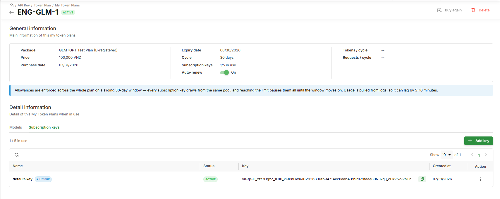
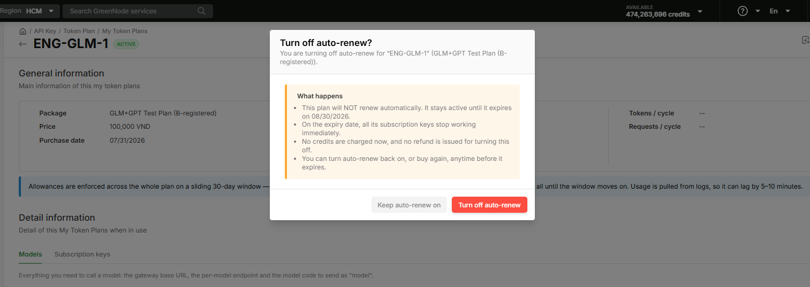
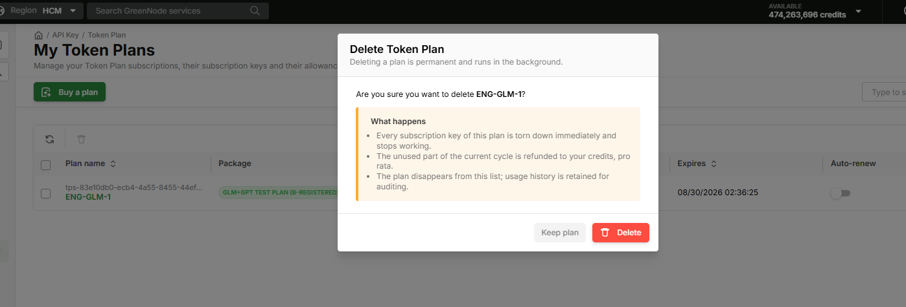

# Manage Token Plan

> Guide to viewing your purchased plans, configuring Auto-renew, deleting/cancelling a plan, and creating/managing subscription-keys within a plan's allowance.

---

## Prerequisites

- Have purchased at least 1 Token Plan — see [Buy a Token Plan](buy-token-plan.md)
- **Root/Admin** role to toggle Auto-renew and delete/cancel a plan; **Developer** to create/manage subscription-keys within the plan's limits; **Viewer** for read-only access

---

## How the allowance works

Each plan grants a flat amount of **tokens and requests per model**, tracked independently per model — there is **no** time-window split (no 6h/weekly windows) and **no** transfer between models. Every subscription-key in the same plan **shares** that model's allowance.

For example, the **Token Plan Alpha** plan (`1,080,000 VND / 30 days`, up to 5 subscription-keys) grants **100,000,000 tokens/cycle** for the **GLM 5.2** model. Every API call deducts from this pool until it's exhausted.


When a model's pool reaches 0, calls to that model are paused until the plan enters a new cycle (after renewal). To keep using it right away, buy another plan or switch to your PAYG API Key. The system still applies a separate rate limit at the model level to protect shared infrastructure — independent of the plan's token/request pool.


---

## View the My Token Plans list

**Step 1: Open the page**

1. Go to **AI Platform** → sidebar → **API Key** → **Token Plan** → **My Token Plans**
2. Each plan shows its name, Plan Type, status, purchase date, expiry date (Expires), Auto-renew, and subscription-keys in use (Keys used)

**Plan status:**

| Status | Meaning |
|---|---|
| `ACTIVE` | The plan is currently active |
| `EXPIRED` | The plan has expired and was not renewed |

**Actions on the Plan Detail page:** **Buy again** (buy the same Plan Type again) and **Delete** (delete/cancel the plan — see below).

---

## View Plan Detail

1. Click the plan's name in **My Token Plans**
2. The **Plan Detail** page shows **General information**: Package, Price, Purchase date, Expiry date, Cycle, subscription-keys in use (e.g. `1/5 in use`), Auto-renew status, and Tokens/cycle, Requests/cycle allowances
3. The **Detail information** section has 2 tabs:

| Tab | Content |
|---|---|
| **Models** | The gateway base URL shared by the whole plan, and a table of the plan's models (Model, Model code, Enabled types, per-model Endpoint) — used to call the API |
| **Subscription keys** | The keys created in this plan (Name, Status, Key, Created at) — create new, enable/disable, rename, delete |

---

## View detailed plan usage

Plan Detail only shows the total allowance (Tokens/cycle, Requests/cycle) — Token Plan does **not** have its own usage tab yet. For an Admin to see detailed usage over time or by model for a specific plan, use the [Usage & Cost](../usage-budget/view-usage-cost.md) dashboard and filter by that plan's subscription-key:

1. Go to [Usage & Cost](../usage-budget/view-usage-cost.md)
2. In the **All API Keys** filter, select the subscription-key(s) belonging to the plan you want to view — subscription-keys appear in the same list as PAYG API Keys, distinguished by Key Type = `Plan: {plan name}` on the [Access Control](../agent-base/access-control/README.md) page
3. The dashboard shows usage/cost filtered to that plan


If a plan has multiple subscription-keys, select each one (or all of them) in the filter to see the plan's total usage.


---

## Toggle Auto-renew

1. In the list or in Plan Detail, click the **Auto-renew** toggle
2. The **Turn off auto-renew?** popup clearly states the impact:
   - The plan will **not** renew automatically — it stays `ACTIVE` until its expiry date
   - On the expiry date, every subscription-key in the plan stops working immediately
   - No credits are charged now, and **no refund** is issued for turning this off
   - You can turn Auto-renew back on, or **Buy again**, anytime before it expires
3. Click **Turn off auto-renew** to confirm, or **Keep auto-renew on** to leave it unchanged


When Auto-renew is on (the default), the system renews before expiry; if credit is insufficient, it retries — if that also fails, the plan becomes `EXPIRED`.


---

## Delete/cancel a plan

1. In **Plan Detail**, click **Delete** (top right) — or in **My Token Plans**, select the checkbox for one or more plans and click the trash icon (bulk action)
2. The **Delete Token Plan** popup clearly states the impact:
   - Every subscription-key in the plan is torn down and stops working **immediately**
   - The **unused** allowance for the current cycle is refunded **pro rata** to Credits
   - The plan disappears from **My Token Plans**; usage history is retained for auditing
3. Click **Delete** to confirm, or **Keep plan** to cancel


Deleting a plan runs in the background and **cannot be undone** — a deleted plan cannot be restored. Only use this when you're sure you want to stop the plan mid-cycle.


---

## Create a subscription-key

**Step 1: Open Add key**

1. Go to **Plan Detail** → **Subscription keys** tab → click **+ Add key**

**Step 2: Name it & create**

1. Fill in **Key name** — a friendly name to identify the key
2. The popup shows what the key inherits from the plan: access to every model in the plan, the plan's shared token/request allowance, and the same gateway endpoint
3. Click **Create key**

The new key appears in the **Subscription keys** tab with status `ACTIVE`, and automatically shows up on the [Access Control](../agent-base/access-control/README.md) page with Key Type = `Plan: {plan name}` — the same record, no duplicate.


Every newly purchased plan already includes 1 default key named `default-key` (marked **Default**) — you don't need to create a key right away to start calling models.



Calling a model outside the plan is blocked at the gateway with a `403 Forbidden` error. When a plan expires or is deleted, every subscription-key in that plan stops working immediately — the next request returns `402 Payment Required`.


---

## Manage a subscription-key

1. In the **Subscription keys** tab, click the **⋮** icon on the key's row
2. Choose **Enable** / **Disable**, **Rename**, or **Delete**


Disabling or deleting a subscription-key immediately revokes that key's ability to call models.


---

## Using a subscription-key with an AI coding tool

Once you have a subscription-key and the model is included in the plan, calling the model works **exactly like the existing PAYG API Key flow** — only the `base_url` and key differ:

| | PAYG API Key | Subscription-key (Token Plan) |
|---|---|---|
| Base URL | GreenNode MaaS Endpoint | `https://tokenplan.api.greennode.ai/v1` |
| Key | API Key | Subscription-key |
| Compatibility | OpenAI SDK | OpenAI SDK |

Send a `POST` request to the endpoint above with the header `Authorization: Bearer <subscription-key>` and `"model": "<model code>"` in the body (get the model code from the **Models** tab, e.g. `glm-5.2`).

See [Connect OpenAI-compatible tools to GreenNode MaaS](../ai-coding/connect-openai-compatible-to-maas.md) for client setup (OpenAI SDK, LiteLLM, Cursor, Continue.dev, Claude Code...) — just swap the Base URL and API Key per the table above; every other step stays the same.

---

## Result

You can track each plan's allowance, control renewal or delete a plan when needed, and issue subscription-keys that share the plan's allowance across any agent or dev tool.

| I want to... | Go to |
|---|---|
| Buy another plan | [Buy a Token Plan](buy-token-plan.md) |
| View overall usage & cost | [Usage & Budget](../usage-budget/README.md) |
| Configure Rate Limit | [Rate Limit](../agent-base/protect-govern/rate-limit.md) |
