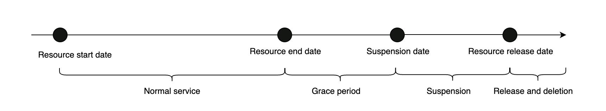

# Renew expiring resources

When your subscription-based resources are about to expire, please renew them in a timely manner to avoid service interruptions caused by resource suspension, release, or permanent deletion. To ensure uninterrupted service, please maintain a sufficient account balance.

**Resource renewal feature applies to**

* Target: Prepaid users.
* Source of money: GreenNode wallet or other sources (done through the payment gateway).
* Resources: All resources of GreenNode products that allow extension.

### Status Changes After Resource Expiration

If you do not renew a resource after it expires, the service may be suspended or limited. After a certain period of time, the system will automatically release the resource. Once a resource is released, all data will be permanently deleted and cannot be recovered.\
After expiration, resources go through three stages: Grace Period, Suspension, and Release and Deletion.

#### Post-Expiration Stages

**Grace Period**:\
From Day 1 to Day 15 after the end of the previous billing cycle. During this period, the resource continues to operate normally.

\
**Suspension**:\
From Day 15 to Day 30 after the end of the previous billing cycle. The service is stopped, but the resource and data are retained.

\
**Release and deletion**:\
After 30 days from the end of the previous billing cycle. The system automatically releases the resource and permanently deletes all data.

### Lifecycle Summary Table

<figure><figcaption></figcaption></figure>

| Stage                | Status     | Service         | Data Status | Renewable |
| -------------------- | ---------- | --------------- | ----------- | --------- |
| Normal Operation     | Active     | Fully available | Safe        | Yes       |
| Grace Period         | Restricted | Limited         | Retained    | Yes       |
| Suspension           | Suspended  | Not available   | Retained    | Yes       |
| Release and deletion | Deleted    | Not available   | Lost        | No        |

### Expiration Notifications and Renewal Monitoring

7 days before expiration (T-7), the system begins sending renewal reminder emails on a scheduled basis.

After the expiration date (T), the system continues sending reminder emails until:

* The resource is renewed
* The resource is released and deleted from the system.

### Resource Renewal

You may renew a resource at any time before it is released.\
The new service period starts immediately after the previous subscription period ends.

* Renewal before expiration supports both manual and automatic methods&#x20;
* Renewal after expiration supports manual renewal only

**Renew resources before expiration**

<figure><figcaption></figcaption></figure>

**Renew resources after expiration**

<figure><figcaption></figcaption></figure>

### Renewal Methods

| Renewal Method    | Renewal Timing                    | How It Works                                                                                                                                                                                                                                                                                                                                                                                                                            |
| ----------------- | --------------------------------- | --------------------------------------------------------------------------------------------------------------------------------------------------------------------------------------------------------------------------------------------------------------------------------------------------------------------------------------------------------------------------------------------------------------------------------------- |
| Manual Renewal    | Before the resource is released   | You manually initiate the renewal. The resource validity period is extended immediately after successful payment.                                                                                                                                                                                                                                                                                                                       |
| Automatic Renewal | Must be enabled before expiration | 
• You configure automatic renewal in advance. • The system automatically attempts payment at key milestones: 7 days, 4 days, and 1 day before expiration, as well as on the expiration date. • If all payment attempts fail on the expiration date, automatic renewal stops. You must then renew manually (if the resource is still within its allowed renewal period). • You can cancel automatic renewal at any time.
 |

