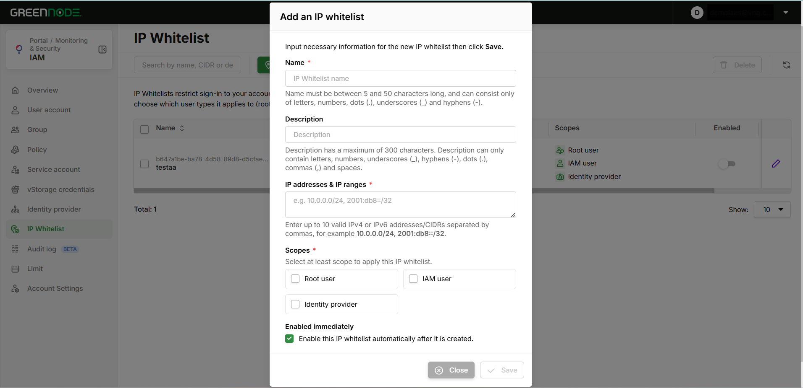

# Configure IP Whitelist

> This guide helps you restrict sign-in to your GreenNode account to approved networks only, using the **IP Whitelist** feature in IAM.

---

## Overview

**IP Whitelist** is an access control layer at the sign-in stage: while a whitelist is enabled, users in the matching **Scope** can only sign in from a source IP that falls inside the declared list.

Each whitelist entry has three parts:

* one or more allowed **IP addresses / IP ranges (CIDR)**,
* one or more **Scopes** — the user types the rule applies to,
* an **Enabled** state — whether the rule is in effect.

### Supported scopes

| Scope | Applies to |
|---|---|
| **Root user** | The root (registration) account |
| **IAM user** | IAM users belonging to the account |
| **Identity provider** | Users signing in through an Identity Provider |


Service Accounts are **not** among the available Scopes, so IP Whitelist does not affect Service Account authentication (API, Terraform, CLI).


---

## Prerequisites

* A GreenNode account with access to the IAM Console.
* Sign in as the **Root user**, or as an IAM user attached to a Policy that grants IP Whitelist management permissions.
* Know your **current public IP** and the network ranges you need to allow (office, corporate VPN, NAT gateway…).

---

## Open the IP Whitelist page

1. Sign in to the [IAM Console](https://iam.console.greennode.ai/).
2. Select **IP Whitelist** in the left menu (route [https://iam.console.greennode.ai/ip-whitelists](https://iam.console.greennode.ai/ip-whitelists)).

<figure><figcaption><p>The IP Whitelist list in the IAM Console</p></figcaption></figure>

### Table columns

| Column | Meaning |
|---|---|
| **Name** | Whitelist name, shown together with its resource ID (click the ID to copy) |
| **Description** | Description; hover to see the full text if it is truncated |
| **IP addresses/IP ranges** | The IP/CIDR list; up to 5 items are shown, click **View all (n)** for the rest |
| **Scopes** | The user types the rule applies to |
| **Enabled** | Quick on/off toggle for the rule |
| **Created at** | Creation time, formatted `dd/MM/yyyy HH:mm:ss` |

You can sort by **Name** and **Created at** (newest first by default). The list is paginated; change the page size in the **Show** selector below the table.

### Toolbar

| Control | Purpose |
|---|---|
| Search box | Filters by name, IP/CIDR or description — case-insensitive, substring match |
| **Add an IP whitelist** | Opens the create form |
| **Delete** | Enabled only when at least one row is selected |
| Reload icon | Clears the search keyword, returns to page 1 (10 rows per page) and reloads the data |

Filter and pagination state is kept in the URL (`?whitelist-ip=...&pageNumber=...&pageSize=...`), so you can copy the link to share exactly what you are looking at.

When the account has no whitelist yet, the page shows an introduction screen with an **Add an IP whitelist** button.

---

## Create an IP whitelist

**Step 1: Open the create form**

1. Click **Add an IP whitelist** in the toolbar.

<figure><figcaption><p>The Add an IP whitelist form</p></figcaption></figure>

**Step 2: Fill in the whitelist details**

1. Enter a **Name** to identify the rule.
2. Enter a **Description** (optional) to record what the rule is for.
3. Enter the IP list in **IP addresses & IP ranges**, separated by commas.
4. Tick at least one entry under **Scopes**.
5. Keep or clear **Enabled immediately**, depending on when you want the rule to take effect.

| Field | Required | Input rules |
|---|---|---|
| **Name** | Yes | 5–50 characters; letters, digits, dots (`.`), underscores (`_`) and hyphens (`-`) only |
| **Description** | No | Up to 300 characters; letters, digits, `_`, `-`, `.`, `,` and spaces only |
| **IP addresses & IP ranges** | Yes | Up to 10 comma-separated IPv4/IPv6 items; each item is a plain IP (`10.0.0.1`) or a CIDR (`10.0.0.0/24`, `2001:db8::/32`) |
| **Scopes** | Yes | Select at least one of **Root user**, **IAM user**, **Identity provider** |
| **Enabled immediately** | No | Ticked by default — the rule takes effect as soon as it is created. Clear it to create the rule now and activate it later |

Example of a valid **IP addresses & IP ranges** value:

```text
203.0.113.10, 10.0.0.0/24, 2001:db8::/32
```

**Step 3: Save the rule**

1. Click **Save**.

**Save** becomes active only when the form is valid and at least one Scope is selected. The hint line under each field turns red when the value is invalid.


If you leave **Enabled immediately** ticked and the IP list does not contain your current IP, the rule takes effect right away and you may be blocked at your next sign-in. Read [Safe rollout](#safe-rollout-avoid-locking-yourself-out) before enabling it.


---

## Enable or disable an IP whitelist

1. Flip the switch in the **Enabled** column on the matching row.
2. Confirm in the dialog that appears.

A disabled whitelist is still stored but has **no effect** on sign-in. This is the safe way to temporarily lift a rule without deleting its configuration.

---

## Edit an IP whitelist

1. Click the **pencil** icon at the end of the row you want to change.
2. Update **Name**, **Description**, **CIDRs** or **Scopes**.
3. Click **Save**.

<figure><figcaption><p>The Edit IP whitelist form</p></figcaption></figure>

Notes when editing:

* The **Enabled** state cannot be changed here — use the toggle in the table's **Enabled** column.
* **Save** becomes active only once you actually change a value and the form is still valid.
* The IP list is **replaced as a whole**, not appended to. To add a range, keep the existing ones in the box and append the new one after a comma.

---

## Delete an IP whitelist

1. Tick one or more rows in the checkbox column (tick the header checkbox to select the whole current page).
2. Click **Delete** in the toolbar.
3. Review the whitelist names listed in the dialog, then click **Delete** to confirm.

Items are deleted in parallel and each one reports its own result, so a failure on one item does not stop the others.


Deletion **cannot be undone**. If you only want to pause a rule, turn off its **Enabled** toggle instead of deleting it.


---

## Safe rollout — avoid locking yourself out

Enabling a whitelist that does not include your current IP can leave you — and the Root user — unable to sign in. The procedure below keeps that risk under control:

1. Determine your **current public IP** before creating the rule.
2. Create the whitelist with **Enabled immediately** **cleared**, then re-check the IP list and the Scopes.
3. Include backup networks (corporate VPN, a second office) in the same whitelist up front.
4. Enable the whitelist, then try signing in from another browser or an incognito session **before** closing your current one.
5. For dynamic ISP addresses, use a wide enough CIDR instead of a single IP so you are not blocked when the address changes.


If every user is already blocked, there is no self-service recovery on the Portal — contact the GreenNode 24/7 support team for assistance.


---

## Troubleshooting

| Symptom | Common cause | What to do |
|---|---|---|
| **Save** stays disabled | A field is still invalid, no Scope is selected, or (when editing) nothing has changed yet | Check the red hint line under each field and tick at least one Scope |
| The IP hint line turns red | An item has the wrong format | Check the commas and CIDR prefixes (IPv4: 0–32, IPv6: 0–128); 10 items maximum |
| *Failed* notification on save | An error returned by the API (duplicate name, missing permission, connection issue) | Read the message in the notification and try again |
| Search returns nothing | The keyword only matches name, IP/CIDR and description | Click the reload icon to clear the filter |
| The table is empty although the account has whitelists | The IAM user has not been granted view permission | Check the Policies attached to your user or group |
| Cannot sign in after enabling | Your current IP is not covered by an enabled whitelist | Ask someone who still has access to disable the rule, or contact 24/7 support |

---

## Result

Once finished, your account only accepts sign-in from the network ranges you declared, for exactly the user types you selected. You can enable, disable or adjust the IP list at any time without affecting your other IAM configuration.

| I want to... | Go to |
|---|---|
| Tighten password and session timeout policies | [Pasword policy & session timeout](pasword-policy-and-session-timeout.md) |
| Review the security recommendations for IAM | [Security for IAM](security-for-iam.md) |
| Check who changed the IP Whitelist configuration | [Audit Logs Management](quan-ly-audit-logs.md) |
| Grant an IAM user permission to manage IP Whitelist | [Access Management via Policy](quan-ly-truy-cap-iam/quan-ly-truy-cap-qua-policy.md) |
