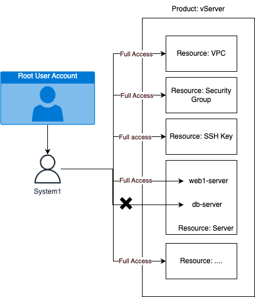

# Access control to specific resources

When there is a need for specific permission delegations on each resource, you need to create a Policy and accurately assign the Resource. In this guide, we will instruct you on how to grant permissions on each server of the vServer, for example, when you have 2 servers: web1-server and db-server, and you want User: System1 to have full rights over all Resources of the vServer, but only full rights over the Resource: server web1-server, not allowing any operations on the important server db-server. The model will be as below:

<figure><figcaption></figcaption></figure>

**To set up IAM according to the model above, we will have the following steps:**\
**Step 1: Create User: System1 if there is no User Account (note that if User: System1 already exists, ensure that User: System1 has no permissions or overlapping permissions with the guidance)**

**Step 2: Retrieve the ID information of the web server web1-server**

**Step 3: Create a Policy named vServerFullAccessWebServers that allows full access to all resources of vServer, but only full permissions on web1-server**

**Step 4: Attach Policy: vServerFullAccessWebServers to User: System1**

**Step 5: Log in and check the permissions of User: System1**

The details of the steps are as follows

Step 1: Create User: System1 if there is no User Account (note that if User: System1 already exists, ensure that User: System1 has no permissions or overlapping permissions with the guidance)\
Proceed to create a User Account by accessing the User Account tab in the IAM management page here, clicking Create a User Account, filling in the Username and Password information, and then clicking Create User Account

After successfully creating the User Account, it will be listed on the User Account page as shown below

Step 2: Retrieve the ID information of the server web1-server

Access the server management page here to obtain the server ID information, click Copy ID on the web1-server to get the ID, and save it for use in the next steps

Step 3: Create a Policy named vServerFullAccessWebServers that allows access to all Resources of vServer, but with full permissions only on web1-server

To create the Policy, go to the Policy tab on the IAM page here, click Create a Policy, name the Policy: vServerFullAccessWebServers and click Next step

Select Product: vserver and Actions: All vserver actions to select all actions of vServer

Then in the Resource section, click the arrow next to Resource to select Resource information, choose Any for other types of Resources, and for Resource: server, click Add a server to specify which server is allowed to operate

A popup will appear where you fill in the server ID information of web1-server, click Add to include it\
At this point, you will see that Resource: server contains the server ID of web1-server, if you want to add more server IDs, continue clicking Add a server to include them. Then click Create Policy to create the Policy

Step 4: Attach Policy: vServerFullAccessWebServers to User: System1

After successfully creating Policy: vServerFullAccessWebServers, you proceed to attach this Policy to User: System1. You can do this in either User Account or Policy; here we will guide you through Policy. Click on the name of the Policy to go to the Policy details page:

Select the Policy usage tab and click Attach to add User: System1

Select User: System1 and click Add

After adding User: System1 to Policy: vServerFullAccessWebServer, you will see information as below

Step 5: Log in and check the permissions of User: System1

At this point, you can log in to User: System1 to check permissions

Access the vServer here, when you have not logged into any account, you will be redirected to the sign-in page, choose "Sign-in With IAM User Account"

Enter the root user account email that User: System1 was previously created with, the IAM username and password of User: System1, and click Sign-in with IAM User Account

At this point, you will see User: System1 has full rights on server web1-server and other Resources of vServer.

Successfully accessed the details page of web1-server

Successfully turned off server web1-server:

Failed to access the details page of db-server:

Failed to turn off server db-server:

Thus, you have completed the assignment of permissions for User: System1 with full rights on all Resources of vServer, but only full rights on Resource: server which is: web1-server, not allowing operations on the important server which is db-server
