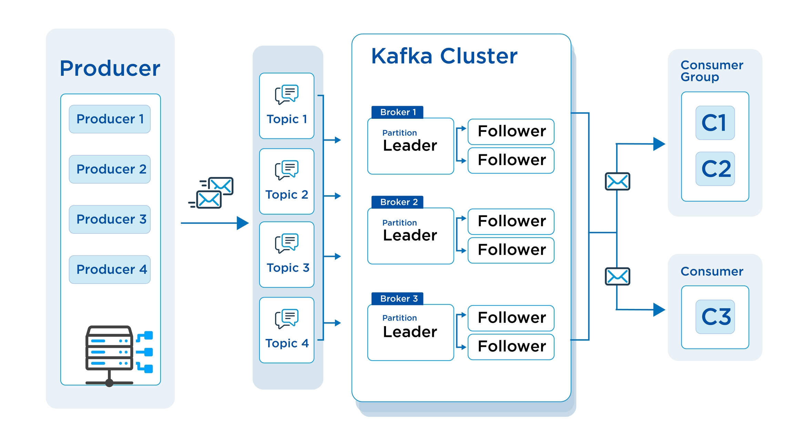

# Kafka Cluster Database (KDS)

Kafka Cluster DB is a new service on the vDB platform, providing a powerful and flexible Kafka server cluster to manage real-time event streaming. With Kafka Cluster DB, you can easily build large-scale data processing applications, messaging systems, and centralized logging with high scalability, data durability, and outstanding performance.

<figure><figcaption></figcaption></figure>

## Features 

**Comprehensive Kafka Cluster Management**

* **Create cluster:** Easily initialize Kafka clusters with flexible configuration options.
* **Adjust broker count:** Increase or decrease the number of brokers to meet data processing demands.
* **Expand storage:** Increase storage capacity for brokers when needed.
* **Edit configuration:** Customize Kafka parameters to optimize performance and reliability.
* **Version**: Supported versions 3.6, 3.6.1, 3.7

**Security and Access Control**

* **Diverse access methods:** Supports mTLS, SASL and Public Accessibility.
* **User management:** Create, authorize and delete Kafka users.
* **Topic management:** Create, delete, modify topic configuration.
* **Certificate update:** Generate new certificates when old certificates expire or are inaccessible.
* **Data encryption features**: Encryption at rest (volume), Encryption within cluster (brokers to brokers), Encryption in transit (clients to brokers)

## Benefits 

* **High performance:** Process large event streams with low latency.
* **Scalability:** Easily scale clusters to meet growth demands.
* **Data durability:** Ensure data integrity and recoverability.
* **Security:** Flexible authentication mechanisms and detailed access control.
* **Easy to use:** Intuitive and user-friendly management interface.

Comparison between Kafka Cluster DB Managed Service and Traditional Kafka Cluster (self-managed)

| **Criteria**                       | **Kafka Cluster DB Managed Service**                                                                                       | **Traditional Kafka Cluster**                                                                                            |
| ---------------------------------- | -------------------------------------------------------------------------------------------------------------------------- | ------------------------------------------------------------------------------------------------------------------------ |
| **Cluster management**             | The service provider (GreenNode vDB) is responsible for managing, maintaining, upgrading and monitoring the Kafka cluster. | Users self-manage the entire Kafka cluster, including installation, configuration, maintenance, upgrades and monitoring. |
| **Configuration and deployment**   | Easy to configure and deploy through web interface or API.                                                                 | Requires in-depth Kafka knowledge and system administration skills for installation and configuration.                   |
| **Scaling**                        | Easy to scale by adding resources through the management interface.                                                        | Requires manual scaling process, which can be complex and time-consuming.                                                |
| **Monitoring and troubleshooting** | The service provider (GreenNode vDB) provides monitoring tools and troubleshooting support.                                | You self-monitor and troubleshoot, requiring expertise and experience.                                                   |
| **Cost**                           | Typically lower long-term costs due to savings on infrastructure investment, operational costs and personnel costs.        | Higher long-term costs due to the need to invest in infrastructure, operations and personnel.                            |
| **Flexibility**                    | May be limited in customization and control compared to self-managed clusters.                                             | Allows full customization and control of the Kafka cluster.                                                              |
| **Suitable for**                   | Businesses that want to focus on application development and don't want to invest heavily in infrastructure management.    | Businesses with strong technical teams that want full system control and can handle incidents themselves.                |
