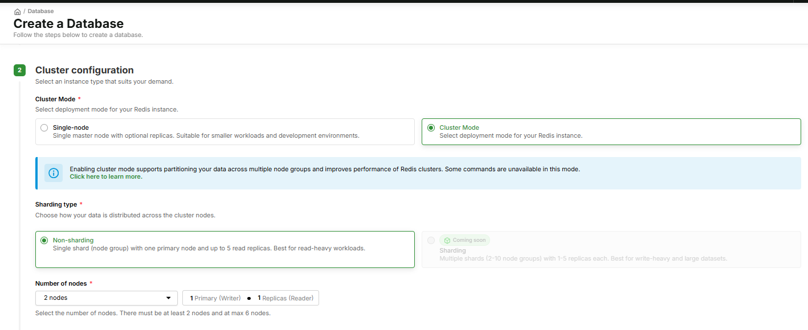
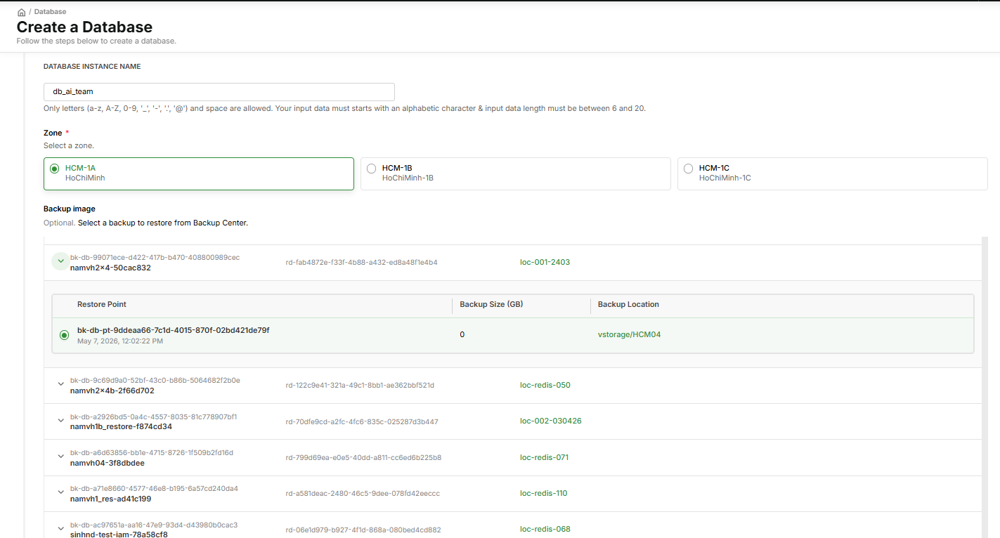
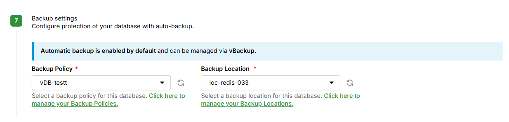

# Create a Redis Cluster

This guide walks you through creating a new **Redis Cluster** on vDB, including cluster configuration, backup settings, and the option to restore from an existing backup.

---

## Prerequisites

- Your vDB account is activated.
- At least 1 **Backup Policy** and 1 **Backup Location** (status Available, Product = vDB) are configured in Backup Center.
- (Optional — if restoring from backup) At least 1 backup exists in Backup Center with a restore point in **Completed** status.

---

## Step 1 — Go to Create Database

1. Go to [https://vdb.console.vngcloud.vn](https://vdb.console.vngcloud.vn).
2. In the left menu, select **Memory Store**.
3. Click **Create Database**.

---

## Step 2 — Basic Configuration

Fill in the general database information:

- **Engine:** Select **Redis**.
- **Cluster Name:** 3–63 characters, lowercase letters, numbers, and hyphens only.
- **Engine Version:** Select the Redis version that suits your needs.
- **Instance Type:** Select the CPU/RAM configuration.
- **Storage Size:** Storage capacity in GB.

---

## Step 3 — Cluster Configuration

In the **Cluster configuration** section, select your **Cluster mode**:

| Option           | Description                                                                              |
| ---------------- | ---------------------------------------------------------------------------------------- |
| **Single-node**  | Single master node with optional replicas. Suitable for smaller workloads and dev environments. |
| **Cluster Mode** | Replication across multiple nodes with automatic failover. Suitable for production and HA. |

Select **Cluster Mode** to proceed with creating a Redis Cluster.


When Cluster Mode is enabled, the system supports High Availability with automatic failover. Note that some Redis commands are unavailable in this mode.


### Configure Number of Nodes

After selecting Cluster Mode, configure the **Number of nodes** (2–10):

- The total includes **1 Primary (Writer)** and the remaining **Replicas (Reader)**.
- For example: selecting 4 nodes = 1 Primary + 3 Replicas.

The **Cluster topology preview** shows a visual diagram with the number of Masters, Replicas, and total nodes based on your configuration.

---

## Step 4 — Restore from Backup (Optional)

If you want to create the cluster from an existing backup instead of an empty database, use the **Backup Image** section:

1. Backups from Backup Center are displayed directly as a table (includes both Auto and Manual Backups). Only backups with at least 1 restore point in **Completed** status are shown.
2. Find the backup you want, click the expand icon to view the list of **restore points**.
3. Select the radio button of the restore point you want to restore from.

When a restore point is selected, the system automatically pre-fills the instance settings (instance type, storage size, etc.) from the backup — you do not need to enter these manually.


The **Storage Size** of the new cluster must be **greater than or equal to the Min.Restore Size (GB)** of the selected restore point. Otherwise, the system will return an error and prevent cluster creation.


If no restore point is selected, the cluster will be created with an empty database.

---

## Step 5 — Backup Settings

In the **Backup Settings** step, configure data protection for the cluster:

| Field               | Required | Description                                                                                      |
| ------------------- | -------- | ------------------------------------------------------------------------------------------------ |
| **Backup Policy**   | Yes      | Select a policy that defines the backup schedule and retention period from Backup Center.        |
| **Backup Location** | Yes      | Select a backup storage location (only locations with status Available and Product = vDB are shown). |


- Both fields are required — this step cannot be skipped when creating in Cluster Mode.
- After the cluster is created, **the Backup Location cannot be changed**.
- If no Backup Location is available, create one in Backup Center before proceeding.


Use the **refresh** icon next to each dropdown to reload the latest list from Backup Center.

---

## Step 6 — Review and Create

Review all configuration on the **Review** page, then click **Create Database**.

The system will provision the cluster with:
- 1 Master node + the number of Replicas you configured.
- Auto Backup running on the schedule of the configured Backup Policy.
- Data from the selected restore point (if chosen in Step 4).

After successful creation, you will be redirected to the cluster detail page.

---

## Next Steps

- [View Topology and change the number of Replicas](manage-redis-cluster.md)
- [Create a Manual Backup or view backup history](manage-redis-cluster.md)
- [View limitations and constraints for Redis Cluster](redis-cluster-limitations.md)
