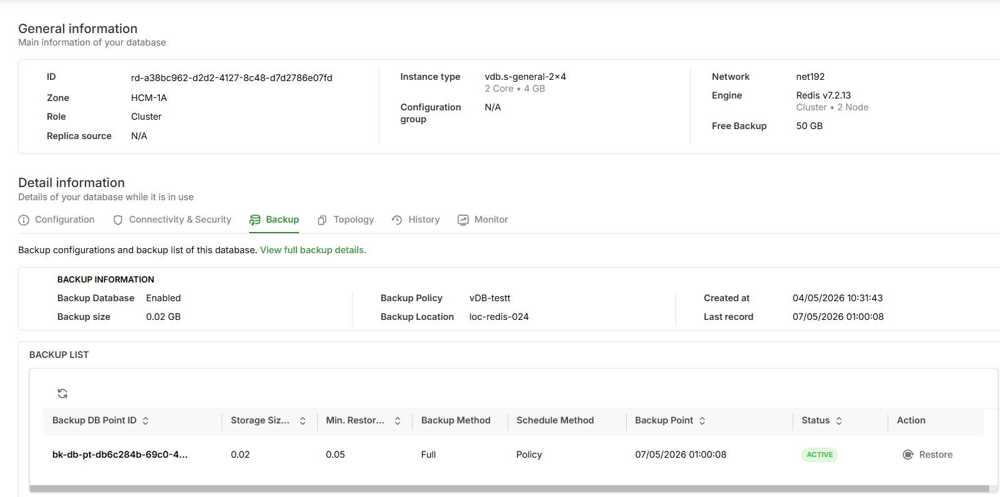

# Manage a Redis Cluster

After creating a Redis Cluster, you can manage its topology, change the number of replicas, trigger manual backups, and delete the cluster directly from the cluster detail page.

***

## Prerequisites

* At least 1 Redis Cluster in **Available** status exists.
* Database management permissions on the vDB account.

***

## Filter the Database List

The Database list page supports quick filtering by deployment type using tabs at the top of the page:

| Tab               | Shows                                   |
| ----------------- | --------------------------------------- |
| **All Databases** | All databases (Single-node and Cluster) |
| **Single-node**   | Single-node databases only              |
| **Cluster**       | Cluster databases only                  |

A count badge is shown next to each tab name. The quick filter works together with search: when on the **Cluster** tab, search results return only Cluster databases.

***

## View Topology

The **Topology** tab on the cluster detail page displays the full master–replica structure of the cluster.

**To view Topology:**

1. Go to the Redis Cluster detail page.
2. Select the **Topology** tab.

This tab shows:

* **Master node:** Green database icon labeled "Master".
* **Replica nodes:** Icons displayed below, showing up to 2 replicas; the rest are grouped as "+N".
* **Summary:** Number of Masters, Replicas, and total nodes.

***

## Change Number of Replicas (Edit Nodes)

You can scale up or scale down the number of Replicas after cluster creation with no downtime.

**To change the number of Replicas:**

1. On the cluster detail page, select the **Topology** tab.
2. Click **Edit nodes**.
3. In the **Edit Cluster** dialog, select a new **Number of nodes** — the UI shows only two options: current−1 or current+1.
4. Review the **Cost Summary** panel on the right:
   * **CURRENT CONFIGURATION:** Current setup and price.
   * **NEW CONFIGURATION:** New setup and price.
   * **Total:** Cost difference (green = increase, red = decrease).
5. Click **SAVE** to apply.


Each edit allows only **±1 node** at a time. To reach a target node count, save and repeat the operation. This ensures each sync completes before the next step, preventing replication errors.


***

## Manual Backup (Back up now)

The **Back up now** button is located directly in the cluster detail page header, allowing you to create a Full Snapshot immediately without navigating into submenus.

**To create a Manual Backup:**

1. On the cluster detail page header, click **Back up now**.
2. Confirm in the dialog: _"This will create a full snapshot of \[cluster name]"_.
3. Click **Back up now**.

The system will show a _"Manual backup is being created"_ notification and the new backup will appear in the **Backup** tab with **In Progress** status.


* The **Back up now** button is disabled when a backup job is already running (Auto or Manual). A tooltip will display: _"A backup job is currently in progress"_.
* When the account quota is exceeded, the system returns a `QuotaExceeded` error and does not auto-retry.
* Only **Full Snapshot** is supported — Incremental manual backup is not available.


***

## View Backup Information

The **Backup** tab on the cluster detail page lets you monitor backup status and history.

**To view Backup information:**

1. On the cluster detail page, select the **Backup** tab.

This tab shows:

* **Backup Information:** Description, Created Date, Latest Record, Backup Size, Backup Policy, Backup Location.
* **Backup List:** List of backup records with columns: Backup DB Point ID, Backup Size (GB), Backup Type, Schedule Type, Backup Location, Backup Point, Status, Action.

Click **View full backup details →** to open the detailed backup page for this cluster in Backup Center (opens in a new tab).

***

## Manage Backups in Backup Center

The vDB **Backup** page (menu: Memory Store > Backup) shows a summary of your backups. For full management operations (Restore, Delete, Policy management), you need to go to Backup Center.

| State               | Action                                                                     |
| ------------------- | -------------------------------------------------------------------------- |
| No backups yet      | Click **Create a Backup** to be redirected to Backup Center to create one. |
| Has backups         | Click **Go to vBackup** to open Backup Center (filtered by Vault vDB).     |
| Click a backup name | Opens the backup detail page in Backup Center (new tab).                   |

***

## Delete a Redis Cluster


Deleting a cluster **cannot be undone**. All data will be permanently deleted.


**To delete a cluster:**

1. On the cluster detail page, click the **More Actions (⋮)** icon.
2. Select **Delete**.
3. In the confirmation dialog:
   * **(Optional)** Check **Create final backup?** to take a final snapshot before deletion (only available if the cluster still has a Backup Database in vBackup).
   * Check **I acknowledge...** to confirm you understand backup access will be lost.
   * Type **delete** in the confirmation input field.
4. Click the red **Delete** button to complete.


If the cluster's Backup Database has already been removed from vBackup, the **Create final backup?** checkbox will be disabled and the system will display: _"No backup database found. Final backup is unavailable."_


***

## Action Menu

From the Database list page, click the **Action (⋮)** icon next to a Redis Cluster for quick actions:

| Action                       | Description                                                  |
| ---------------------------- | ------------------------------------------------------------ |
| **Edit configuration group** | Edit Redis configuration parameters.                         |
| **Edit DB settings**         | Edit the cluster name, backup policy, and database settings. |
| **Delete**                   | Delete the cluster (with confirmation dialog).               |

***

## Next Steps

* [View limitations and constraints for Redis Cluster](redis-cluster-limitations.md)
* [Understand the architecture and compare with Single-node](./)
