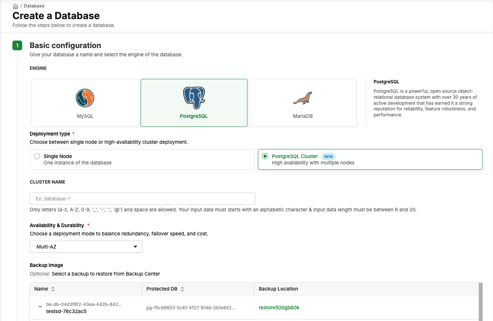
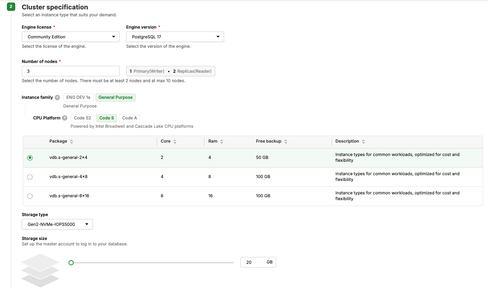
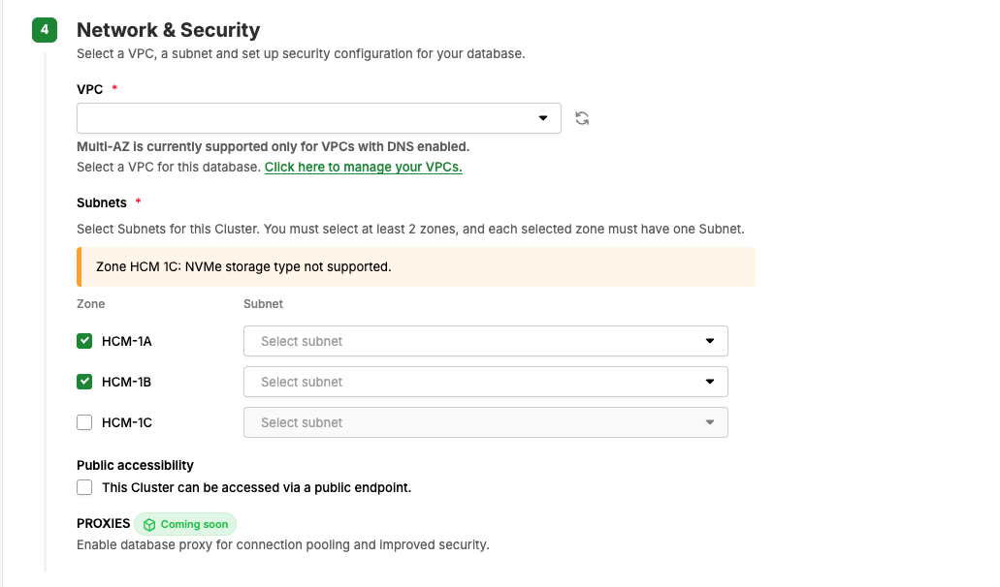

# Create a Multi-AZ PostgreSQL Cluster

This guide shows you how to create a PostgreSQL Cluster whose Nodes are spread across multiple Availability Zones in the Ho Chi Minh region, so the cluster keeps serving traffic when one Availability Zone fails.

---

## What is Multi-AZ

A PostgreSQL Cluster on vDB has two deployment modes, selected in the **Availability & Durability** field:

* **Single-AZ** — every Node sits in one Availability Zone.
* **Multi-AZ** — Nodes are spread across two or more Availability Zones. When one Availability Zone becomes unreachable, a Replica in a remaining Availability Zone is promoted to Primary and the cluster keeps running.

```
   HCM03-1A                            HCM03-1B
┌──────────────────┐                ┌──────────────────┐
│ Primary (Writer) │ ─────────────→ │ Replica (Reader) │
│   Read / Write   │   Streaming    │ Read / Failover  │
└──────────────────┘   Replication  └──────────────────┘
```

| Aspect | Single-AZ | Multi-AZ |
|---|---|---|
| Node placement | All Nodes in one Availability Zone | Nodes spread across two or more Availability Zones |
| Availability Zone fault tolerance | No | Yes |
| Where zones are selected | The **Basic configuration** step | The **Network & Security** step, together with the Subnet |
| VPC requirement | None | The VPC must have **DNS** enabled |
| Available regions | HCM, HAN | HCM only |
| Subnets to select | 1 | One Subnet per zone — at least 2 zones, so at least 2 Subnets |

---

## Prerequisites

* A GreenNode account with access to the vDB service.
* You are working in the **HCM** region — Multi-AZ is currently available in Ho Chi Minh only.
* A VPC in HCM that **has DNS enabled**.
* That VPC has Subnets in **at least two different Availability Zones**.
* A **Backup Policy** and a **Backup Location** in the **Available** status on Backup Center — Backup Settings are mandatory for every PostgreSQL Cluster.


The **VPC** dropdown in the **Network & Security** step **only lists VPCs that have DNS enabled**. If your VPC is missing from the list, it most likely does not have DNS enabled yet.


---

## Create a Multi-AZ Cluster

### Step 1: Select the Multi-AZ mode

1. Go to vDB Relational at [https://vdb.console.greennode.ai/relational/database](https://vdb.console.greennode.ai/relational/database), or from the GreenNode homepage open the **vServer** service and select **vDB Relational**.
2. Select **HCM** in the **Region** selector in the top navigation bar.
3. Click **Create Database**.
4. In **Basic configuration**, select **PostgreSQL** as the **ENGINE**.
5. Select **PostgreSQL Cluster** as the **Deployment type**.
6. Enter the **CLUSTER NAME**: 6–20 characters, starting with an alphabetic character, using `a-z`, `A-Z`, `0-9`, `_`, `-`, `.`, `@` and spaces. Leave it empty and the system generates a name for the cluster.
7. Open the **Availability & Durability** dropdown and select **Multi-AZ**.

Once **Multi-AZ** is selected, the **Zone** group no longer appears in **Basic configuration**. In Multi-AZ mode you select zones in [Step 3](#step-3-select-the-vpc-and-one-subnet-per-zone), together with the Subnet, because each zone must be paired with exactly one Subnet of the VPC you choose.




Changing **Availability & Durability** clears every zone and Subnet you have selected, in both directions and at any point — including after you have finished filling in **Network & Security**. Select the mode before configuring the network.


### Step 2: Choose the number of Nodes

1. In **Cluster specification**, select the **Engine license** and the **Engine version**.
2. Enter **Number of nodes**: at least 2, at most 10.
3. Check the role distribution shown next to the field.



| Number of nodes | Role distribution |
|---|---|
| 2 | 1 Primary (Writer) · 1 Replica (Reader) |
| 3 | 1 Primary (Writer) · 2 Replicas (Reader) |
| 5 | 1 Primary (Writer) · 4 Replicas (Reader) |
| 10 | 1 Primary (Writer) · 9 Replicas (Reader) |


Every cluster has exactly one Primary (Writer) that handles all write operations. The remaining Nodes are Replicas (Readers) that stay in sync with the Primary through Streaming Replication and are ready to be promoted when the Primary fails. Nodes are distributed across the Availability Zones you select in Step 3.


### Step 3: Select the VPC and one Subnet per zone

1. Scroll to **Network & Security**.
2. Select the **VPC** for this cluster. The dropdown only shows VPCs that have DNS enabled; if no suitable VPC exists, use the VPC management link below the field.
3. In the **Subnets** table, tick the zones you want to deploy to. The **first two zones** in the list are ticked by default — in the HCM region these are **HCM03-1A** and **HCM03-1B**.
4. For each ticked zone, select a **Subnet** in the right-hand column.
5. Enable **Public accessibility** if you want to reach the cluster from the Internet.



| Rule | Detail |
|---|---|
| Minimum zones | You must tick at least two different zones |
| Subnet per zone | Each ticked zone must have exactly one Subnet selected |
| Same VPC | Every Subnet must belong to the VPC you selected |
| Zone with no Subnet | A zone with no Subnet in the VPC is disabled in the table |
| Zone without the Storage type | A zone that does not support the **Storage type** you selected in **Cluster specification** cannot be used either. A warning appears on the **Subnets** table, for example `Zone HCM 1C: NVMe storage type not supported` |


**Public accessibility** can only be set once, at creation time, and cannot be changed afterwards.


### Step 4: Complete the remaining steps

The remaining sections of the creation flow are the same as for Single-AZ:

* **Cluster specification** — **Instance family**, **CPU Platform**, **Package** (Core, Ram, Free backup), **Storage type**, **Storage size**.
* **DB instance settings** — **Master username** and **Master password**. Note that the **Master username** must not match any of the reserved system usernames.
* **Database options** — **Database name** and **Configuration group** (optional).
* **Backup settings** — **Backup Policy** and **Backup Location**, mandatory for every PostgreSQL Cluster.

For each field in detail, see [Create and Manage PostgreSQL Cluster](create-and-manage-postgresql-cluster.md).

Review the **Summary** panel on the right, then click **CREATE DATABASE**.

---

## Result

The cluster enters the **Building** status, then moves to **Active** once provisioning completes. Open the cluster detail page to verify:

* The **General information** section shows **Availability & Durability** as **Multi-AZ**, along with the engine version and the Node count of the cluster.
* The **Connectivity & Security** tab shows a **Select zone** tab group, one tab per Availability Zone of the cluster.

---

## Connect to a Multi-AZ Cluster

In the **Connectivity & Security** tab, each zone tab shows two endpoint groups:

| Endpoint group | Used for |
|---|---|
| **PRIMARY ENDPOINT (READ/WRITE)** | Read and write queries, pointing at the Primary Node |
| **READER ENDPOINT (READ-ONLY, LOAD BALANCED)** | Read-only queries, load balanced across the Replica Nodes |

Each group contains a **Private Endpoint**, a **Public Endpoint** and a **Domain Endpoint**, each with a copy control. Take the **Port** shown in the endpoint group you are using.

GreenNode recommends using the **Domain Endpoint** in your application connection string:

* The Domain Endpoint is **a single value for the whole cluster** and does not change when you switch to another zone tab.
* The Domain Endpoint **does not change on failover**, so your application does not need reconfiguring each time the Primary moves to another Node.
* You can check the addresses the Domain Endpoint resolves to with:

```bash
dig A <domain-endpoint>
```

Use the per-zone **Private Endpoint** and **Public Endpoint** addresses when you need a specific address, for example to open a firewall rule or to configure routing.

For client tools, connection strings and the `sslmode=require` parameter, see [Connect to an RDS Instance](../../getting-started/ket-noi-toi-rds-instance/README.md).

---

## Limitations and notes

| Item | Limitation |
|---|---|
| Region | HCM only. The HAN region offers PostgreSQL Cluster but does not support Multi-AZ yet |
| Number of Nodes | At least 2, at most 10 |
| Availability Zones | At least 2 |
| VPC | Must have DNS enabled |
| Changing the mode after creation | Switching between Single-AZ and Multi-AZ after the cluster is created is not supported. Create a new cluster instead |
| Configuration group | A Configuration group is bound to a deployment type; a group created for Cluster cannot be applied to a Single Node, and vice versa |
| Storage when restoring from a backup | The new cluster needs more storage than the backup itself. The system shows the required minimum on the **Storage size** field once you select a backup — enter that value or higher |

---

## See also

| I want to... | Go to |
|---|---|
| Understand the PostgreSQL Cluster architecture and concepts | [PostgreSQL Cluster](README.md) |
| Manage the cluster: backup, resize, change the Node count | [Create and Manage PostgreSQL Cluster](create-and-manage-postgresql-cluster.md) |
| Connect to the database with a client tool | [Connect to an RDS Instance](../../getting-started/ket-noi-toi-rds-instance/README.md) |
| Configure parameters for the cluster | [PostgreSQL Parameters for Cluster](postgresql-cluster-parameters.md) |
