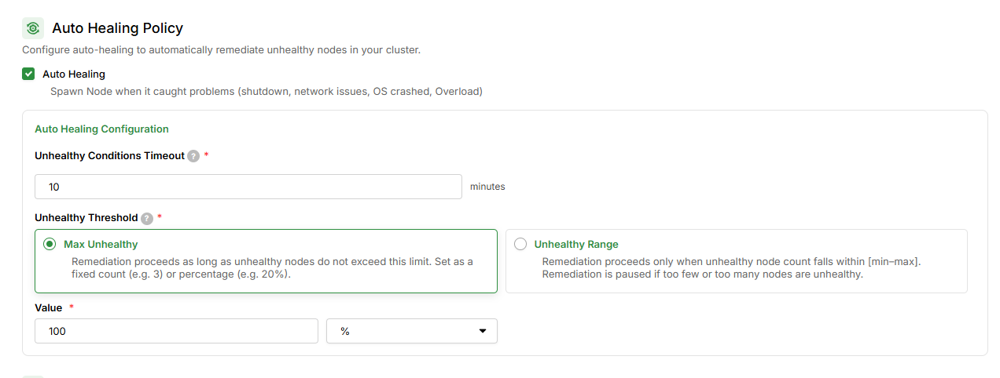
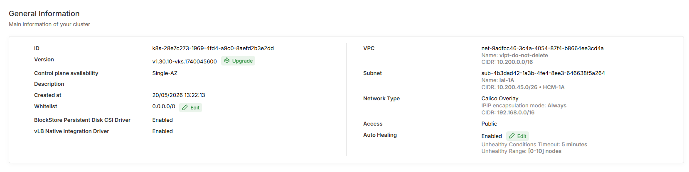

# Auto Healing

---

## 1. Overview

**Auto Healing** is a feature that automatically monitors the health of worker nodes in a cluster. When a node enters an **unhealthy** state (lost connection, node hang, unresponsive, prolonged NotReady...), the system automatically **deletes the faulty node and creates a replacement** — the entire process requires no manual intervention.

VKS allows users to customize several Auto Healing parameters via the Portal: enable/disable, unhealthy node detection thresholds, and safety limits to protect the cluster.


**Note for IAM-user accounts:**

Before configuring Auto Healing, IAM-user accounts must be granted the permissions below (an admin should grant these once before use):


| Permission                 | Purpose                              | Used at step                                           |
| -------------------------- | ------------------------------------ | ------------------------------------------------------ |
| `UpdateAutoHealingConfig`  | Update Auto Healing configuration    | Create new cluster / Update a running cluster          |

---

## 2. Key highlights

- **Runs 24/7, no manual intervention required.** Faulty nodes are automatically detected and replaced even outside business hours.
- **Flexible enable/disable.** Can be temporarily disabled during maintenance or manual node inspection to avoid conflicts with your operations.
- **Cluster protection mechanism.** When too many nodes fail simultaneously — typically a sign of a widespread infrastructure incident — the system halts replacements to prevent mass deletion and total capacity loss.
- **False positive prevention.** A node must maintain an error state continuously for a sufficient duration (Timeout) before being considered unhealthy, preventing false triggers when a node experiences only a transient issue (network flap, brief pause due to memory reclamation...).
- **Supports both starting and running nodes.** New nodes have a default 30-minute window (`nodeStartupTimeout`) to become ready — if they fail to come up within that time, they are also considered candidates for replacement.
- **Simple configuration, suitable for any scale.** Supports both absolute values (`2`) and percentages (`30%`), usable from small clusters to large production environments.

---

## 3. How it works

<figure><figcaption></figcaption></figure>

---

## 4. Configurable parameters

VKS allows configuration of the following 4 parameters via the Portal:

### 4.1. Enable / Disable Auto Healing

**What it does:** Master switch for the entire feature. When disabled, the system still monitors node health but does **not** automatically replace nodes.

**When to enable:** Recommended by default for production and any cluster requiring high availability.

**When to disable:**

- Actively inspecting/debugging nodes manually and don't want the system to intervene.
- During planned maintenance: updating nodes your own way, changing node configuration, migrating workloads.
- Short-lived test environments that don't require availability guarantees.


When Auto Healing is disabled, faulty nodes persist until someone handles them manually. Remember to re-enable it immediately after maintenance — this is the most important protection layer for your cluster.


---

### 4.2. Timeout

**What it does:** The duration a node must **continuously** maintain an error state before being flagged for replacement. This mechanism filters transient issues such as network flaps, brief disconnections, pauses due to memory reclamation, or temporary CPU throttling.

**When to increase:** Unstable network infrastructure where nodes often experience brief disconnections before recovering on their own. Increase Timeout to give nodes more time to self-heal.

**When to decrease:** Production clusters that need to respond quickly to failures, accepting the risk of early node replacement to restore capacity faster.

**Recommendations:**

| Scenario                  | Value                           |
| ------------------------- | ------------------------------- |
| Standard production       | **5 minutes** (default)         |
| Unstable infrastructure   | 10–15 minutes                   |


The recommended minimum is 5 minutes. Below that, nodes may flip between states (NotReady ↔ Ready within tens of seconds) for legitimate reasons — not always a real incident. A Timeout that is too low leads to unnecessary node replacements, wastes resources, and disrupts workloads.


---

### 4.3. Max Unhealthy

**What it does:** The maximum number of unhealthy nodes the system still allows automatic replacement for. This is a **protection mechanism** — when the number of faulty nodes exceeds the threshold, replacements stop for the entire cluster.

Rationale: Multiple simultaneous node failures are typically a sign of a widespread infrastructure incident (full cluster network loss, storage failure, cloud provider failure). In that case, mass replacement does not fix the root cause and instead drains the cluster of all capacity, prolonging the outage.

**When to increase:** Large clusters (> 20 nodes) where workloads can tolerate many simultaneous node losses.

**When to decrease:** Critical production clusters where each replacement carries a brief disruption risk for pods running on the deleted node.

**Recommendations:**

| Scenario                        | Value                                              |
| -------------------------------- | -------------------------------------------------- |
| Small cluster (≤ 3 nodes)        | **1**                                              |
| Standard production              | **40%**                                            |
| Large cluster, auto-scaling      | **30%** (percentage scales with cluster size)      |
| Stability-first cluster          | **1** (replace one node at a time)                 |

**Examples:**

- Cluster of 10 nodes, `Max Unhealthy = 2`: 1–2 faulty nodes → replacement proceeds normally. ≥ 3 faulty nodes → replacement stops, `RemediationRestricted` event is raised.
- Cluster of 50 nodes, `Max Unhealthy = 40%`: allows replacement when ≤ 20 nodes are unhealthy.

---

### 4.4. Unhealthy Range

**What it does:** Similar to `Max Unhealthy` but allows configuring **both a lower and upper threshold**. Replacement only occurs when the number of unhealthy nodes falls within the range `[min – max]`.

**Key difference from `Max Unhealthy`:**

- **Upper threshold** (`max`): Same as Max Unhealthy — stops replacement when too many nodes fail.
- **Lower threshold** (`min`): Skips replacement when too few nodes fail — avoids overreacting to isolated incidents.

**When to use:** Clusters where nodes frequently flap up and down, or workloads that should only trigger replacement when multiple nodes fail simultaneously (a single faulty node may self-recover).

**Example:**

Cluster of 20 nodes, `Unhealthy Range = [2-5]`:

- 1 faulty node → **no replacement** (may be temporary — let the node self-recover or inspect manually).
- 2–5 faulty nodes → replacement proceeds normally.
- ≥ 6 faulty nodes → replacement stops (suspected infrastructure incident).

**Comparison:**

| Unhealthy node count | `Max Unhealthy = 3`        | `Unhealthy Range = [2-5]`              |
| -------------------- | -------------------------- | -------------------------------------- |
| 1                    | Replace                    | **Skip** (below min threshold)         |
| 3                    | Replace                    | Replace                                |
| 5                    | **Skip** (exceeds max)     | Replace                                |
| 6                    | Skip                       | Skip (exceeds max)                     |

---

### Parameter summary

| Parameter       | Format          | Default     | Role                                                          |
| --------------- | --------------- | ----------- | ------------------------------------------------------------- |
| Enable / Disable | on/off         | On          | Master switch for Auto Healing                                |
| Timeout         | minutes         | `5 minutes` | Filters false positives before marking a node unhealthy       |
| Max Unhealthy   | number or `%`  | `100%`      | Upper threshold — protection mechanism for replacements       |
| Unhealthy Range | `[min-max]`    | —           | Lower and upper threshold (takes priority over Max Unhealthy) |

---

## 5. Recommended configuration by cluster type

| Cluster type                                                                        | Auto Healing    | Timeout       | Max Unhealthy | Unhealthy Range                        |
| ----------------------------------------------------------------------------------- | --------------- | ------------- | ------------- | -------------------------------------- |
| **Dev / Test** (1–3 nodes)                                                          | On              | `5 min`       | `1`           | —                                      |
| **Small production** (3–10 nodes)                                                   | On              | `5 min`       | `40%`         | —                                      |
| **Medium production** (10–20 nodes)                                                 | On              | `5 min`       | `30%`         | or `[2-6]`                             |
| **Large production** (> 20 nodes)                                                   | On              | `5 min`       | `30%`         | or `[2-N]` (N ≈ 30% of total nodes)   |
| **Stability-first** (databases, stateful workloads, critical workloads)             | On              | `10 min`      | `1`           | —                                      |
| **Under maintenance**                                                               | **Off**         | —             | —             | —                                      |

**Guidance on choosing values:**

- **Small clusters:** Set `Max Unhealthy = 1` to replace nodes one at a time, avoiding simultaneous deletion that drains all capacity.
- **Large clusters:** Use percentages so the threshold scales automatically as the cluster grows or shrinks.
- **Sensitive workloads:** Increase Timeout to 10 minutes for a higher buffer, reducing the risk of replacing a node during a transient incident the node could have recovered from on its own.

---

## 6. Configuration guide

### 6.1. Configure Auto Healing when creating a new Cluster

**Step 1: Open the Create Cluster page**

1. Log in to [VNG Cloud Console](https://console.vngcloud.vn)
2. Select **VKS** → **Clusters** → **Create Cluster**

**Step 2: Configure Auto Healing**

1. Locate the **Auto Healing** section in the Create Cluster form
2. Enable **Auto Healing** (enabled by default)
3. Fill in the parameters as needed:

| Field             | Example value | Notes                                                   |
| ----------------- | ------------- | ------------------------------------------------------- |
| **Max Unhealthy** | `40%`         | Stop replacement when more than 40% of nodes are faulty |
| **Timeout**       | `5`           | Wait 5 minutes before marking a node as unhealthy       |

<figure><figcaption></figcaption></figure>

4. Click **Create** to create the cluster


If you skip the Auto Healing section, the system automatically enables it with defaults: `Max Unhealthy = 100%`, `Timeout = 5 minutes`.


---

### 6.2. Update Auto Healing configuration for a running Cluster

**Step 1: Open Cluster details**

1. Select **VKS** → **Clusters**
2. Click the name of the cluster you want to update

<figure><figcaption></figcaption></figure>

**Step 2: Edit the Auto Healing configuration**

> _IAM-user accounts require the `UpdateAutoHealingConfig` permission — see **Note for IAM-user accounts** at the top of this page._

1. Locate the **Auto Healing** row on the Cluster details page → click **Edit**
2. Update the parameters as needed

<figure><figcaption></figcaption></figure>

3. Click **Save** to apply the changes


Configuration changes take effect immediately — no cluster or node restart required.


---

## 7. Auto Healing Events

During operation, Auto Healing emits several Kubernetes Events on the cluster to report status. You can observe these events via the Portal or when viewing node/cluster details.

| Event                    | Type    | Meaning                                                                                                                                                                                                                                              |
| ------------------------ | ------- | ---------------------------------------------------------------------------------------------------------------------------------------------------------------------------------------------------------------------------------------------------- |
| `DetectedUnhealthy`      | Warning | A node has begun showing signs of failure (lost connection, NotReady...) and the system is waiting for the full Timeout to confirm. This is an early warning — no replacement yet, the node may still self-recover.                                  |
| `MachineMarkedUnhealthy` | Warning | The node has maintained an error state for the full Timeout and has been officially marked as unhealthy. The system is preparing to delete the node and create a replacement.                                                                        |
| `RemediationRestricted`  | Warning | The number of faulty nodes has exceeded `Max Unhealthy` or falls outside `Unhealthy Range`. The system has paused replacements for the entire cluster to avoid mass deletion — typically a sign of a widespread infrastructure incident requiring manual inspection. |

---

## 8. Important notes

1. **The cluster halting replacements is correct behavior, not a bug.** When the number of faulty nodes exceeds the configured threshold, the system intentionally stops replacing and waits for an operator to intervene rather than performing mass deletions.
2. **`nodeStartupTimeout` defaults to 30 minutes.** New nodes have 30 minutes to start up and join the cluster. If still not ready after that time → marked as faulty and will be replaced. This value is managed by the system and cannot be configured via the Portal.
3. **Auto Healing does not preserve Pod data.** When a node is replaced, pods running on it are also deleted. Workloads that need to persist data must use `PersistentVolume`; workloads requiring high availability must have multiple replicas spread across multiple nodes.
4. **Configuration changes take effect immediately** — no cluster or node restart required.
5. **Auto Healing does not replace a monitoring system.** This is a self-healing mechanism at the node level; you still need monitoring tools (metrics, logs, alerts) to detect issues at the application or infrastructure layer that node status alone cannot reflect.
6. When a node fails, the system creates a replacement. Ensure you have sufficient credit and resource quota to provision the new node.

---

## 9. Frequently asked questions

**When should I disable Auto Healing?**

When you are actively intervening on nodes manually: inspection/debugging, planned maintenance, infrastructure checks. Re-enable it immediately after you're done to keep the cluster protected — leaving it off for long periods removes the cluster's ability to self-heal.

**My node is unhealthy but I don't see any replacement. Why?**

Three common causes:

1. **Timeout not yet elapsed** — the node must maintain an error state continuously for the full Timeout (default 5 minutes) before being flagged. Wait a bit longer.
2. **Safety threshold exceeded** — the number of unhealthy nodes has exceeded `Max Unhealthy` or falls outside `Unhealthy Range`. The system has paused replacements — check the threshold configuration and the `RemediationRestricted` event.
3. **Auto Healing is disabled** — check the toggle on the Portal.

**If a node is replaced, will Pod data be lost?**

Pods running directly on the node will be deleted along with the node. To preserve data, use `PersistentVolume` (storage decoupled from the node lifecycle). To maintain availability, deploy workloads with multiple replicas so that when one replica is lost, the remaining replicas continue serving traffic.

**What configuration is right for my cluster?**

Refer to the recommendations table in [Section 5](#5-recommended-configuration-by-cluster-type). Pick the row that matches your cluster's scale and workload characteristics, then fine-tune based on real-world experience.

**Why does the Portal show fewer "healthy" nodes than the total node count even though the cluster is running fine?**

Nodes in the initialization phase (not yet past `nodeStartupTimeout`) are not yet counted as "healthy" but are also not considered "unhealthy" — they are in a **transitional state**. The system waits for the node to finish starting up; only after 30 minutes of not becoming ready is it marked unhealthy and replaced. This is normal behavior, not a bug.
