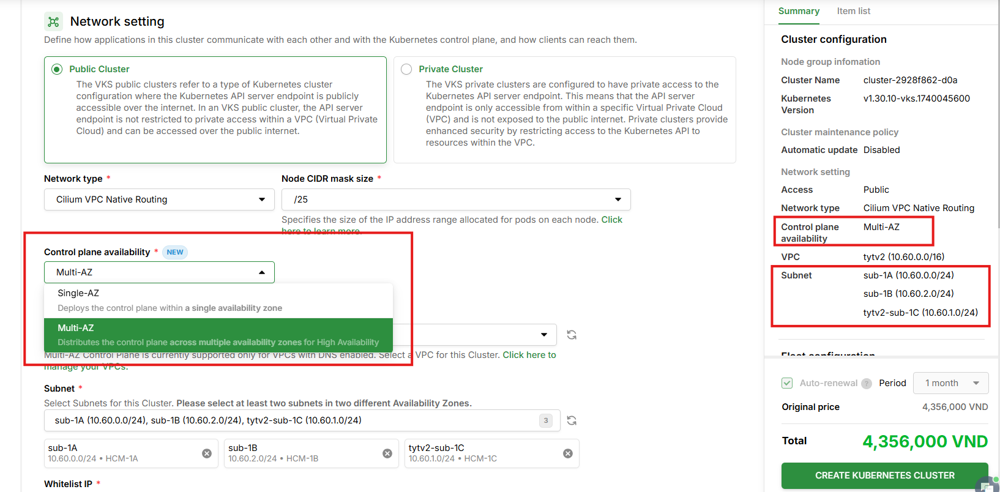

# Create a Multi-AZ Cluster

Multi-AZ Cluster allows deploying the Control Plane across multiple Availability Zones, ensuring **High Availability** for your cluster. When an AZ experiences an outage, the Control Plane continues to operate normally from the remaining AZs without manual intervention.

To learn more about concepts, architecture, and the comparison between Single-AZ and Multi-AZ, please refer to [Multi-AZ Control Plane](../clusters/multi-az-control-plane.md).

***

## Prerequisites

To create a Multi-AZ Cluster, you need to ensure the following prerequisites:

### 1. VPC must have DNS enabled


**Important:**

Multi-AZ Control Plane **only supports VPCs with DNS enabled**. If a VPC does not have DNS enabled, it will **not appear** in the dropdown when creating a Multi-AZ Cluster.


To enable DNS for your VPC, please do so in the vServer portal following the guide [here](../../vserver/compute-hcm03-1a/network/virtual-private-cloud-vpc/).

### 2. Prepare Subnets

* **Minimum 2 subnets** from **2 different Availability Zones**
* All subnets must belong to the **same VPC**
* Subnets must be in **ACTIVE** state

Example of valid subnet configuration:

| Subnet Name | AZ | CIDR | Valid? |
| --- | --- | --- | --- |
| sub-1A | HCM-1A | 10.60.0.0/24 | ✅ |
| sub-1B | HCM-1B | 10.60.1.0/24 | ✅ |

Example of **invalid** subnet configuration:

| Subnet Name | AZ | CIDR | Reason for invalidity |
| --- | --- | --- | --- |
| sub-1A | HCM-1A | 10.60.0.0/24 | ❌ Same AZ |
| sub-2A | HCM-1A | 10.60.3.0/24 | ❌ Same AZ |

### 3. Other prerequisites

* At least 1 **VPC** and 1 **Subnet** in **ACTIVE** state. If you do not have a VPC or Subnet yet, please create one following the guide [here.](../../vserver/compute-hcm03-1a/network/virtual-private-cloud-vpc/)
* At least 1 **SSH key** in **ACTIVE** state. If you do not have an SSH key, please create one following the guide [here.](../../vserver/compute-hcm03-1a/security/ssh-key-bo-khoa.md)
* **kubectl** installed and configured on your device. Please refer to [here](https://kubernetes.io/docs/tasks/tools/install-kubectl/) if you are unfamiliar with installing and using kubectl. Additionally, you should not use a kubectl version that is too old; we recommend using a kubectl version that differs by no more than one version from the cluster version.

***

## Create Cluster

To create a Multi-AZ Cluster, follow the steps below:

**Step 1:** Navigate to [https://vks.console.vngcloud.vn/overview](https://vks.console.vngcloud.vn/overview)

**Step 2:** On the **Overview** screen, select **Activate.**

**Step 3:** Wait until we successfully initialize your VKS account. After successful activation, select **Create a Cluster.**

**Step 4:** On the cluster creation screen, configure the **Cluster Configuration**:

* Cluster Information:
  * **Cluster Name:** Name for your Cluster. The name can only contain alphanumeric characters (a-z, A-Z, 0-9, '\_', '-'). Input length must be between 5 and 50. The name must be unique within the Region and GreenNode account where you are creating the Cluster.
  * **Kubernetes Version:** The Kubernetes version to use for your Cluster. We recommend selecting the latest version unless you need an older version.
  * **Description:** Enter notes for your Cluster to create distinctive markers for easier management in the future.

**Step 5:** Configure the **Network Setting** — this is the most important step for creating a Multi-AZ Cluster:

* **Control Plane Availability:** Select **Multi-AZ** to deploy the Control Plane across multiple Availability Zones.

<figure><figcaption><p>Control Plane Availability selection</p></figcaption></figure>

  There are 2 options:

  | Option | Description |
  | --- | --- |
  | **Single-AZ** (default) | Deploy the cluster in a single Availability Zone. Suitable for development and testing environments. |
  | **Multi-AZ** | Deploy the cluster across multiple Availability Zones for High Availability. Recommended for production. |

* **Network type:** Select the network type you want to use for your Cluster. Currently, VKS provides 3 network types: Calico Overlay, Cilium Overlay, Cilium VPC Native Routing.
  * For **Calico Overlay, Cilium Overlay** network types: Encapsulation Mode is automatically set by the system and cannot be changed. You can modify the **CIDR** (the virtual network range that pods will use).
  * For **Cilium VPC Native Routing** network type: When selecting this network type, the **Node CIDR mask size** field will appear in the Network Setting section. This parameter specifies the CIDR size allocated to each node, determining the number of IP addresses from the Pod IP range that can be assigned to that node. You need to select a value that suits your needs.

<figure><figcaption><p>Network Setting when selecting Cilium VPC Native Routing: Node CIDR mask size appears</p></figcaption></figure>


**Note about Cilium VPC Native Routing and Multi-AZ:**

When selecting **Cilium VPC Native Routing** combined with **Multi-AZ**, the **Pod IP range** (Default Pod IP range) field will **not appear** in the Network Setting section but is moved to the **Node Group Network Setting** (Step 7). This allows each Node Group in each AZ to configure its own Pod IP range.


* **VPC:** Select a VPC with **DNS enabled** from the dropdown. Note: when selecting Multi-AZ, **only VPCs with DNS enabled will be displayed**. If you do not see any VPC in the list, please enable DNS for your VPC in the vServer portal.

* **Subnets:** When selecting **Multi-AZ**, the Subnet field changes to a **multi-select dropdown**, allowing you to select multiple subnets:

  * The system will **automatically pre-select the first subnet from each AZ** available in the VPC. For example: If the VPC has subnets in HCM-1A, HCM-1B, HCM-1C → 3 subnets are pre-selected by default (1 subnet/zone).
  * Selected subnets are displayed as **chip/tag**. Click the **(x)** button on a chip to remove that subnet from the selection.
  * You can add/remove subnets but must ensure **at least 2 subnets from 2 different AZs**.

<figure><figcaption><p>Network Setting for Multi-AZ Cluster: VPC, Subnets multi-select and subnet chips</p></figcaption></figure>


**Validation Rules:**

* At least **2 subnets** must be selected
* Subnets must belong to **at least 2 different AZs**
* If 2 subnets from the same AZ are selected, the system will display an error: *"Subnets must belong to at least 2 different Availability Zones"*


**Step 6:** Configure the **Default Node Group Configuration**:

* Node Group Information:
  * **Node Group Name**: A descriptive name for your Node Group.
  * **Number of nodes:** Enter the number of Worker nodes for your Cluster. Note that the number of nodes must be greater than or equal to 1 and less than or equal to 100.
* Node Group Automation Setting:
  * **Auto Healing:** By default, we enable the HA feature in your Cluster.
  * **Auto Scaling:** Enable auto-scaling in your Cluster.
    * **Minimum node**: the minimum number of nodes the Cluster needs.
    * **Maximum node**: the maximum number of nodes the Cluster can scale to.
  * **Node Group upgrade strategy:** Node Group upgrade strategy via **Surge upgrade** method.
    * **Max surge:** limits the number of nodes upgraded simultaneously. Default **Max surge = 1**.
    * **Max unavailable**: limits the number of nodes that cannot be accessed during the upgrade. Default **Max unavailable = 0**.
* Node Group Setting:
  * **Image**: by default, we provide 1 Image type: Ubuntu with containerd.
  * **Instance type**: select the appropriate instance type for Worker nodes based on your usage needs.
* Node Group Volume Setting: **Boot Volume Configuration** – Parameters are set by default by the system to optimize your Cluster.

**Step 7:** Configure the **Node Group Network Setting** — this section differs from Single-AZ Cluster:

<figure><figcaption><p>Node Group Network Setting for Multi-AZ Cluster</p></figcaption></figure>

* You can choose **Public Node Group** or **Private Node Group** based on your Cluster usage needs.
* **VPC:** Inherited from Network Configuration (read-only, cannot be changed).
* **Subnet:** Single-select dropdown, **only displays the subnets selected for the cluster in Step 5**. Each Node Group can only select **1 subnet** (corresponding to 1 AZ).
* **Pod IP range** *(only displayed when Network type = Cilium VPC Native Routing)*: The secondary IP range used to allocate IP addresses for pods on this Node Group. You need to select at least 1 Secondary IP range created from vServer.

<figure><figcaption><p>Node Group Network Setting when selecting Cilium VPC Native Routing: Pod IP range appears</p></figcaption></figure>


**Note:**

* The Node Group's AZ is automatically determined based on the selected subnet.
* You can create additional Node Groups in other AZs after the cluster is created.
* To ensure High Availability for workloads, you should create multiple Node Groups in different AZs. This distributes worker nodes across multiple AZs, increasing fault tolerance for your applications.
* When using **Cilium VPC Native Routing**, each Node Group can select its own **Pod IP range**, suitable for allocating network resources per AZ.


* Node Group Security Setting: You can select **Security Group and SSH Key** for your Node Group.
* Node Group Metadata Setting: You can enter **Metadata** for your Node Group.

**Step 8:** Configure **Plugins**:

* **Enable BlockStore Persistent Disk CSI Driver**: enable to automatically install the CSI Controller on your Cluster.
* **Enable vLB Native Integration Driver**: enable to automatically install the LB Controller on your Cluster.

**Step 9:** Select **Create Kubernetes cluster.** Please wait a few minutes for us to initialize your Cluster. The Cluster status at this point is **Creating**.

**Step 10:** When the **Cluster** status is **Active**, you can view Cluster information and Node Group information by clicking on the Cluster Name in the **Name** column. In the **Control Plane Availability** column, you will see the **Multi-AZ** badge confirming the cluster was created with the correct configuration.

<figure><figcaption><p>Cluster Active with Multi-AZ badge on the list page</p></figcaption></figure>

***

## Private Service Endpoint

Multi-AZ Cluster operates on a **private flow**. When you create a Multi-AZ Cluster, the system will automatically create **4 Private Service Endpoints** to enable nodes in the cluster to connect privately to other services on GreenNode:

| Endpoint | Connected Service | Purpose |
| --- | --- | --- |
| **vks-iam-endpoint-...** | IAM | Authentication and authorization |
| **vks-vcr-endpoint-...** | vContainer Registry (vCR) | Pull/push container images |
| **vks-vserver-endpoint-...** | vServer | Manage compute resources |
| **vks-vstorage-endpoint-...** | vStorage | Connect to object storage |

You can view information about the 4 private service endpoints through the vServer portal at [here](https://hcm-3.console.vngcloud.vn/vserver/vnetwork/endpoint/list).


**Important notes about Private Service Endpoints:**

* **Do not delete Private Service Endpoints**: To ensure stable operation of the cluster, you should not delete the 4 pre-created service endpoints. If you accidentally delete or modify these 4 endpoints, within a maximum of 5 minutes, the system will automatically recreate them but may cause disruption to running services. At this time, because the recreated service endpoint may have changed the Endpoint IP compared to the original, for the cluster to work, you need to manually add the Endpoint IP to the previously running servers via the command:

    ```
    vks-bootstraper add-host -i <IP> -d <DOMAIN>
    ```

    For example,

    *   If you delete a private service endpoint in **Region HCM**, you need to add hosts via the commands:

        ```
        vks-boostraper add-host -i 192.168.1.9 -d vcr.vngcloud.vn
        vks-boostraper add-host -i 192.168.1.8 -d hcm-3.api.vngcloud.vn
        vks-boostraper add-host -i 192.168.1.5 -d iamapis.vngcloud.vn
        vks-boostraper add-host -i 192.168.1.7 -d hcm03.vstorage.vngcloud.vn
        ```
    *   If you delete a private service endpoint in **Region HAN**, you need to add hosts via the commands:

        ```
        vks-boostraper add-host -i 192.168.1.9 -d vcr-han.vngcloud.vn
        vks-boostraper add-host -i 192.168.1.8 -d han-1.api.vngcloud.vn
        vks-boostraper add-host -i 192.168.1.5 -d iamapis.vngcloud.vn
        vks-boostraper add-host -i 192.168.1.7 -d han02.vstorage.vngcloud.vn
        ```

* **Reuse Private Service Endpoints:** Service endpoints can be shared by multiple private clusters / Multi-AZ clusters. When clusters share the same VPC, we will reuse them.
* **Automatic deletion of Private Service Endpoints:** When you delete a cluster, if no other clusters are reusing these service endpoints, the system will automatically delete them.
* **Multi-AZ Control Plane cost:** During the initial release phase, the Multi-AZ Control Plane feature is provided **free of charge**. Official pricing will be updated in the future. Note: using a Multi-AZ Cluster will incur additional costs for 4 Private Service Endpoints.


***

## Container Registry (vCR)

Since Multi-AZ Cluster operates on a private flow, nodes in the cluster can **only connect privately** to vContainer Registry (vCR) and **cannot connect** to other Container Registries on the internet (Docker Hub, ghcr.io, quay.io...).

You need to pull/push images to vCR for use. Please refer to the detailed guide in the [Using Docker to Pull/Push images](create-a-private-cluster.md#khoitaomotpublicclustervoiprivatenodegroup-deploymotworkload) section of the Private Cluster documentation.


**Note:**

On VKS, the vCR domain for pulling/pushing images differs between regions:
* **For Region HCM**: use domain `vcr.vngcloud.vn`
* **For Region HAN**: use domain `vcr-han.vngcloud.vn`


***

## Connect and verify the newly created Cluster


**Important:**

Since Multi-AZ Cluster operates on a private flow, to access the **kube-api** of the Control Plane, you must be **within the VPC** that you selected for the Cluster. If you are not within the VPC, you will not be able to connect to the kube-api and will receive the error `Unable to connect to the server`.


After the Cluster has been successfully initialized, you can connect and verify the newly created Cluster by following these steps:

**Step 1:** Navigate to [https://vks.console.vngcloud.vn/k8s-cluster](https://vks.console.vngcloud.vn/k8s-cluster)

**Step 2:** The Cluster list is displayed. Select the **Download** icon and choose **Download config file** to download the kubeconfig file. This file will give you full access to your Cluster.

**Step 3:** Rename this file to config and save it to the **\~/.kube/config** directory

**Step 4:** Verify the Cluster using the following commands:

* Run the following command to check **nodes**

```
kubectl get nodes -o wide
```

* If the output is similar to the following, your Cluster has been successfully initialized:

```
NAME                                            STATUS   ROLES    AGE     VERSION   INTERNAL-IP   EXTERNAL-IP
vks-multi-az-cluster-nodegroup-1a-abc123        Ready    <none>   5m      v1.30.1   10.60.0.10    <none>
```

* Run the following command to check **services**

```
kubectl get svc
```

* The output should be similar to:

```
NAME         TYPE        CLUSTER-IP   EXTERNAL-IP   PORT(S)   AGE
kubernetes   ClusterIP   10.96.0.1    <none>        443/TCP   10m
```


**Next steps:**

* To ensure High Availability for workloads, you should **create additional Node Groups in other AZs**. Refer to the Node Group management guide [here](../node-groups/).
* To learn more about managing, upgrading, and deleting Multi-AZ Clusters, please refer to [Multi-AZ Control Plane](../clusters/multi-az-control-plane.md).

