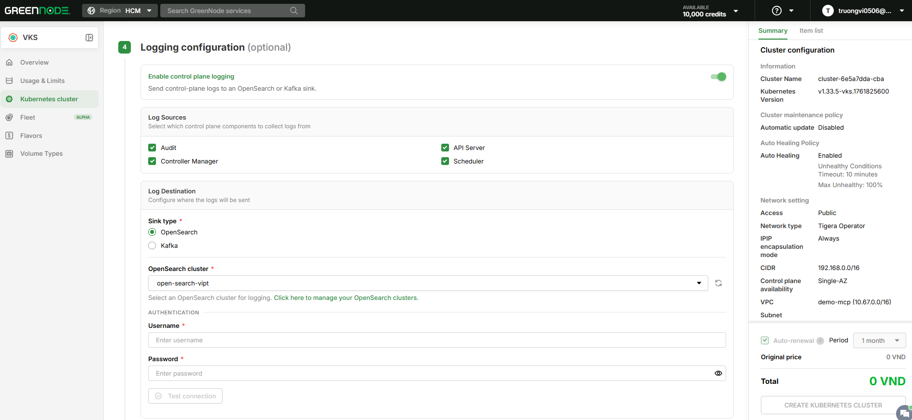
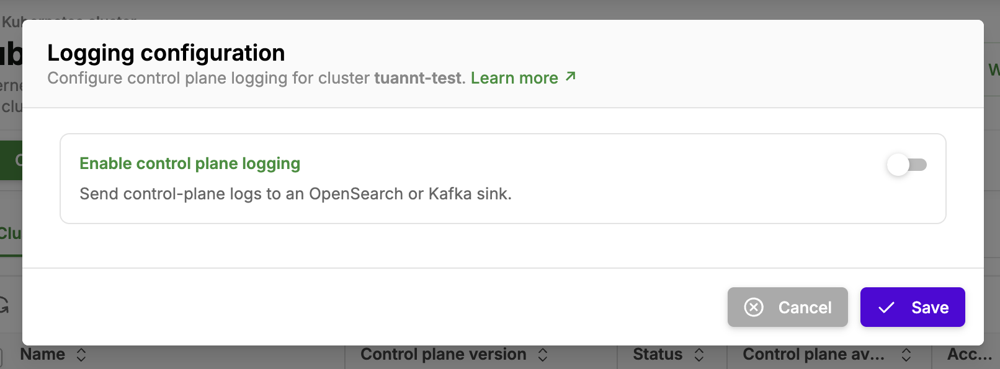
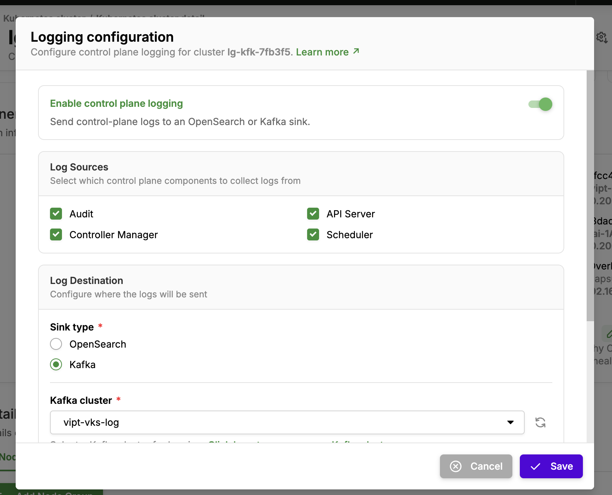
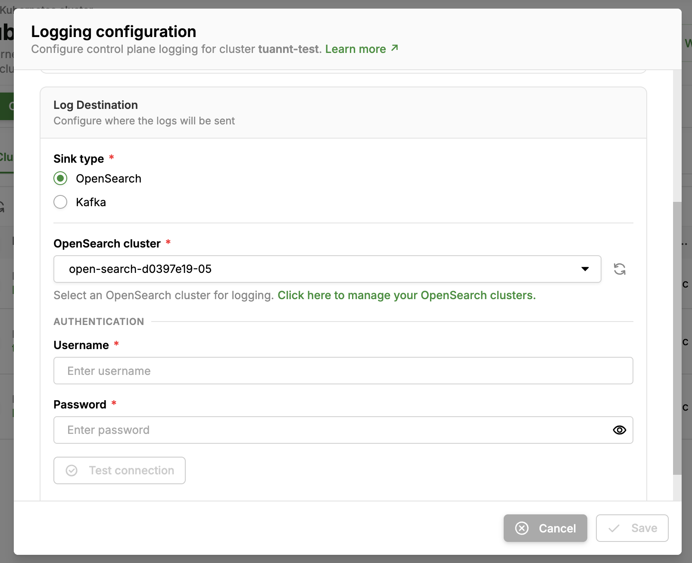

# Configure Cluster Logging

> How to enable Control Plane Logging for a VKS Cluster and push the logs to your own OpenSearch or Kafka on vDB — either while creating the Cluster, or at any time from the Cluster detail screen.

---

## 1. Overview

VKS is a managed Kubernetes service: the Control Plane components — **kube-apiserver**, **kube-controller-manager**, **kube-scheduler** — run on infrastructure operated by VKS, so you cannot access them directly. Previously this meant you could not view your own **audit log** (who called which API, when, with what result) or the Control Plane component logs when investigating an incident.

The **Logging configuration** feature lets you enable Control Plane log collection per Cluster and **deliver those logs to storage that you own** — an **OpenSearch Cluster** or a **Kafka Cluster** on vDB. The logs belong to you and are isolated per account and per Cluster.

Common use cases:

- Meeting **audit / compliance** requirements: keep a record of every request made to the Kubernetes API.
- **Security investigation**: trace who created, modified, or deleted which resource in the Cluster.
- **Cluster troubleshooting**: read apiserver, controller-manager, and scheduler logs when Pods are not scheduled, requests are rejected, or a controller behaves unexpectedly.
- **Integration with an existing observability stack**: forward logs to Kafka so your internal pipeline can consume them.

---

## 2. Highlights

- **Turn it on or off at any time.** Enable it during Cluster creation, or open the Cluster detail screen and toggle it later. When disabled, the collection resources are cleaned up and you consume no resources for this feature.
- **Collect only the logs you need.** Enable each source independently: **Audit**, **API Server**, **Controller Manager**, **Scheduler** — turn on only what you actually use to control storage cost.
- **Logs land where you manage them.** The sink is an OpenSearch or Kafka Cluster **in your own account** on vDB, using credentials you provide.
- **No log loss when the sink is temporarily unavailable.** Delivery follows an **at-least-once** model: when the sink stops serving (maintenance, lost connectivity, 5xx errors), logs are retained and delivered once the sink recovers. See the limits of this mechanism in section 7.
- **Per-Cluster isolation.** Each Cluster's logs go to their own index/topic named `{user_id}_{cluster_id}_{component}` (see section 8), never mixed across Clusters or accounts.

---

## 3. Prerequisites


This feature is currently available in **region HAN** only. If your Cluster is in another region, the **Logging configuration** step does not appear.


- A GreenNode account with the **VKS** service activated.
- A sink already created on vDB, depending on the type you choose:
  - **OpenSearch**: an [OpenSearch Cluster](../../vdb/opensearch-cluster-database-ods/) in **ACTIVE** state, plus a **Username** and **Password** with the following permissions on indices whose name starts with `{user_id}_{cluster_id}_`:
    - create indices and write data (`indices:admin/create`, `indices:data/write/bulk*`, `indices:data/write/index`);
    - the simplest option is to use the admin account of the OpenSearch Cluster.
  - **Kafka**: a [Kafka Cluster](../../vdb/kafka-cluster-kds/) in **ACTIVE** state with public access enabled, plus a [Kafka User](../../vdb/kafka-cluster-kds/quan-ly-kafka-cluster/quan-ly-kafka-user.md) with **produce** permission. The Kafka Cluster must have at least as much free **topic quota** as the number of log sources you enable (up to 4) — VKS creates the topics automatically, see section 6.3.
- The VKS Cluster and the vDB Cluster used as the sink belong to the same GreenNode account.
- The OpenSearch/Kafka Cluster has its **public endpoint** enabled — VKS connects to the sink through the vDB public endpoint.


Only **Kafka Users** with produce permission (`produceAll` or `produceConsumeAll`) appear in the selection list. If the user you expect is missing, grant produce permission to that user in the vDB console, then click the refresh icon in the form.


---

## 4. Enable Logging when creating a Cluster

**Step 1:** Go to [https://vks.console.greennode.ai/overview](https://vks.console.greennode.ai/overview), open the **Kubernetes cluster** menu, and click **Create a Cluster**.

**Step 2:** Fill in the usual Cluster configuration steps (Cluster Configuration, Node Group, Plugin).

**Step 3:** At the **Logging configuration (optional)** step, turn on the **Enable control plane logging** toggle.

<figure><figcaption>
Enable Logging directly in the Cluster creation flow
</figcaption></figure>

**Step 4:** In the **Log Sources** block, select the Control Plane components to collect logs from: **Audit**, **API Server**, **Controller Manager**, **Scheduler**. You can select one or several sources.

**Step 5:** In the **Log Destination** block, set **Sink type** to **OpenSearch** or **Kafka**, then fill in the matching connection details (see each field in section 6 below).

**Step 6:** If **Sink type** is **OpenSearch**, click **Test connection** to verify that VKS can reach and authenticate against your sink. The Kafka form does not have this connectivity check — see how to verify it yourself in section 8.

**Step 7:** Click **Create Kubernetes cluster** to finish. Logging is activated together with the Cluster.


The **Logging configuration** step is optional. If you skip it, the Cluster is created normally and you can enable logging at any time afterwards using the steps in section 5.


---

## 5. Enable or disable Logging on a running Cluster

**Step 1:** Go to [https://vks.console.greennode.ai/overview](https://vks.console.greennode.ai/overview) and open the **Kubernetes cluster** menu.

**Step 2:** Select the Cluster you want to configure to open its detail screen, then open the **Logging configuration** dialog.

**Step 3:** Turn the **Enable control plane logging** toggle on or off.

<figure><figcaption>
When the toggle is off, the whole sink configuration area is hidden
</figcaption></figure>

**Step 4:** With the toggle on, select your sources under **Log Sources** and configure the destination under **Log Destination**.

<figure><figcaption>
Select log sources and destination — shown here with Kafka as the Sink type
</figcaption></figure>

**Step 5:** Enter the authentication details in the **Authentication** block. If **Sink type** is **OpenSearch**, also click **Test connection** to confirm connectivity before saving.

<figure><figcaption>
With OpenSearch as the Sink type, enter the Username and Password of the OpenSearch Cluster
</figcaption></figure>

**Step 6:** Click **Save** to apply the configuration.

---

## 6. Configuration field reference

### 6.1. Log Sources

| Log source | Name in index/topic | What is collected | When to use it |
|---|---|---|---|
| **Audit** | `audit` | kube-apiserver audit events following the standard VKS policy (see below): who called which API, on which resource, when, and with what result | Compliance, security investigation, change tracing |
| **API Server** | `apiserver` | kube-apiserver runtime logs (stdout) | Debugging request failures, timeouts, authentication/authorization issues |
| **Controller Manager** | `kcm` | kube-controller-manager runtime logs (stdout) | Debugging controllers that fail to reconcile or resources that are never created |
| **Scheduler** | `scheduler` | kube-scheduler runtime logs (stdout) | Debugging Pods stuck in Pending |

**Standard VKS audit policy** — applied to every Cluster and not customizable:

| Request type | Log level | Notes |
|---|---|---|
| Operations on `leases`, `endpointslices`, `events` | **Not logged** | Constantly changing resources (leader-election, heartbeat) with no audit value |
| Health/metrics endpoints (`/healthz*`, `/readyz*`, `/livez*`, `/version`, `/metrics`, `/swagger*`) and internal requests from kube-proxy, kubelet, controller-manager, scheduler | **Not logged** | Noise filtering |
| Reads/writes on `secrets`, `configmaps`, `tokenreviews` | **Metadata** | Records who/when/result only; **contents are never logged**, to avoid exposing sensitive data |
| ServiceAccount token creation (`serviceaccounts/token`) | **Request** | Logs the request, not the response containing the token |
| Reads (`get`, `list`, `watch`) on other resources | **Request** | Read trail for compliance, without logging the returned content |
| Writes (`create`, `update`, `patch`, `delete`, `deletecollection`) on other resources | **RequestResponse** | Logs the full request and response (excluding `managedFields`) |
| Everything else | **Metadata** | |

In addition, only the `ResponseComplete`/`Panic` stages are logged (not `RequestReceived`), and an audit event larger than **256 KB** has its `requestObject`/`responseObject` truncated (Kubernetes marks it with `audit.k8s.io/truncated`).

### 6.2. Log Destination — Sink type: OpenSearch

| Field | Required | Description |
|---|---|---|
| **Sink type** | Yes | Select **OpenSearch** as the log destination |
| **OpenSearch cluster** | Yes | Select an ACTIVE OpenSearch Cluster in your account. Click the refresh icon to reload the list, or use the link in the form to open the vDB console and create/manage Clusters |
| **Username** | Yes | An OpenSearch account with permission to create and write indices (see section 3) |
| **Password** | Yes | The matching password |
| **Test connection** | — | Button that verifies VKS can reach and authenticate against the OpenSearch Cluster |

VKS creates the daily indices and (where permissions allow) the index template for each Cluster; you do not need to create them in advance.

### 6.3. Log Destination — Sink type: Kafka

| Field | Required | Description |
|---|---|---|
| **Sink type** | Yes | Select **Kafka** as the log destination |
| **Kafka cluster** | Yes | Select an ACTIVE Kafka Cluster in your account. Only public vKafka clusters are supported for now (you need to enable public access for the vKafka cluster from vDB). Click the refresh icon to reload the list, or use the link in the form to open the vDB console and create/manage Clusters |
| **Kafka user** | Yes | Select the Kafka User used to write logs. Only users with **produce** permission on the Kafka Cluster are listed |
| **Authentication mode** | Yes | The authentication method used when writing logs: **SASL** or **mTLS**. You can only select a method supported by both the Kafka Cluster and the Kafka User |

Unlike OpenSearch, the Kafka form has no **Test connection** button.

**VKS creates the topics automatically** on your Kafka Cluster — one topic per enabled log source, named `{user_id}_{cluster_id}_{component}` (3 partitions, 3 replicas). These topics count towards the topic quota of the Kafka Cluster. You do not need to create them in advance and **should not delete them** while logging is still enabled; if you do, VKS recreates them on the next delivery.

---

## 7. Important notes

- **You own the retention policy.** VKS does not apply any retention to the data at your sink. Configure your own deletion policy (for example ISM on OpenSearch, retention on the Kafka topics) to match your needs and budget. OpenSearch indices are created per day (`-YYYY.MM.dd`), which makes it convenient to apply ISM based on index age.
- **Storage cost sits with your sink.** The more sources you enable, the more data is written to OpenSearch/Kafka. On Clusters with heavy API traffic, **Audit** produces by far the largest volume.
- **A full OpenSearch disk pauses delivery — it does not lose logs.** When the OpenSearch Cluster hits its capacity threshold (flood-stage, indices switched to read-only), VKS retains the logs and delivers them once you free up space or scale the Cluster. During that period new logs do **not** appear.
- **Logs may be duplicated.** The at-least-once model prioritizes never losing logs, so during catch-up after an outage some records may appear more than once. On OpenSearch, audit events use `auditID` as their `_id`, so OpenSearch deduplicates them automatically (overwriting the duplicate); **API Server / Controller Manager / Scheduler** logs have no such identifier and may be written twice.
- **Logs are not real time.** The delivery worker scales with the pending log volume (from zero), so right after you enable logging, or on a Cluster with little traffic, logs may appear with a delay of **a few minutes**.
- **Deleting the VKS Cluster does not delete your logs.** All logging resources on the VKS side are cleaned up, but the logs already delivered stay in your OpenSearch/Kafka.

---

## 8. Result

Once enabled, the Cluster's Control Plane logs start flowing to the sink you selected (usually within a few minutes), separated by account, Cluster, and log type.

**Naming convention** — where `user_id` is your GreenNode account ID and `cluster_id` is the VKS Cluster ID (in the form `k8s-xxxxxxxx`), with `component` ∈ `audit`, `apiserver`, `kcm`, `scheduler`:

| Sink | Name | Example |
|---|---|---|
| OpenSearch index (daily) | `{user_id}_{cluster_id}_{component}-YYYY.MM.dd` | `11413_k8s-662308fa_audit-2026.09.07` |
| Kafka topic | `{user_id}_{cluster_id}_{component}` | `11413_k8s-662308fa_audit` |

**Record format:**

- **Audit**: the original [Kubernetes audit Event](https://kubernetes.io/docs/reference/config-api/apiserver-audit.v1/) (`audit.k8s.io/v1`), plus the routing fields `user_id`, `cluster_id`, `component`, `host` (the apiserver pod name) and `@timestamp`. On Kafka, the message key is the `auditID`.
- **API Server / Controller Manager / Scheduler**: one JSON record per log line, containing `@timestamp`, `level`, `stream`, `user_id`, `cluster_id`, `component`, `host`, `message`.

**Verification:**

- With **OpenSearch**: open OpenSearch Dashboard, create the index pattern `{user_id}_{cluster_id}_*` (or `{user_id}_{cluster_id}_audit-*` for audit only) and run your queries.
- With **Kafka**: after a few minutes the `{user_id}_{cluster_id}_{component}` topics appear in the vDB Kafka console — that is the sign VKS connected and authenticated successfully; consume those topics with your own consumer.
