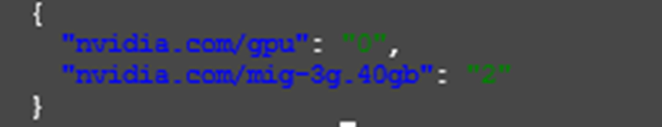
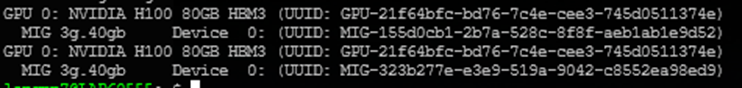

# Use Multi-Instance GPU (MIG) on VKS

> This guide walks you through configuring **Multi-Instance GPU (MIG)** on VKS to partition an NVIDIA H100 GPU into multiple isolated MIG instances — each with dedicated VRAM and Streaming Multiprocessors, ensuring complete workload isolation.

<figure><figcaption><p>MIG architecture on VKS: GPU Operator manages both MIG GPU (2x 3g.40gb) and non-MIG GPU (full 80 GB) on the same node</p></figcaption></figure>

---

## Prerequisites

- A running VKS Cluster with a node group using an **NVIDIA H100** GPU (or Ampere/Hopper or newer — MIG requires Ampere architecture or later).
- `kubectl` and `helm` installed on your local machine.
- `yq` version ≥ 4 installed for safe YAML merging (see Step 2).
- `kubectl` connected to the cluster. Verify with `kubectl get nodes`.

---

## Step 1: Install GPU Operator with `mixed` MIG Strategy

MIG on VKS requires the NVIDIA GPU Operator. VKS nodes **do not include** a pre-installed NVIDIA driver, so `driver.enabled=true` is mandatory.

The **`mixed` strategy** allows a node to run some GPUs in MIG mode and others as full (non-MIG) GPUs simultaneously — for example, GPU 0 partitioned into MIG instances while GPU 1 remains a full GPU.

**Step 1.1: Add the NVIDIA Helm repo and install GPU Operator**

```bash
helm repo add nvidia https://helm.ngc.nvidia.com/nvidia
helm repo update

helm install gpu-operator nvidia/gpu-operator \
  --namespace gpu-operator \
  --create-namespace \
  --set driver.enabled=true \
  --set mig.strategy=mixed \
  --set toolkit.enabled=true \
  --timeout=15m
```

**Step 1.2: Verify pod status**

Wait **5–10 minutes** for the GPU Operator to deploy the driver container to the node, then run:

```bash
kubectl -n gpu-operator get pods -owide
```

All pods must be `Running` or `Completed`:

| Pod | Expected status |
|---|---|
| `gpu-feature-discovery` | Running |
| `nvidia-container-toolkit` | Running |
| `nvidia-cuda-validator` | Completed |
| `nvidia-dcgm-exporter` | Running |
| `nvidia-device-plugin-daemonset` | Running |
| `nvidia-driver-daemonset` | Running |
| `nvidia-mig-manager` | Running |
| `nvidia-operator-validator` | Running |

<figure><figcaption><p>All GPU Operator pods in Running/Completed state</p></figcaption></figure>


VKS nodes have no pre-installed NVIDIA driver. Omitting `driver.enabled=true` will prevent the `nvidia-device-plugin` pod from starting, and the node will not expose any GPU resources.


---

## Step 2: Create a Custom MIG ConfigMap

GPU Operator overwrites `default-mig-parted-config` on every reconcile. You **must create a new ConfigMap with a different name** and point `migManager.config.name` to it.


Do not use `cat >> heredoc` to append a profile to the YAML file. Heredoc preserves literal whitespace, and YAML is highly sensitive to indentation — a single extra space will cause MIG Manager to report `"selected mig-config not present"`. Use `yq` to merge safely.


**Step 2.1: Install `yq` if not already available**

```bash
wget -qO /usr/local/bin/yq \
  https://github.com/mikefarah/yq/releases/latest/download/yq_linux_amd64
chmod +x /usr/local/bin/yq
```

**Step 2.2: Export the default ConfigMap**

```bash
kubectl get configmap default-mig-parted-config -n gpu-operator \
  -o jsonpath='{.data.config\.yaml}' > /tmp/mig-base.yaml
```

**Step 2.3: Merge the new profile using `yq`**

```bash
yq -i '.mig-configs.custom-gpu0-3g40gb = [
  {"devices": [0], "mig-enabled": true, "mig-devices": {"3g.40gb": 2}},
  {"devices": [1], "mig-enabled": false, "mig-devices": {}}
]' /tmp/mig-base.yaml
```

In this example:
- **GPU 0** is enabled for MIG with profile `3g.40gb` — split into 2 instances, each with 40 GB VRAM and 60 Streaming Multiprocessors.
- **GPU 1** remains non-MIG (full 80 GB).

**Step 2.4: Verify the YAML structure before applying**

```bash
# Verify the new profile was added
yq '.mig-configs | keys' /tmp/mig-base.yaml

# Dry-run to confirm correct format
kubectl create configmap custom-mig-parted-config \
  -n gpu-operator \
  --from-file=config.yaml=/tmp/mig-base.yaml \
  --dry-run=client -o yaml | grep -A8 "custom-gpu0"
```

**Step 2.5: Create the ConfigMap and upgrade GPU Operator**

```bash
# Create the new ConfigMap
kubectl create configmap custom-mig-parted-config \
  -n gpu-operator \
  --from-file=config.yaml=/tmp/mig-base.yaml

# Upgrade GPU Operator to point to the new ConfigMap
helm upgrade gpu-operator nvidia/gpu-operator \
  --namespace gpu-operator \
  --set driver.enabled=true \
  --set mig.strategy=mixed \
  --set migManager.config.name=custom-mig-parted-config \
  --timeout=10m
```


The Helm value `migManager.config.default` only accepts `"all-disabled"` or `""`. To reference a custom ConfigMap, use `migManager.config.name`.


---

## Step 3: Apply MIG Config to the Node

Label the node with `nvidia.com/mig.config` to activate the MIG profile:

```bash
kubectl label node <NODE_NAME> \
  nvidia.com/mig.config=custom-gpu0-3g40gb --overwrite
```

Follow MIG Manager logs to confirm the config is applied:

```bash
kubectl logs -n gpu-operator -l app=nvidia-mig-manager -f
```

Expected output:

```
level=info msg="Updating to MIG config: custom-gpu0-3g40gb"
level=info msg="Successfully updated to MIG config: custom-gpu0-3g40gb"
level=info msg="Changing the 'nvidia.com/mig.config.state' node label to 'success'"
```

<figure><figcaption><p>MIG Manager confirms config applied successfully with state "success"</p></figcaption></figure>

---

## Step 4: Verify Node Resources

Check that the node exposes the correct MIG resources:

```bash
kubectl get node <NODE_NAME> \
  -o json | jq '.status.capacity | with_entries(select(.key | contains("nvidia")))'
```

Expected result (2x MIG `3g.40gb` + 1 full GPU):

```json
{
  "nvidia.com/gpu": "1",
  "nvidia.com/mig-3g.40gb": "2"
}
```

Verify node labels set by MIG Manager:

```bash
kubectl get node <NODE_NAME> -o json \
  | jq '.metadata.labels | with_entries(select(.key | contains("mig")))'
```

| Label | Example value | Meaning |
|---|---|---|
| `nvidia.com/mig-3g.40gb.count` | `2` | Number of MIG instances |
| `nvidia.com/mig-3g.40gb.memory` | `40448 MiB` | VRAM per instance |
| `nvidia.com/mig-3g.40gb.multiprocessors` | `60` | Streaming Multiprocessors per instance |
| `nvidia.com/mig.config.state` | `success` | Config apply status |
| `nvidia.com/mig.strategy` | `mixed` | Active MIG strategy |

<figure><figcaption><p>Node exposes 2 MIG instances (mig-3g.40gb: 2) and 1 full GPU (gpu: 1)</p></figcaption></figure>

---

## Step 5: Deploy a Workload Using MIG Instances

Declare `nvidia.com/mig-3g.40gb` in `resources.limits` — the Kubernetes scheduler automatically assigns an available MIG instance to the Pod with no additional configuration.

Deploy 2 pods simultaneously to verify isolation:

```bash
kubectl apply -f - <<EOF
apiVersion: v1
kind: Pod
metadata:
  name: mig-test-0
spec:
  restartPolicy: Never
  containers:
  - name: cuda
    image: nvidia/cuda:12.1.0-base-ubuntu22.04
    command: ["nvidia-smi", "-L"]
    resources:
      limits:
        nvidia.com/mig-3g.40gb: "1"
---
apiVersion: v1
kind: Pod
metadata:
  name: mig-test-1
spec:
  restartPolicy: Never
  containers:
  - name: cuda
    image: nvidia/cuda:12.1.0-base-ubuntu22.04
    command: ["nvidia-smi", "-L"]
    resources:
      limits:
        nvidia.com/mig-3g.40gb: "1"
EOF

kubectl logs mig-test-0
kubectl logs mig-test-1
```

Each Pod receives a different MIG UUID — confirming complete isolation:

```
# mig-test-0
MIG 3g.40gb Device 0: (UUID: MIG-323b277e-e3e9-519a-9042-c8552ea98ed9)

# mig-test-1
MIG 3g.40gb Device 0: (UUID: MIG-155d0cb1-2b7a-528c-8f8f-aeb1ab1e9d52)
```

<figure><figcaption><p>Each Pod is assigned a distinct MIG UUID — complete isolation between workloads</p></figcaption></figure>

---

## (Optional) Step 6: Clean Up

```bash
# Delete test pods
kubectl delete pod mig-test-0 mig-test-1

# Full cleanup (if you want to reinstall GPU Operator from scratch)
helm uninstall gpu-operator -n gpu-operator --no-hooks
kubectl delete namespace gpu-operator --force --grace-period=0
kubectl label node <NODE_NAME> nvidia.com/mig.config- --overwrite
```

---

## Result

After completing these steps, your VKS node exposes both MIG instances and a full GPU simultaneously:

| Resource | K8s Resource Name | Capacity |
|---|---|---|
| GPU 0 — MIG (2x `3g.40gb`) | `nvidia.com/mig-3g.40gb` | 2 |
| GPU 1 — non-MIG (full 80 GB) | `nvidia.com/gpu` | 1 |

Each `3g.40gb` MIG instance provides: **40 GB VRAM · 60 SM · full isolation**.

| I want to... | Go to |
|---|---|
| Monitor GPU resources | [Monitor GPU Resources](khoi-tao-va-lam-viec-voi-nvidia-gpu-node-group.md#monitor-gpu-resources) |
| Autoscale GPU Nodegroup | [Autoscale GPU Resources](khoi-tao-va-lam-viec-voi-nvidia-gpu-node-group.md#autoscaling-gpu-resources) |
| Compare GPU sharing modes | [GPU Sharing modes](khoi-tao-va-lam-viec-voi-nvidia-gpu-node-group.md#configure-gpu-sharing) |
