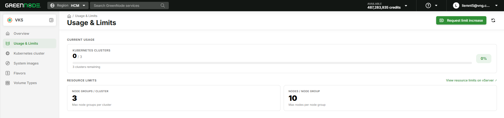

# Usage & Limits

> The **Usage & Limits** page lets you monitor your current resource usage and the limits applied to your VKS account. If you need higher limits, you can submit a request directly to the 24/7 support team.

***

## Prerequisites

* A VNG Cloud account with access to [GreenNode Portal](https://console.vngcloud.vn).

***

## View Usage & Limits

**Step 1: Open the Usage & Limits page**

1. In the left navigation panel, select **VKS**.
2. Click **Usage & Limits**.

**Step 2: Review current usage**

<figure><figcaption></figcaption></figure>

The **CURRENT USAGE** section shows:

| Resource                | Description                                                                                             |
| ----------------------- | ------------------------------------------------------------------------------------------------------- |
| **Kubernetes Clusters** | Number of clusters in use / total limit. For example: `0 / 3` means 0 clusters used, maximum 3 allowed. |

The progress bar on the right shows the percentage consumed. The line below shows remaining capacity (e.g., _3 clusters remaining_).

**Step 3: Review resource limits**

The **RESOURCE LIMITS** section shows limits applied per cluster:

| Limit                     | Description                                        |
| ------------------------- | -------------------------------------------------- |
| **Node Groups / Cluster** | Maximum number of Node Groups allowed per cluster. |
| **Nodes / Node Group**    | Maximum number of Nodes allowed per Node Group.    |


To view the full set of resource limits (vCPU, RAM, Disk, etc.) on vServer, click the **View resource limits on vServer ↗** link in the top-right corner of the **RESOURCE LIMITS** section.


***

## Request a Limit Increase

If the current limits do not meet your needs, you can request an increase:

**Step 1: Open the request form**

1. On the **Usage & Limits** page, click the **Request limit increase** button in the top-right corner.
2. Your browser will open the GreenNode support portal at [https://helpdesk.vngcloud.vn/portal/en/home](https://helpdesk.vngcloud.vn/portal/en/home).

**Step 2: Submit the request**

1. Fill in the request details (resource type, quantity needed, use case).
2. Submit the request — the 24/7 support team will respond as soon as possible.

***

## Result

After completing these steps, you can:

* Know exactly how many clusters and resources are still available to create.
* Monitor usage to avoid hitting limits when scaling your system.
* Proactively request higher limits before deploying large workloads.

| I want to...                      | Go to                                                             |
| --------------------------------- | ----------------------------------------------------------------- |
| Create my first cluster           | [Getting Started with VKS](getting-started/)                      |
| View full vServer resource limits | [vServer Limits](https://hcm-3.console.vngcloud.vn/vserver/limit) |
| Contact support                   | [GreenNode Helpdesk](https://helpdesk.vngcloud.vn/portal/en/home) |
