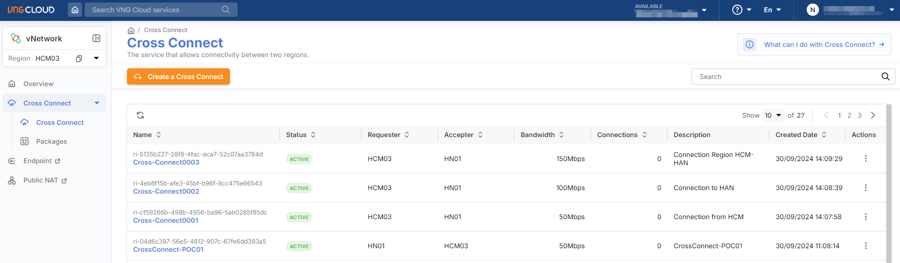
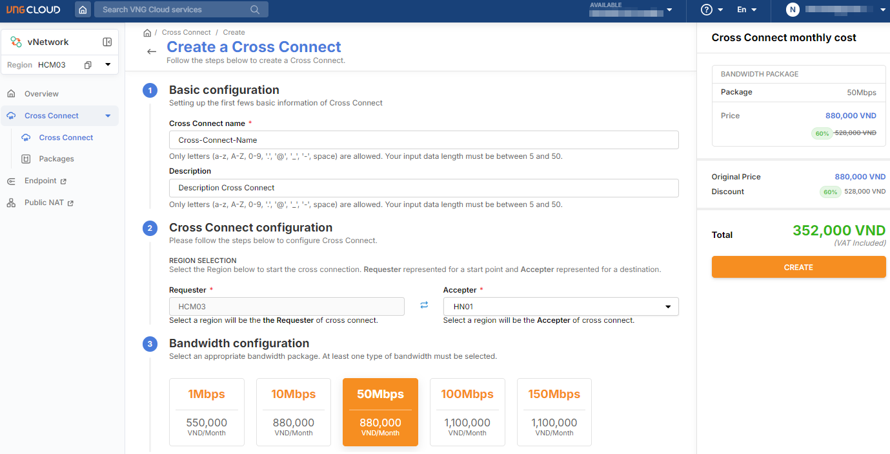

# Create Cross Connect

**Follow these steps to create a Cross Connect connection:**&#x20;

**Step 1:** Successfully log in to VNG Cloud, and on the Console screen, navigate to the vNetwork service;

**Step 2:** In the left-hand menu of the vNetwork interface, select the Cross Connect section;&#x20;

**Step 3:** The screen will navigate to the Cross Connect List page;&#x20;

<figure><figcaption></figcaption></figure>

**Step 4:** On the Cross Connect list screen, click '<mark style="color:blue;">**Create a Cross Connect**</mark>';&#x20;

**Step 5:** On the 'Create a Cross Connect' screen, fill in the setup information as follows:

* <mark style="color:blue;">**Cross Connect Name:**</mark> Enter the name of the Cross Connect being created;
* Description: (optional) Enter a description for the Cross Connect being created;
* <mark style="color:blue;">**Cross Connect Configuration**</mark>: Select the Requester (default according to the configured region) and Accepter as the two regions that need to communicate with each other;
* <mark style="color:blue;">**Bandwidth Configuration**</mark>: Select the appropriate bandwidth package according to your needs.

<figure><figcaption></figcaption></figure>

**Step 6:** On the right side of the screen, review the package summary and bandwidth costs to create the Cross Connect, then click '**Create**' to confirm and proceed with payment;&#x20;

**Step 7:** After successful payment, the system will process the connection for the newly created Cross Connect.&#x20;


**Note:**

* On the Cross Connect list screen, you can see the newly created Cross Connect with the status '<mark style="color:blue;">**Provisioning**</mark>' (which means the system is establishing the connection).
* During the setup process for this Cross Connect, the system requires time to authenticate between the two regions, so it <mark style="color:blue;">**may take up to 20 minutes to complete**</mark>. Once the system finishes processing, the status will automatically change to '<mark style="color:blue;">**Active**</mark>.'
* At this point, the user can proceed to [create a VPC connection](create-a-vpc-connection.md) between the two regions.

