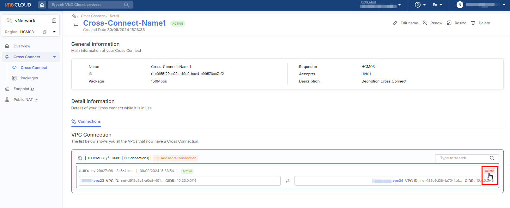
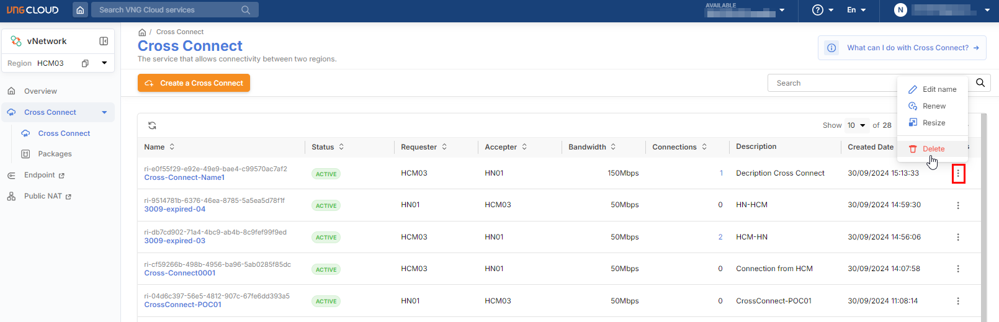

# Delete Cross Connect

Users can still delete a Cross Connect. However, to delete it, the following steps must be performed:

**Step 1**: Remove all VPC connections in the Cross Connect.

1. Successfully log in to VNG Cloud, and on the Console screen, navigate to the vNetwork service;
2. In the left-hand menu of the vNetwork interface, select the **Cross Connect** section;
3. The screen will navigate to the **Cross Connect List** page;
4. On the Cross Connect list screen, select and view the details of the Cross Connect that has VPC connections you wish to delete;
5. On the Cross Connect detail screen, in the **Connections** tab, hover over the VPC connections to display the delete icon, then click the delete icon;
6. Confirm the deletion of the VPC connection from the Cross Connect.

<figure><figcaption></figcaption></figure>

**Step 2**: Delete the Cross Connect.

1. After removing all VPC connections from the Cross Connect, return to the Cross Connect list screen;
2. For the Cross Connect you wish to delete, click the 'Delete' action to perform the deletion;
3. Confirm the deletion of the Cross Connect. Once deleted, it cannot be recovered.

<figure><figcaption></figcaption></figure>
