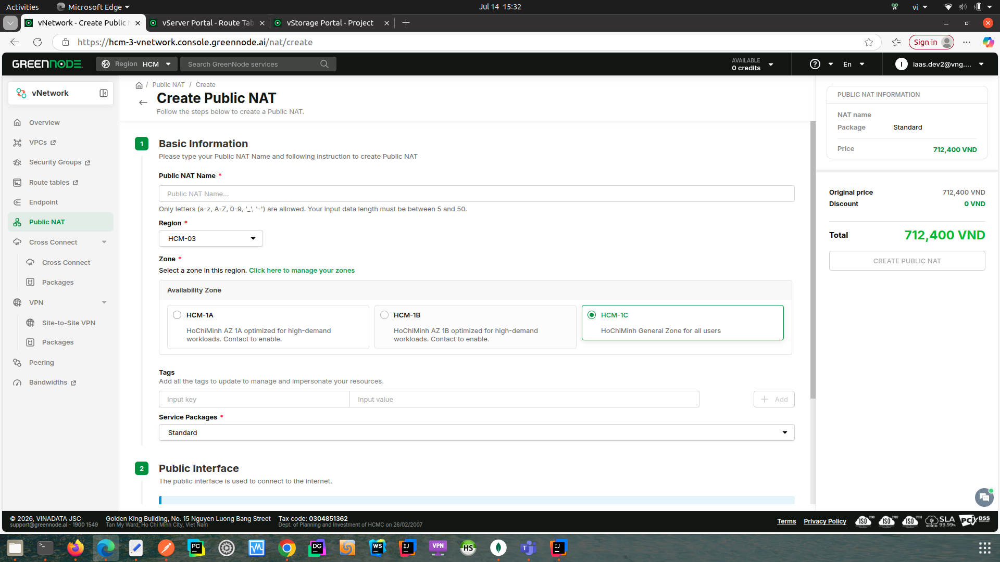
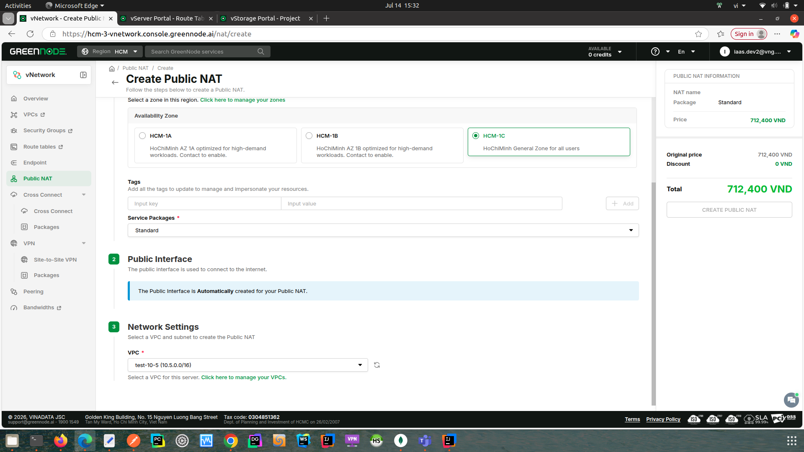

# Create NAT


* Any VM in the same VPC (the entire /16) can reach the internet through the NAT — it does not need to be on the NAT's subnet. (In V1, the VM had to be on the same subnet as the NAT.)
* The NAT's public interface is created automatically when the NAT is successfully established. You can add the public IP into a [purchased bandwidth](https://docs.greennode.ai/vng-cloud-document/vserver/compute-hcm03-1a/vpc/bandwidth/datatransfers-bandwidth-service) package (if available) to increase the NAT's bandwidth.
* By default, the NAT allows some common outbound services from your VPC: DNS (UDP 53), HTTP (TCP 80), HTTPS (TCP 443), and ICMP (ping). To allow additional ports or protocols, add an inbound rule (see [Add / Remove NAT Port](/broken/pages/36c349d2212aa971b7367af2f31735365325976d)).
* With V2, the route from your VPC to the internet through the NAT gateway is added to your VPC route table automatically. You do not need to configure a route on each VM.


* Log in to https://hcm-3-vnetwork.console.greennode.ai/nat/list with region set to HCM.
* Select the "Public NAT" menu, then choose "Create a Public NAT".



## Basic Information

* **Public NAT Name** — only letters (a–z, A–Z), digits (0–9), `_` and `-` are allowed; length must be between 5 and 50 characters.
* **Region** — select the region (e.g. HCM-03).
* **Availability Zone** — select the zone in which to place the NAT.
* **Tags** (optional) — add key/value tags to help manage your resources.
* **Service Package** — select the service package (e.g. Standard).

>
>
> 



## Public Interface

* The public interface is used to connect to the internet. It is created automatically for your Public NAT — no input is required.



## Network Settings

* **VPC** — select the VPC in which to create the Public NAT (the VPC CIDR, e.g. 10.5.0.0/16, is shown next to its name).
* **Subnet** — select the subnet.

> 

* Check the pricing in the "Summary" panel on the right.
* Click "CREATE A PUBLIC NAT".



When the NAT is created successfully, it appears on the NAT list. Open it to see its details, including the NAT Gateway IP and the Public IP.

## Routing (automatic)

With V2 you do not need to log in to each VM to add a route. When the NAT is created, GreenNode automatically adds a default route (0.0.0.0/0) pointing to the NAT gateway into your VPC route table. Every instance in the VPC then reaches the internet through the NAT with no further configuration.


**If an instance still cannot reach the internet**

Make sure the instance does not already have its own default route to a different gateway that overrides the VPC route. If such a route exists on the VM, remove it so traffic follows the NAT route added to the VPC route table.

