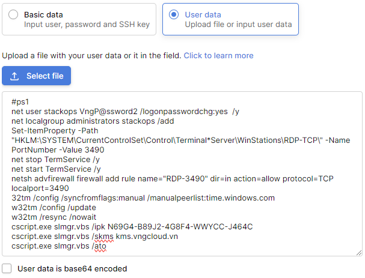

# UserData

**UserData** is the user custom content exposed to the guest instance by the currently deployed and running cloud infrastructure.

Its purpose is to provide additional data for the instance to customize it as much as you need, the vServer cloud service does support this feature.&#x20;

&#x20;VNG Cloud is able to interpret and use this kind of user specific data in multiple ways. In most of the cases, the thing that indicates of what type is the processed data is usually the first line.

* Batch
* PowerShell
* Bash
* Python
* Cloud config
* Initialize UserData when activating vServer
* Suggestions for filling commands for UserData

## **Batch**

***

**rem cmd**

This file is executed in a cmd.exe shell (can be changed with the COMSPEC environment variable).

## **PowerShell**

***

**#ps1** or **#ps1\_sysnative** (system native)

**#ps1\_x86** (Windows On Windows 32bit)

Execute PowerShell scripts using the desired executable.

## **Bash**

***

**#!/bin/bash**

A bash shell needs to be installed in the system and available in the _PATH_ in order to use this feature.

## **Python**

***

**#!/usr/bin/env python**

Python is available by default with the build itself, but also it must be in the system PATH.

## **Cloud config**

***

**#cloud-config**

Cloud-config YAML configuration as support by _cloud-init_, excluding Linux specific content. The following cloud-config directive are supported:

* **write\_files:** Definenes a set of files which will be created on the local filesystem. It can be a list of items or only one item, with the following attributes:

1. **path**: Absolute path on disk where the content should be written.
2. **content**: The content which will be written in the given file.
3. **permissions**: Integer representing file permissions.
4. **encoding**: The encoding of the data in content. Supported encodings are:
   1. b64, base64 for base64-encoding content;
   2. gz,gzip for gzip encoded content;
   3. gz+b64,gz+base64,gzip+b64,gzip+base64 for base64 encoded gzip content.

_Example_:

<table data-header-hidden><thead><tr><th></th></tr></thead><tbody><tr><td><pre><code>#cloud-config
write_files:
   encoding: b64
   content: NDI=
   path: C:\test
   permissions: '0o466'
</code></pre></td></tr></tbody></table>

 

<table data-header-hidden><thead><tr><th></th></tr></thead><tbody><tr><td><pre><code>#cloud-config
write_files:
   -   encoding: b64
       content: NDI=
       path: C:\b64
       permissions: '0644'
   -   encoding: base64
       content: NDI=
       path: C:\b64_1
       permissions: '0644'
   -   encoding: gzip
       content: !!binary |
           H4sIAGUfoFQC/zMxAgCIsCQyAgAAAA==
       path: C:\gzip
       permissions: '0644'
</code></pre></td></tr></tbody></table>

* **set\_timezone**: Change the underlying timezone.

_Example_:

<table data-header-hidden><thead><tr><th></th></tr></thead><tbody><tr><td><pre><code>#cloud-config
set_timezone: Asia/Tbilisi
</code></pre></td></tr></tbody></table>

* **set\_hostname**: Override the already default set hostname value (taken from  metadata). If the hostname is changed, a reboot will be required.

_Example_:

<table data-header-hidden><thead><tr><th></th></tr></thead><tbody><tr><td><pre><code>#cloud-config
set_hostname: newhostname
</code></pre></td></tr></tbody></table>

* **groups**: Create local groups and add existing users to those local groups.

The definition of the groups consists of a list in the format:

\<group\_name>: \[\<user1>,\<user2>]

List of users can be empty, when creating a group without members.

_Example_:

<table data-header-hidden><thead><tr><th></th></tr></thead><tbody><tr><td><pre><code>groups:
  - windows-group: [user1, user2]
  - cloud-users
</code></pre></td></tr></tbody></table>

* **users**: Create and configure local users.

the users are defined as a list. Each element from the list represents a user. Each user can have the following attributes defined:

1. **name:** (required string) The username;
2. **gecos**: The user description;
3. **primary\_group**: the user's primary group;
4. **groups**: the user's group. On Windows, primary\_group and groups are concatenated.
5. **passwd**: the user's password. On Linux, the password is a hashed string, whereas on Windows the password is a plaintext string. If the password is not defined, a random password will be set.&#x20;
6. **inactive**: boolean value, defaults to False. If set to True, the user will be disabled.
7. **expiredate**: a string in the format \<year>-\<month>-\<day>. Example: 2020-10-01.
8. **ssh\_authorized\_keys**: a list of SSH public keys, that will be set in \~/.ssh/authorized\_keys .

_Example_:

<table data-header-hidden><thead><tr><th></th></tr></thead><tbody><tr><td><pre><code>users:
  -
    name: Admin
  -
    name: brian
    gecos: 'Brian Cohen'
    primary_group: Users
    groups: cloud-users
    passwd: StrongPassw0rd
    inactive: False
    expiredate: 2020-10-01
    ssh_authorized_keys:
      - ssh-rsa AAAB...byV
      - ssh-rsa AAAB...ctV
</code></pre></td></tr></tbody></table>

* **ntp**: Set NTP servers. The definition is a dict with the following attributes:

1. **enabled**: Boolean value, default to True, to enable or disable the NTP config;
2. **servers**: A list of NTP servers;
3. **pools**: A list of NTP pools.

the Server and pools are aggregated, servers being the first ones in the list. On Windows, there is no difference between an NTP pool or server.

_Example_:

<table data-header-hidden><thead><tr><th></th></tr></thead><tbody><tr><td><pre><code>#cloud-config
ntp:
  enabled: True
  servers: ['my.ntp.server.local', '192.168.23.2']
  pools: ['0.company.pool.ntp.org', '1.company.pool.ntp.org']
</code></pre></td></tr></tbody></table>

* **runcmd**: Directive that can contain a list of commands that will be executed, in the order of their defination.

A command can be defined as a string or as a list of strings, the first one being the executable path.

On windows, the commands are aggregated into a file and executed with cmd.exe.

_Example_:

<table data-header-hidden><thead><tr><th></th></tr></thead><tbody><tr><td><pre><code>#cloud-config
runcmd:
  - 'dir C:\\'
  - ['echo', '1']
</code></pre></td></tr></tbody></table>

The cloud-config directives are executed by default in the following order:

1. write\_files;
2. set\_timezone;
3. set\_hostname
4. ntp;
5. groups;
6. users;
7. runcmd;

Use config option _cloud\_config\_plugins_ to filter or to change the order of the cloud config plugins.

The execution of set\_hostname or runcmd can request a reboot if needed. the reboot is performed at the end of the cloud-config execution (**after** all the directives have been executed .

 

## **Initialize UserData when activating vServer**

***

To type the command lines to provide Userdata to Server, you can implement in Create-Server step (step 4 in Getting stared vServer in [**here**](http://docs.vngcloud.vn/display/VSERVERENG/Getting+started)):

* In step "**Network setting**" to configure UserData, you could select "UserData" option, as shown below:

<figure><figcaption></figcaption></figure>

* You able to upload the file or **input the command lines into content field** to execute providing user information to Server. Refer to the section "Suggestions for filling commands for UserData", VNG Cloud provided defaults script command suggestions to configure.
* If UseData information in the tools being used has been Base64 encoded, you will select it.

## **Suggestions for filling commands for UseData**

***

When creating Windows Severs, VNG Cloud provide Khi tạo Server Windows, VNG Cloud Default commands (Default Scripts) in UserData field, including Windows OS licences that you can use immediately:

<table data-header-hidden><thead><tr><th></th></tr></thead><tbody><tr><td><pre><code>#ps1
net user stackops VngP@ssword2 /logonpasswordchg:yes  /y
net localgroup administrators stackops /add
Set-ItemProperty -Path "HKLM:\SYSTEM\CurrentControlSet\Control\Terminal*Server\WinStations\RDP-TCP\" -Name PortNumber -Value 3490
net stop TermService /y
net start TermService /y
netsh advfirewall firewall add rule name="RDP-3490" dir=in action=allow protocol=TCP localport=3490
32tm /config /syncfromflags:manual /manualpeerlist:time.windows.com
w32tm /config /update
w32tm /resync /nowait
cscript.exe slmgr.vbs /ipk N69G4-B89J2-4G8F4-WWYCC-J464C
cscript.exe slmgr.vbs /skms kms.vngcloud.vn
cscript.exe slmgr.vbs /ato 
</code></pre></td></tr></tbody></table>

Include:

* **stackops VngP@ssword2** : Username and password of OS;
* **N69G4-B89J2-4G8F4-WWYCC-J464C** : is activation key of OS, system will automatically map with the corresponding key and OS:

<table data-header-hidden><thead><tr><th></th></tr></thead><tbody><tr><td><pre><code>{
  "Windows Server 2016 Standard": "WC2BQ-8NRM3-FDDYY-2BFGV-KHKQY",
  "Windows Server 2019 Standard": "N69G4-B89J2-4G8F4-WWYCC-J464C",
  "Windows Server 2012 Server Standard": "XC9B7-NBPP2-83J2H-RHMBY-92BT4",
  "Windows Server 2012 R2 Server Standard": "D2N9P-3P6X9-2R39C-7RTCD-MDVJX",
  "Windows Server 2022 Standard": "VDYBN-27WPP-V4HQT-9VMD4-VMK7H"
}
</code></pre></td></tr></tbody></table>

The result will be displayed by default:

<figure><figcaption></figcaption></figure>

| 
Note:

Windows license usage is authenticated according to the IP where the VM purchased the license, then system will active the license.
 |
| ------------------------------------------------------------------------------------------------------------------------------------------------------ |

 

 
