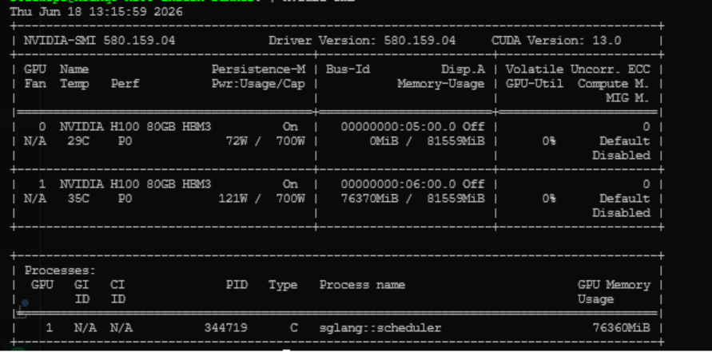
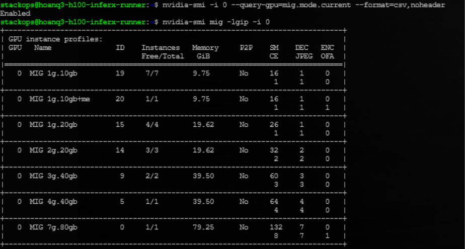
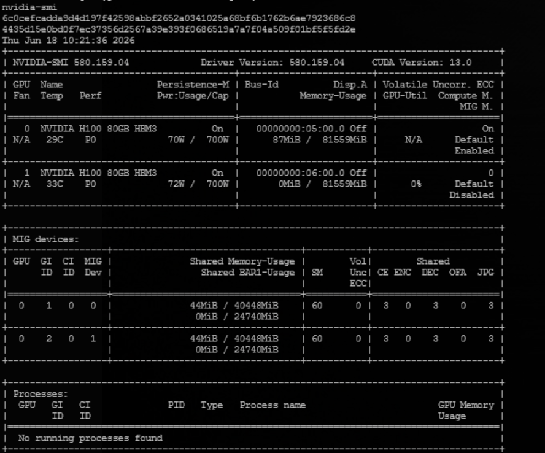
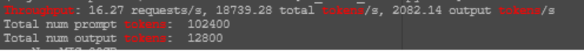

# Use Multi-Instance GPU (MIG) on vServer

> This guide walks you through configuring and using **Multi-Instance GPU (MIG)** directly on a bare-metal vServer with NVIDIA H100 — partitioning a single physical GPU into multiple isolated MIG instances, each with dedicated VRAM and Streaming Multiprocessors. Docker containers are assigned to individual MIG instances for complete workload isolation.

<figure><figcaption><p>MIG architecture on vServer: Docker + NVIDIA Container Toolkit manages both MIG GPU (2x 3g.40gb) and non-MIG GPU (full 80 GB) on the same machine</p></figcaption></figure>

---

## Prerequisites

- A bare-metal vServer with an **NVIDIA H100** GPU (or Ampere/Hopper or newer — MIG requires Ampere architecture or later).
- NVIDIA Driver **≥ 525** installed on the server. Verify with `nvidia-smi`.
- **NVIDIA Container Toolkit** installed (required to run Docker containers with GPU access).
- **Docker** installed and running.
- `sudo` access on the server.

---

## MIG Profiles Reference (H100 80GB)

Choose the profile that fits your workload before creating MIG instances. The H100 80GB supports 7 profiles:

| Profile | VRAM | Streaming Multiprocessors (SM) | Max per GPU | DEC |
|---|---|---|---|---|
| `1g.10gb` | 9.75 GB | 16 | 7 | 1 |
| `1g.10gb+me` | 9.75 GB | 16 | 1 | 1 |
| `1g.20gb` | 19.62 GB | 26 | 4 | 1 |
| `2g.20gb` | 19.62 GB | 32 | 3 | 2 |
| **`3g.40gb`** | **39.50 GB** | **60** | **2** | 3 |
| `4g.40gb` | 39.50 GB | 64 | 1 | 4 |
| `7g.80gb` | 79.25 GB | 132 | 1 | 7 |

<figure><figcaption><p>All 7 MIG profiles available on H100 80GB HBM3 — inspect with nvidia-smi mig -lgip</p></figcaption></figure>


The `3g.40gb` profile is well-suited for running AI models in the 7B–30B range (BF16). Measured performance: **16.27 req/s and 18,739 tokens/s** with Qwen2.5-7B-Instruct on a single `3g.40gb` instance.


---

## Step 1: Enable MIG on the GPU

Enable MIG mode on GPU 0 (replace `-i 0` with your target GPU index):

```bash
sudo nvidia-smi -i 0 -mig 1
```

Verify MIG is enabled:

```bash
nvidia-smi -i 0 --query-gpu=mig.mode.current --format=csv,noheader
```

Expected output:

```
Enabled MIG Mode for GPU 00000000:05:00.0
All done.
> mig.mode.current = Enabled
```

<figure><figcaption><p>MIG successfully enabled on GPU 0 — mig.mode.current = Enabled</p></figcaption></figure>


MIG mode is **not persistent** across reboots on H100 (Hopper). You must re-enable it after each server restart. To automate this, add the enable command to `/etc/rc.local` or create a systemd service.

H100 (Hopper CC 9.0) does **not require a GPU reset** to enable MIG — more production-friendly than A100.


---

## Step 2: List Available MIG Profiles

```bash
nvidia-smi mig -lgip -i 0
```

This command displays all 7 profiles along with VRAM, SM count, and the maximum number of instances that can be created per GPU.

<figure><figcaption><p>nvidia-smi mig -lgip lists all available profiles and the maximum instance count for each</p></figcaption></figure>

---

## Step 3: Create MIG Instances

Create 2 MIG instances using the `3g.40gb` profile on GPU 0:

```bash
sudo nvidia-smi mig -i 0 -cgi 3g.40gb,3g.40gb -C
```

Expected output:

```
Successfully created GPU instance ID  2 on GPU  0 using profile MIG 3g.40gb (ID  9)
Successfully created compute instance ID  0 on GPU  0 GPU instance ID  2
Successfully created GPU instance ID  1 on GPU  0 using profile MIG 3g.40gb (ID  9)
Successfully created compute instance ID  0 on GPU  0 GPU instance ID  1
```

Verify the newly created MIG instances:

```bash
nvidia-smi -L
nvidia-smi
```

Each instance has 40,448 MiB VRAM and 60 SM, with a unique UUID:

| MIG Device | GI ID | CI ID | UUID | VRAM | SM |
|---|---|---|---|---|---|
| Device 0 | 1 | 0 | `MIG-db487433-...` | 40,448 MiB | 60 |
| Device 1 | 2 | 0 | `MIG-1ee682bf-...` | 40,448 MiB | 60 |

<figure><figcaption><p>2 MIG instances of type 3g.40gb created successfully — each with its own UUID and VRAM allocation</p></figcaption></figure>

---

## Step 4: Run a Docker Container on a Single MIG Instance

Assign a container to a specific MIG instance using the `device=<GPU_index>:<MIG_instance_index>` notation:

```bash
# Container on MIG instance 0 (device=0:0)
docker run --rm --gpus '"device=0:0"' \
  nvidia/cuda:12.1.0-base-ubuntu22.04 nvidia-smi -L

# Container on MIG instance 1 (device=0:1)
docker run --rm --gpus '"device=0:1"' \
  nvidia/cuda:12.1.0-base-ubuntu22.04 nvidia-smi -L
```

Each container sees only the single MIG device it was assigned — complete isolation confirmed:

```
# device=0:0
GPU 0: NVIDIA H100 80GB HBM3 (UUID: GPU-e1c0ae81-...)
MIG 3g.40gb Device 0: (UUID: MIG-db487433-...)

# device=0:1
GPU 0: NVIDIA H100 80GB HBM3 (UUID: GPU-e1c0ae81-...)
MIG 3g.40gb Device 0: (UUID: MIG-1ee682bf-...)
```

<figure><figcaption><p>Containers on device=0:0 and device=0:1 see different MIG UUIDs — isolation confirmed</p></figcaption></figure>

---

## Step 5: Run 2 Containers in Parallel

Test that 2 containers run simultaneously on 2 MIG instances without conflict:

```bash
docker run -d --name mig0 --gpus '"device=0:0"' \
  nvidia/cuda:12.1.0-base-ubuntu22.04 \
  bash -c "nvidia-smi && sleep 60"

docker run -d --name mig1 --gpus '"device=0:1"' \
  nvidia/cuda:12.1.0-base-ubuntu22.04 \
  bash -c "nvidia-smi && sleep 60"

# Check both containers running simultaneously
nvidia-smi
```

Expected output — 2 MIG devices running in parallel with independent memory:

```
| GPU  GI  CI  MIG | Memory-Usage        | SM |
|  0    1   0   0  | 44MiB / 40448MiB   | 60 |  ← mig0 running
|  0    2   0   1  | 44MiB / 40448MiB   | 60 |  ← mig1 running
```

```bash
# Clean up after testing
docker rm -f mig0 mig1
```

<figure><figcaption><p>2 containers running simultaneously on 2 MIG instances — no conflict, fully independent memory</p></figcaption></figure>

---

## (Advanced) Step 6: Run vLLM on a MIG Instance

The `3g.40gb` MIG instance (40 GB VRAM) is capable of running AI models in the 7B–30B range. Example with **Qwen2.5-7B-Instruct** via vLLM:

**Start the vLLM server:**

```bash
docker run -d --name vllm-mig0 \
  --gpus '"device=0:0"' \
  --shm-size 8g \
  -p 8000:8000 \
  -e HF_TOKEN=<YOUR_HF_TOKEN> \
  vllm/vllm-openai:latest \
  --model Qwen/Qwen2.5-7B-Instruct \
  --gpu-memory-utilization 0.85 \
  --max-model-len 8192
```

**Wait for the server to be ready, then test:**

```bash
# Wait for health check
until curl -s http://localhost:8000/health | grep -q "{}"; do sleep 5; done

# Send a test request
curl http://localhost:8000/v1/chat/completions \
  -H "Content-Type: application/json" \
  -d '{
    "model": "Qwen/Qwen2.5-7B-Instruct",
    "messages": [{"role": "user", "content": "Hello"}],
    "max_tokens": 100
  }'
```

Measured results on MIG `3g.40gb`:

| Metric | Value |
|---|---|
| vLLM version | 0.23.0 |
| Attention backend | FlashAttention v3 |
| VRAM used | 34,432 MiB / 40,448 MiB (85%) |
| KV cache | 329,168 tokens |
| **Throughput** | **16.27 req/s** |
| **Total tokens/s** | **18,739 tokens/s** |
| API response | HTTP 200 ✅ |

<figure><figcaption><p>vLLM serving Qwen2.5-7B-Instruct on MIG 3g.40gb — 34 GB VRAM in use, API responding normally</p></figcaption></figure>

**Run throughput benchmark:**

```bash
docker run --rm --gpus '"device=0:0"' \
  --shm-size 8g \
  -e HF_TOKEN=<YOUR_HF_TOKEN> \
  --entrypoint bash \
  vllm/vllm-openai:latest \
  -c "python3 -m vllm.entrypoints.cli.main bench throughput \
    --model Qwen/Qwen2.5-7B-Instruct \
    --num-prompts 100 \
    --input-len 512 \
    --output-len 128 \
    --gpu-memory-utilization 0.85" 2>&1 | tee /tmp/benchmark_mig.txt

grep -E "Throughput|tokens" /tmp/benchmark_mig.txt
```

<figure><figcaption><p>Benchmark results: 16.27 req/s, 18,739 tokens/s on MIG 3g.40gb with Qwen2.5-7B-Instruct</p></figcaption></figure>


Starting from **vLLM 0.23.0**, the benchmark command has changed. Use:
`python3 -m vllm.entrypoints.cli.main bench throughput`

Do not use the old command: `python -m vllm.entrypoints.benchmark_throughput` (deprecated).


---

## Cleanup

Remove MIG instances and disable MIG mode when done:

```bash
# Step 1: Destroy Compute Instances first, then GPU Instances
sudo nvidia-smi mig -dci -i 0 && sudo nvidia-smi mig -dgi -i 0

# Step 2: Disable MIG mode
sudo nvidia-smi -i 0 -mig 0

# Step 3: Verify the GPU is back to a clean state
nvidia-smi -i 0 --query-gpu=mig.mode.current --format=csv,noheader
nvidia-smi
```

Expected output after cleanup:

```
Successfully destroyed compute instance ID  0 from GPU  0 GPU instance ID  1
Successfully destroyed compute instance ID  0 from GPU  0 GPU instance ID  2
Successfully destroyed GPU instance ID  1 from GPU  0
Successfully destroyed GPU instance ID  2 from GPU  0
Disabled MIG Mode for GPU 00000000:05:00.0
> mig.mode.current = Disabled
> GPU 0: 0MiB / 81559MiB  ← clean
```


Always destroy **Compute Instances first**, then **GPU Instances**. Reversing this order will cause errors.


---

## Result

After completing these steps, you can partition an H100 80GB GPU into multiple MIG instances and assign each Docker container to a dedicated instance:

| Example configuration | Docker device | VRAM | SM |
|---|---|---|---|
| 2x MIG `3g.40gb` | `device=0:0`, `device=0:1` | 40 GB / instance | 60 |
| GPU 1 non-MIG | `device=1` | 80 GB | 132 |

**Key notes:**
- MIG mode is not persistent after reboot — re-enable after each server restart.
- Each idle MIG instance uses only ~44 MiB overhead.
- GPU 1 operates completely independently from GPU 0 throughout.

| I want to... | Go to |
|---|---|
| View available GPU flavors on vServer | [Flavor](flavor.md) |
| Use MIG on VKS (Kubernetes) | [Use MIG on VKS](../../../../vks/node-groups/use-multi-instance-gpu-mig.md) |
