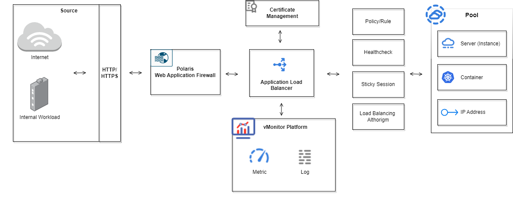

# How it works (ALB)

ALB acts as a traffic director, intelligently distributing incoming requests across multiple backend servers to ensure optimal performance, availability, and security for your applications. Here's how it works:

<figure><figcaption></figcaption></figure>
