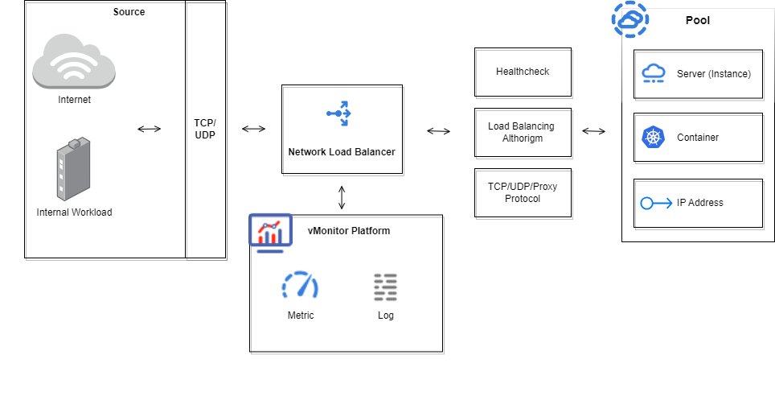

# How it works (NLB)

A Network Load Balancer (NLB) acts as a high-performance traffic distributor at the network layer (Layer 4 of the OSI model). It efficiently directs incoming TCP or UDP traffic to a pool of backend servers, ensuring optimal resource utilization and high availability for your services. Let's take a look at the high-level workflow of an NLB

<figure><figcaption></figcaption></figure>
