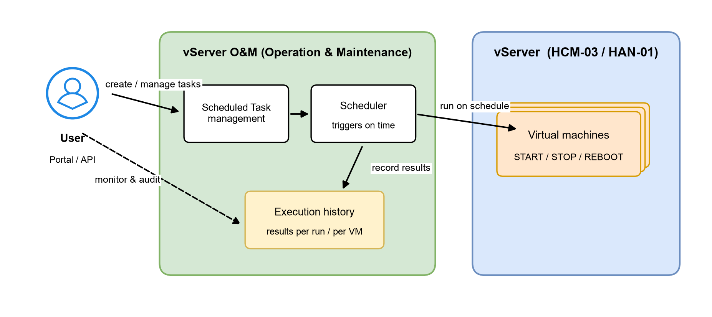

# Scheduled O&M

vServer **Operation and Maintenance (O&M) — Scheduled Task** lets you schedule routine operations on your virtual machines (VMs) automatically, instead of performing them by hand every day. You define it once — which action (Start, Stop or Reboot), on which VMs, at what time — and the system carries it out on schedule and records the result of every run.


**Note:** This is a **Beta** release for early-access customers. Features may be adjusted or extended based on your feedback.


## Benefits

* **Cost savings:** automatically shut down dev/test VMs outside working hours and start them again the next morning.
* **Less manual work:** no need to remember the time or have someone on duty to start/stop servers every day.
* **Consistent operations:** reboot application VMs on a regular cadence to refresh resources.
* **Full transparency:** every run keeps a detailed history down to each VM — whether it succeeded or failed, and why.

## Common use cases

| Scenario                                        | How to use Scheduled Task                                                                  |
| ----------------------------------------------- | ------------------------------------------------------------------------------------------ |
| Dev/test environments used only in office hours | Create two tasks: STOP at 19:00 and START at 07:00 daily for VMs tagged `env=dev`            |
| Applications that need periodic restarts        | Create a REBOOT task daily during off-peak hours (for example 03:00)                        |
| Nightly batch jobs on a dedicated VM            | START the VM at 22:00 to run the job, STOP it at 05:00 once the job finishes                |

## Beta scope

* Supported actions: **START**, **STOP**, **REBOOT**.
* Schedule frequency: **daily**, at the hour and minute you choose.
* Available regions: **HCM-03** and **HAN-01**.

## Concepts and terminology

| Term                | Meaning                                                                                                                   |
| ------------------- | ------------------------------------------------------------------------------------------------------------------------- |
| **Scheduled Task**  | A scheduled job: the action, the list of targets (VMs/tags), the schedule and the effective time window.                    |
| **Action**          | The operation performed on a VM: START / STOP / REBOOT.                                                                    |
| **Target**          | The VMs affected by the task. Selected directly by VM or indirectly by tag.                                               |
| **Tag**             | A key/value label on a VM (for example `env=dev`). A tag-based task applies to every VM carrying that tag at run time.      |
| **Execution**       | One run of a task (scheduled or manual), with an aggregate status and per-VM results.                                      |
| **Trigger**         | How an execution starts: **SCHEDULED** (at the scheduled time) or **MANUAL** (you clicked "Run now").                       |
| **Service Account** | A dedicated service account the system creates for you at activation, used to perform scheduled operations securely.        |
| **Quota**           | The maximum number of Scheduled Tasks your account can create.                                                            |
| **Region**          | The infrastructure region where the VMs run (HCM-03, HAN-01). Each task belongs to a single region.                        |

## How it works

You define tasks in the Portal; the O&M scheduler watches them and triggers them on time; the action is applied to your VMs through vServer; the outcome is written to the execution history for you to review at any time.

<figure><figcaption>
Scheduled O&#x26;M operating model
</figcaption></figure>

Three notable design points:

* **Definition is separate from execution:** you can create or edit tasks at any time; the system takes care of running them at the scheduled moment.
* **Actions run on your behalf, under your own identity:** every operation uses a Service Account dedicated to your account with least-privilege permissions — never a shared account.
* **Everything is recorded:** each run produces a history entry with results down to the individual VM.

## Beta limitations

| Area              | Current (Beta)                              | Roadmap                                        |
| ----------------- | ------------------------------------------- | ---------------------------------------------- |
| Schedule frequency| Daily                                       | Hourly / weekly / monthly to be added          |
| Actions           | START / STOP / REBOOT                       | Additional operations under evaluation         |
| Region scope      | One region per task (HCM-03, HAN-01)        | More regions per the product roadmap           |
