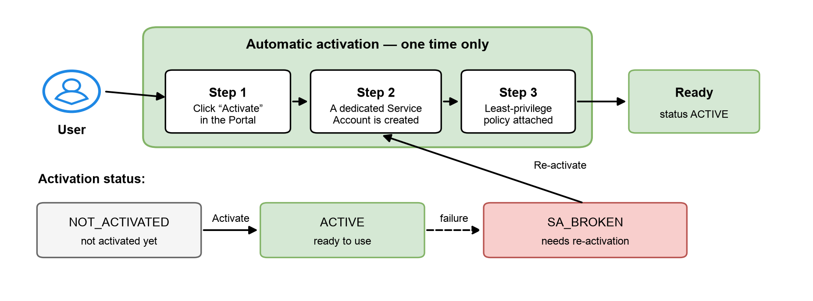

# Activate the O&M service

## Prerequisites

* A VNG Cloud account with access to the vServer Portal.
* At least one running VM in region **HCM-03** or **HAN-01**.
* Permission to use the O&M feature (if you use a sub-account through IAM, the corresponding permissions must be granted).

## Activation (one time only)

Before creating your first Scheduled Task you need to activate the service. The process is fully automatic and takes only a few seconds.

<figure><figcaption>
O&#x26;M service activation flow
</figcaption></figure>

1. Go to **Operation & Maintenance (O&M)** in the vServer Portal.
2. Click **Activate**. The system creates a dedicated Service Account for your account and attaches a least-privilege operations policy.
3. Once the status turns **ACTIVE**, you can start creating tasks.

## Activation statuses

| Status              | Meaning                                                                     | What you should do                            |
| ------------------- | --------------------------------------------------------------------------- | --------------------------------------------- |
| **NOT\_ACTIVATED**  | The service has not been activated yet                                      | Click **Activate**                            |
| **ACTIVE**          | The service is ready                                                        | Use it normally                               |
| **SA\_BROKEN**      | The Service Account is broken (for example deleted or its permissions changed) | Click **Re-activate** to let the system repair it |


**Note:** While the service is not activated, or the Service Account is broken, you can still view your task list and execution history. Only create/update/delete/run operations are temporarily blocked until activation succeeds.

