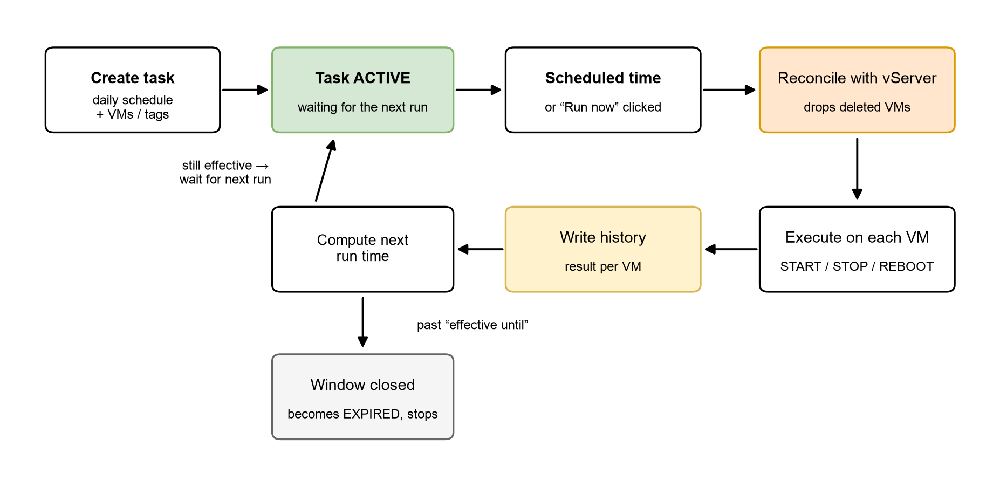

# Create and manage Scheduled Tasks

## Create a Scheduled Task

1. Go to **O&M** and choose **Create Scheduled Task**.
2. Enter a name and description for the task.
3. Select the region that holds the target VMs (**HCM-03** or **HAN-01**).
4. Choose the action: **START**, **STOP** or **REBOOT**.
5. Set the daily schedule: hour and minute.
6. Set the effective window: start date and end date.
7. Select the targets: a list of specific VMs, or a tag.
8. Confirm. The task becomes **ACTIVE** and waits for its scheduled time.

### Parameters

| Parameter                         | Required | Description and constraints                                                                 |
| --------------------------------- | -------- | ------------------------------------------------------------------------------------------- |
| Task name (`name`)                | Yes      | 5–50 characters; letters, digits and the characters `_` `-` `.` only; no spaces.              |
| Description (`description`)       | No       | A note about the purpose of the task.                                                        |
| Region                            | Yes      | HCM-03 or HAN-01. The task only affects VMs in this region.                                   |
| Action (`action`)                 | Yes      | START / STOP / REBOOT.                                                                       |
| Schedule (`schedule`)             | Yes      | Daily frequency; choose the hour (0–23) and minute (0–59).                                    |
| Effective from (`effective_from`) | Yes      | The moment the task becomes eligible to run.                                                 |
| Effective until (`effective_until`)| Yes     | After this moment the task no longer runs.                                                    |
| Targets (`targets`)               | Yes      | A list of VMs (instances) or a list of tags (key/value).                                      |

### Choosing targets: by VM or by tag?

| Criterion              | By VM (instance)                    | By tag                                                     |
| ---------------------- | ----------------------------------- | ---------------------------------------------------------- |
| How you select         | Name each VM explicitly             | Specify a tag key/value pair                               |
| Scope                  | Fixed to the selected list          | Dynamic: every VM carrying the tag at run time             |
| VMs added later        | You must update the task            | Automatically included once the tag is applied             |
| Best for               | A small, stable set of VMs          | Groups that change often (dev/test, autoscaling)           |


**Important:** With tag-based tasks, manage your tags carefully — applying the wrong tag means that VM will be stopped or rebooted on the task's schedule.


### Example: shut down dev VMs outside working hours

Goal: VMs tagged `env=dev` in HCM-03 stop at 19:00 and start again at 07:00 the next morning, through the end of 2026.

| Parameter       | Task 1 — evening shutdown   | Task 2 — morning startup    |
| --------------- | --------------------------- | --------------------------- |
| Name            | `stop-dev-19h`              | `start-dev-07h`             |
| Region          | HCM-03                      | HCM-03                      |
| Action          | STOP                        | START                       |
| Schedule        | Daily at 19:00              | Daily at 07:00              |
| Effective window| 2026-08-01 → 2026-12-31     | 2026-08-01 → 2026-12-31     |
| Targets         | tag `env=dev`               | tag `env=dev`               |

## How the system runs a task

Once created, the task is **ACTIVE** and continuously monitored. At the scheduled time — or when you click **Run now** — an execution starts.

<figure><figcaption>
Scheduled Task lifecycle — from creation to each individual run
</figcaption></figure>

### Built-in safeguards

* **Reconcile before running:** the system re-checks the target list against vServer immediately before each execution. VMs that have been deleted are dropped from the task automatically, so they never produce errors in the history.
* **No duplicate runs:** each scheduled moment executes exactly once, even if the system is busy or restarts.
* **Per-VM isolation:** a failure on one VM does not stop the others; each VM's result is recorded separately.
* **Automatic expiry:** once past the effective end date, the task stops on its own — no need to remove the schedule manually.

### Run now (manual trigger)

Besides the automatic schedule, you can click **Run now** to execute a task immediately — useful for verifying a task you just created, or handling an unplanned situation. Manual runs are recorded in the history with trigger type **MANUAL** and do not affect the next scheduled run.


**Note:** There is a cooldown between two consecutive **Run now** actions on the same task to prevent duplicate operations. If you click too quickly, the system tells you how many seconds to wait.


## Managing tasks

### Management operations

| Operation             | Description                                                                                                                                    | Condition                                              |
| --------------------- | ---------------------------------------------------------------------------------------------------------------------------------------------- | ------------------------------------------------------ |
| List / view details   | View all your tasks with their configuration, targets and next run time                                                                         | Always available                                       |
| Update                | Change the name, description, action, schedule, effective window and targets; you may also change the region (which then requires selecting new targets) | Task is **ACTIVE**                                     |
| Duplicate             | Create a new task from an existing configuration — just change the name and adjust the differences                                               | Service activated; quota available                     |
| Run now (Trigger)     | Execute immediately without waiting for the schedule                                                                                            | Task is **ACTIVE**                                     |
| Cancel                | Stop the task's schedule; the task becomes **CANCELED** and its history is preserved                                                             | Task is **ACTIVE**                                     |
| Delete                | Remove the task from your list and release its quota                                                                                            | Task is no longer ACTIVE — **Cancel** it first          |

### Task statuses

| Status         | Meaning                                                                              |
| -------------- | ------------------------------------------------------------------------------------ |
| **ACTIVE**     | Running on schedule within its effective window                                       |
| **CANCELED**   | Cancelled — no longer runs, but its history remains viewable                           |
| **EXPIRED**    | Past its effective end date — the system sets this automatically and the task stops    |


**Tip:** Cancel and Delete are different — Cancel keeps the task and its full history for reference, while Delete removes the task entirely and releases the quota. An ACTIVE task must be cancelled before it can be deleted.

