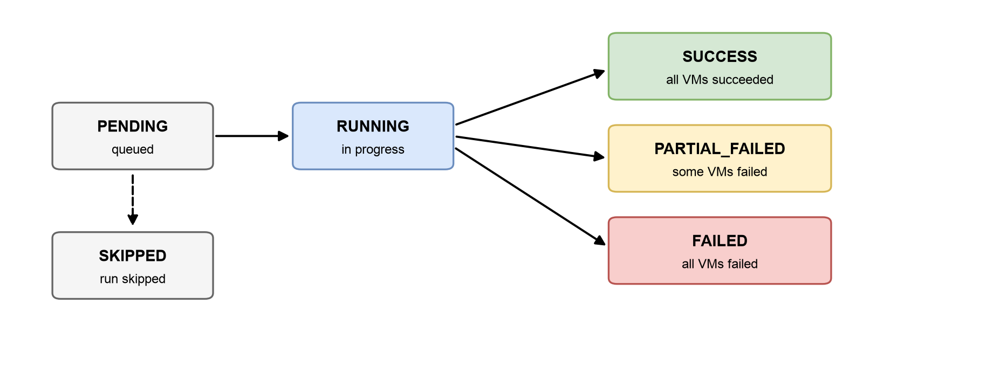

# Monitor execution history

Every time a task runs — whether on schedule or manually — the system creates an execution record. You can browse the executions of each task (paginated, filterable by status and trigger type) and drill down into the result for each individual VM.

## Aggregate status of an execution

<figure><figcaption>
Execution status model
</figcaption></figure>

| Status               | Meaning                                                                              |
| -------------------- | ------------------------------------------------------------------------------------ |
| **PENDING**          | Recorded and queued for processing                                                    |
| **RUNNING**          | Currently executing across the target VMs                                             |
| **SUCCESS**          | Every VM succeeded                                                                    |
| **PARTIAL\_FAILED**  | Some VMs succeeded and some failed — open the details to see why                        |
| **FAILED**           | Every VM failed                                                                       |
| **SKIPPED**          | The run was deliberately skipped (for example a precondition was not met) — with a note |

## Per-VM details

Within an execution, each VM has its own record: the status (**SUCCESS** / **FAILED** / **SKIPPED**), the timestamp, and a specific error message if it failed (for example the VM no longer exists, or the VM is in a state that does not allow the operation). This lets you pinpoint the cause without guesswork.
