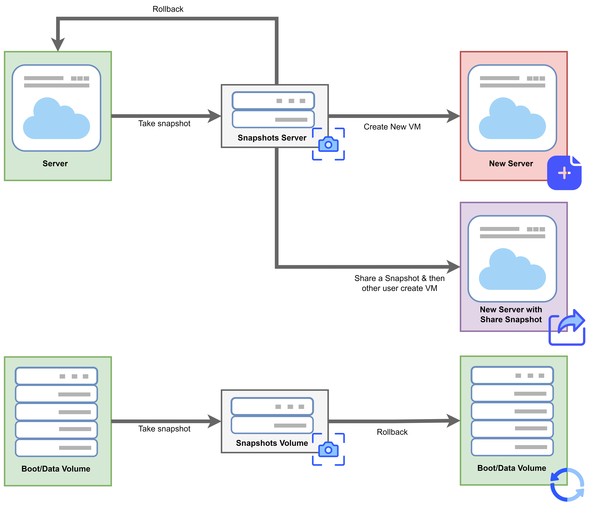

# Manage vContainer with Terraform

#### **To manage vServer with Terraform, you need to do the following steps:** <a href="#managevcontainerwithterraform-tomanagevserverwithterraform-youneedtodothefollowingsteps" id="managevcontainerwithterraform-tomanagevserverwithterraform-youneedtodothefollowingsteps"></a>

**Step 1**: Install Terraform CLI as instructed [here](install-terraform.md)

**Step 2**: To be able to manage vServer with Terraform, you need to create a Service account from the Root account on the IAM homepage (see instructions on how to create a Service account and use [IAM here](../identity-and-access-management-iam-for-vserver/actions-resources-and-required-conditions-for-vserver-access-decentralization.md)), in this case you want to create a Server with Terraform requires the following (Policy) permissions:

* CreateCluster
* GetCluster (specify by **all resources**)
* ListClusterSecGroupDefault (specify by **all resources**)
* GetClusterConfig (specify by **all resources**)

or you can grant vServerFullAccess permission (should have vServerReadOnlyAccess permission to get resource information after creation). For more information on how to assign permissions to each Resource, the corresponding Action at  [{IAM Authorization Page}](../identity-and-access-management-iam-for-vserver/actions-resources-and-required-conditions-for-vserver-access-decentralization.md).

> **Note:** Each different resource management action will require different permissions, so it's essential to set up a reasonable set of permissions that fit your business needs.

**Step 3**: Create a folder containing the terraform file and download the example from the VNG Cloud repo at [here](https://github.com/vngcloud/terraform-provider-vngcloud/tree/main/examples).

After downloading the Example folder to the computer, the user opens the file [variable.tf](https://github.com/vngcloud/terraform-provider-vngcloud/blob/main/examples/variable.tf) (under the path **terraform-provider-vngcloud/examples/**[**variable.tf**](http://variable.tf/)), then changes the necessary information as follows:

* **Client\_id:** Get at IAM homepage/ Service account - Service account Detail - **Tab Security credentials**
* **Client\_secret:** Obtained when initializing Service account at IAM homepage or can be reset at IAM homepage/ Service account - Service account Detail - **Tab Security credentials**

<figure><figcaption></figcaption></figure>

```


variable "client_id" {  
type = string  
default = "xxxxxxxxxxxxxxxxxxxxxxxxxxxxxxxxx"
}
variable "client_secret" {  
type = string  
default = "xxxxxxxxxxxxxxxxxxxxxxxxxxxxxxxxx"}
```

<figure><figcaption></figcaption></figure>

**Step 4:** Check the file [**main.tf**](https://github.com/vngcloud/terraform-provider-vngcloud/blob/main/examples/main.tf) information again (follow the path  examples/ [main.tf](http://main.tf/)), in this case you need to delete the lines below:

* _module "vserver" {source = "./modules/vng-cloud-vserver"_\
  _}_
* _module "vlb" { source = "./modules/vng-cloud-vlb" }_

_just keep:_

* module "k8s" {\
  source = "./modules/vng-cloud-k8s" }

```
source = "./modules/vng-cloud-k8s" }
terraform {  
required_providers {    
vngcloud = {      
source  = "vngcloud/vngcloud"      
version = "1.1.0"    
}  
}  
#  backend "s3" {  
#    skip_credentials_validation = true  
#    skip_metadata_api_check = true  
#    skip_region_validation = true  
#    bucket = "bucket-name"  
#    endpoint = "https://hcm01.vstorage.vngcloud.vn/"  
#    key = "terraform.tfstate"  
#    region = "HCM01"  
#    access_key = "xxxxxxxxxxxxxxxxxxxxxxxxxxxxxx"  
#    secret_key = "xxxxxxxxxxxxxxxxxxxxxxxxxxxxxx"  
#  }
} 
provider "vngcloud" {  
token_url        = "https://iamapis.vngcloud.vn/accounts-api/v2/auth/token"  
client_id        = var.client_id  
client_secret    = var.client_secret  
vserver_base_url = "https://hcm-3.api.vngcloud.vn/vserver/vserver-gateway"  
vlb_base_url = "https://hcm-3.api.vngcloud.vn/vserver/vlb-gateway"}
module "k8s" {  
source = "./modules/vng-cloud-k8s" }
}
```

\
**Step 5:** Then go to the directory **vng-cloud-vserver/ examples/ modules/ vng-cloud-k8s/**, and open the [**variable.tf**](https://github.com/vngcloud/terraform-provider-vngcloud/blob/main/examples/modules/vng-cloud-k8s/variable.tf) **file**:&#x20;

* **project\_id**: your project information, you can get it at [{Limit Tab}](https://hcm-3.console.vngcloud.vn/vserver/limit) on vServer Portal, For example: **pro-462803f3-6858-466f-bf05-df2b33faa360**:

<figure><figcaption></figcaption></figure>

* **image\_id**: operating system to initialize vServer eg: **img-b5bf635e-0456-4765-b493-31d5fcfc05aa** (1\_Ubuntu-22.04x64) ... you can see Id list when creating vServer on Portal/ [{System Image Tab}](https://hcm-3.console.vngcloud.vn/vserver/v-server/system-image)

<figure><figcaption></figcaption></figure>

* **flavor\_id**: vServer configuration that you will initialize for example: **flav-e2028a81-cc75-47e4-8af1-9eef2f857f84** (s-general-2x4) ,... you can see the list when creating vServer on Portal/ [{Flavors Tab}](https://hcm-3.console.vngcloud.vn/vserver/v-server/flavor).

<figure><figcaption></figcaption></figure>

```
variable "project_id" {  
type    = string  
default = "pro-462803f3-6858-466f-bf05-df2b33faa360"
}
variable "s_general_4x8" {  
type    = string  
default = "flav-05f97524-0410-46a4-87a8-af92aa759231"}
variable "ubuntu_20_04" {  
type    = string  
default = "img-a34d639b-e070-46ff-8b91-addf4fac45b4"
}
```

* **volume\_type\_name**: specify IOPS for root disk and data disk, for example: **SSD-3000**, you can see Volume Type list on vServer Portal/ [{Volume Type Tab}](https://hcm-3.console.vngcloud.vn/vserver/v-server/system-image).

<figure><figcaption></figcaption></figure>

* **root\_disk\_size:** specify the size of the root disk drive, for example: **20**\

* **data\_disk\_size:** specify the root disk volume, for example: **50**

```
variable "ssd_3000" {  
type    = string  
default = "3000"
}
variable "root_disk_size" {  
type    = number  
default = 20
}
variable "data_disk_size" {  
type    = number  
default = 50
}
```

* **network\_id**: specify the network id that the vServer will be created on, you can get it from the [VPC tab](https://hcm-3.console.vngcloud.vn/vserver/network/vpc), if you haven't initialized any network you can see the instructions [{Network creation page}](https://docs.vngcloud.vn/pages/viewpage.action?pageId=49648039):

<figure><figcaption></figcaption></figure>

* **subnet\_id**: specify the subnet id that vServer will be created on, you can get it from [{VPC Tab}](https://hcm-3.console.vngcloud.vn/vserver/network/vpc), if you haven't initialized any subnet you can see the instructions at [{Subnet creation page}](../vpc/virtual-private-cloud-vpc.md):&#x20;

```
variable "network_id" {  
type    = string  
default = "net-22581aed-a65d-4b1e-86d3-102d68e148e0"
}
variable "subnet_id" {  
type    = string  
default = "sub-5f101cba-7ce0-4084-8576-06b8dbfb298a" }
```

\


* **ssh\_key\_id**: specify the ssh key that will be injected into the vServer, you can get it at [{SSH Keys Tab}](https://hcm-3.console.vngcloud.vn/vserver/v-server/ssh-key), if you haven't initialized any ssh key you can see it at [{SSH key creation page}](../security/ssh-key-key-pairs.md):

<figure><figcaption></figcaption></figure>

* **security\_group\_id\_list**: specify a list of security group ids that need to be attached to vServer, you can get it at [{Security Groups Tab}](https://hcm-3.console.vngcloud.vn/vserver/network/sec-group), if you need to create more security groups you can see it at [{Security Group Creation Page}](../server-group.md).

```
variable "ssh_key_id" {  
type    = string  
default = "ssh-b4fbf87a-d9bc-4f04-9ea1-39e086f443de"
}
variable "security_group_id_list" {  
type    = list(string)  
default = [    "secg-28e91c47-11b1-4cc1-8e24-dd174882708d"  ]
}
```

<figure><figcaption></figcaption></figure>

**Step 6**: Check the file [**main.tf**](https://github.com/vngcloud/terraform-provider-vngcloud/blob/main/examples/modules/vng-cloud-vserver/main.tf)  information (follow the path _**erraform-provider-vngcloud/examples/modules/vng-cloud-k8s/**_[_**main.tf**_](http://main.tf/)), in the file we have some commands available: **Create K8S**, **Create Cluster Node Group, Change Cluster for SecGroup, Attach Load Balancer for K8s...,** in this case to Create K8S you just need to leave the **Create K8S** resource follow the instructions below:

```
data "vngcloud_vserver_volume_type_zone" "volume_type_zone" {  
name       = "SSD"  
project_id = var.project_id
} 
data "vngcloud_vserver_volume_type" "volume_type" {  
name                = var.volume_type_name  
project_id          = var.project_id  
volume_type_zone_id = data.vngcloud_vserver_volume_type_zone.volume_type_zone.id
} 
data "vngcloud_vserver_k8s_version" "k8sVersion1" {  
name       = "Version 1.18.7"  
project_id = var.project_id
} 
data "vngcloud_vserver_k8s_network_type" "k8sNetworkType" {  
name       = "Calico"  
project_id = var.project_id
} resource "vngcloud_vserver_k8s" "k8s" {  
project_id            = var.project_id  
ipip_mode             = "Always"  
name                  = "vng-cloud-k8s-example"  
k8s_version           = data.vngcloud_vserver_k8s_version.k8sVersion1.id  
master_count          = 1  
node_count            = 1  
network_type          = data.vngcloud_vserver_k8s_network_type.k8sNetworkType.id  
calico_cidr           = "10.46.0.0/16"  
network_id            = var.network_id  
subnet_id             = var.subnet_id  
ssh_key_id            = var.ssh_key_id  
master_flavor_id      = var.s_general_4x8  
node_flavor_id        = var.s_general_4x8  
etcd_volume_size      = 20  
etcd_volume_type_id   = data.vngcloud_vserver_volume_type.volume_type.id  
boot_volume_size      = 20  
boot_volume_type_id   = data.vngcloud_vserver_volume_type.volume_type.id  
docker_volume_size    = 20  
docker_volume_type_id = data.vngcloud_vserver_volume_type.volume_type.id  
description           = "K8S example"  
auto_scaling          = true  
min_node_count        = 1  
max_node_count        = 3  
enable_lb             = false  
auto_healing          = true  
ingress_controller = true
}
```

**Step 7**: Launch the terraform command

* After completing the above information, in order for terraform to initialize and download the VNG Cloud provider and set up the necessary information, run the command below, note that when running, you need to stand in the directory terraform-provider-vngcloud/ [examples/](https://github.com/vngcloud/terraform-provider-vngcloud/tree/main/examples) :

```
terraform init
```

The system will return the following results:

```
vnglab:vngcloud cbr09$ terraform init 

Initializing the backend... 

Initializing provider plugins...
- Finding vngcloud/vngcloud versions matching "0.0.5"...
- Installing vngcloud/vngcloud v0.0.5...
- Installed vngcloud/vngcloud v0.0.5 (self-signed, key ID A6A27B3126EF15EB) 
Partner and community providers are signed by their developers.
If you'd like to know more about provider signing, you can read about it here:
https://www.terraform.io/docs/cli/plugins/signing.html 

Terraform has created a lock file .terraform.lock.hcl to record the providerselections it made above. Include this file in your version control repositoryso that Terraform can guarantee to make the same selections by default whenyou run "terraform init" in the future. 

Terraform has been successfully initialized! 

You may now begin working with Terraform. Try running "terraform plan" to seeany changes that are required for your infrastructure. All Terraform commandsshould now work. 

If you ever set or change modules or backend configuration for Terraform,rerun this command to reinitialize your working directory. If you forget, othercommands will detect it and remind you to do so if necessary.
```

Then, to see what changes will be applied to the resources that terraform is managing, you can run:

| `terraform plan` |
| ---------------- |

Finally you choose to run the command line:

| `terraform apply` |
| ----------------- |

and select **YES** to perform vServer initialization via Terraform


**Step 8**: You can go to the Portal to see the Server being initialized from Terraform:

<figure><figcaption></figcaption></figure>
