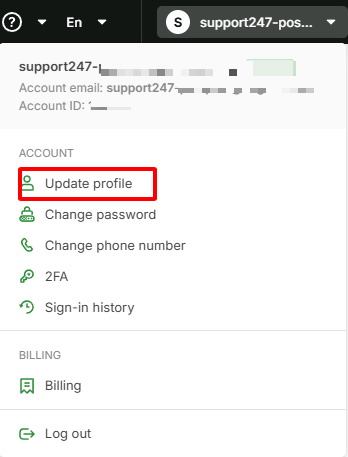

# Public Virtual IP Address for vMarketplace

## I. Purpose

Virtual IP is mainly used to:

**1. Ensure High Availability (HA)**

* If the primary server fails, the VIP moves to the standby server.
* The service stays online. Users are not interrupted.

**2. Load balancing**

* Distribute traffic to multiple backend servers.
* Improve performance and prevent overload.

**3. Simplify operations**

* Users only connect to one IP.
* Admins can change backends without impacting clients.

## II. Document objectives

This document helps you:

* Understand and use Virtual IP Address(es) on vMarketplace.
* Use pfSense or Palo Alto as an Internet Gateway.

## III. Implementation steps

**1.Standalone Mode (Single Firewall)**

Standalone mode characteristics:

**Pros:**

* Simple configuration. Easy to deploy.
* Lower cost (only one firewall VM).
* Fits dev/test and small workloads.

**Cons:**

* No failover. If the firewall VM fails, connectivity is lost.
* Single Point of Failure (SPOF).
* Downtime during maintenance or firewall restarts.

**Traffic flow:** Internet → VIP (157.20.200.185) → Firewall VM (NAT + Filter) → Server 1 (192.168.2.7), Server 2 (192.168.2.5)

**Step 1: Create a Virtual IP Address in the GreenNode portal**

Go to [vServer Portal - Create-virtual-ip-address](https://hcm-3.console.vngcloud.vn/vserver/network/virtual-ip-address).\
Select **Virtual IP Address type** = **Public Market Place**.\
Fill in the required information.

<figure><figcaption></figcaption></figure>

**Step 2: Allow an address pair for the VIP with the Marketplace external IP**

After creating the Public Marketplace VIP, allow the address pair.\
Click **Add Address Pair Interface**.\
In the popup, choose the pfSense **External IP Marketplace**.

<figure><figcaption></figcaption></figure>

Verify the address pair was added successfully.

\*Note: Save the VIP value. You will use it inside pfSense later.

<figure><figcaption></figcaption></figure>

**Step 3: Create the VIP in pfSense**

In the pfSense webGUI, go to **Firewall → Virtual IPs**.\
Click **Add**.

Fill in the required fields.

\*For **Address(es)**, enter the VIP created in the GreenNode portal in Step 2.

<figure><figcaption></figcaption></figure>

Verify the VIP in pfSense.

<figure><figcaption></figcaption></figure>

**Step 4: Create an outbound NAT rule to egress to the Internet via a specific IP**

1. Switch to **Manual Outbound NAT** mode.

<figure><figcaption></figcaption></figure>

2. Create a NAT rule.

<figure><figcaption></figcaption></figure>

3. Configure the NAT rule.

Rule requirement:

Server 1 (192.168.2.7) and Server 2 (192.168.2.5) are behind pfSense.\
They must egress to the Internet using VIP **157.20.200.185**.

<figure><figcaption></figcaption></figure>

4. **Create a route table**

Select the VPC that contains the pfSense firewall and the internal servers.

Add a route rule with:

* **Destination**: `0.0.0.0/0` (Internet)
* **Target**: `192.168.2.4` (pfSense internal interface IP)

<figure><figcaption></figcaption></figure>

**Step 5: Verify**

Log in to both servers (192.168.2.7 and 192.168.2.5).\
Run `curl ifconfig.me` to verify the public egress IP.

<figure><figcaption></figcaption></figure>

<figure><figcaption></figcaption></figure>

At this point, both servers reach the Internet using the VIP.\
All outbound traffic goes through pfSense.\
You can also access the pfSense webGUI via this VIP.

<figure><figcaption></figcaption></figure>

<figure><figcaption></figcaption></figure>

**2.High Availability (HA) Mode (2+ Firewall VM)**

**a. Characteristics**

* The VIP is shared between **two or more firewalls**.
* Automatic failover is supported.

**b. When to use**

* Production environments.
* Mission-critical services (downtime is not acceptable).
* High SLA requirements (99.9% uptime or higher).

**Pros:**

* If the primary firewall fails, the VIP moves to the backup firewall.
* Near-zero downtime, or minimal downtime (a few seconds).

**Common configurations:**

* **Active-Passive**: one firewall is active, one firewall is standby.
* **Active-Active**: both firewalls are active (combined with load balancing).

**Recommended mode when selecting the firewall deployment model**

* **pfSense**: choose **Active/Active**.
* **Palo Alto**: choose **Active/Passive**.


If you deploy **pfSense**, keep the marketplace deployment mode as **Active/Active**, then follow the VIP failover steps below for the public VIP layer.


**Traffic flow:** Internet → VIP (157.20.200.185) → Firewall VM 1 (NAT + Filter), Firewall VM 2 (NAT + Filter) → Server 1 (192.168.2.7), Server 2 (192.168.2.5)

**Implementation steps**

**Step 1: Prepare the Virtual IP Address and two pfSense firewall VMs**

Repeat the same setup as **Step 1 → Step 4** in standalone mode:

* Create the VIP.
* Add address pairs.
* Create the VIP inside pfSense.
* Configure outbound NAT and routing.

Note: The Virtual IP Address must be paired with both pfSense external interfaces.

<figure><figcaption></figcaption></figure>

**Step 2: Add an HA internal interface to both pfSense firewall VMs**

In the vServer portal, open each firewall VM details page.\
Add one more **internal interface** to both firewalls.\
Use this interface for HA sync.

<figure><figcaption></figcaption></figure>

<figure><figcaption></figcaption></figure>

**Step 3: Configure the HA interface on both pfSense firewalls**

In the pfSense webGUI, assign the new interface added from the vServer portal.\
Configure it as shown below.

Set **IPv4 Address** to the HA interface IP from the vServer portal.

<figure><figcaption></figcaption></figure>

Repeat the same configuration on the other pfSense firewall.

**Step 4: Add firewall rules on the HA interface to allow configuration sync**

In the pfSense webGUI, go to **Firewall → Rules → SYNC** (or your HA interface name).\
Click **Add**.

<figure><figcaption></figcaption></figure>

Configure the rule as shown below.

<figure><figcaption></figcaption></figure>

Repeat the same rule on the backup firewall.

**Step 5: Configure HA (master firewall only)**

In the pfSense webGUI, go to **System → High Availability**.

Configure it as shown below.

Notes:

* **pfsync Synchronize Peer IP** and **Synchronize Config to IP**: enter the backup pfSense HA interface IP.
* **Remote System Username** and **Remote System Password**: enter the backup pfSense admin credentials.
* **Select options to sync**: select what you want to synchronize to the backup.

<figure><figcaption></figcaption></figure>

<figure><figcaption></figcaption></figure>

**Step 6: Verify**

In the pfSense webGUI, go to **Status → CARP (failover)**.

* On the **master** pfSense firewall

<figure><figcaption></figcaption></figure>

* On the **backup** pfSense firewall

<figure><figcaption></figcaption></figure>

CARP VIP on pfSense HA creates a shared virtual IP for the HA cluster.\
If the master firewall fails, CARP moves the VIP to the backup firewall automatically.
