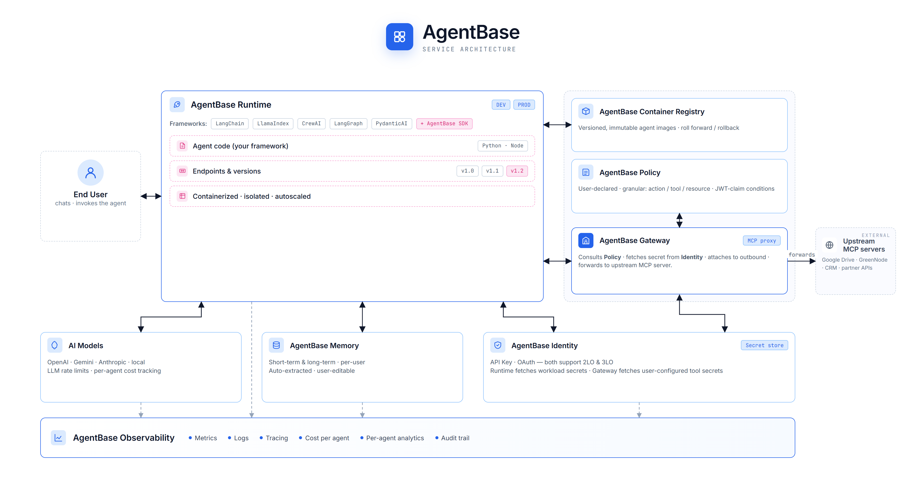

# AgentBase

## Bắt đầu bằng một ví dụ thực tế

Bạn muốn xây một AI Agent hỗ trợ khách hàng: nhận câu hỏi qua chat, tra cứu đơn hàng trong database, gửi thông báo qua Slack, và nhớ lại nội dung cuộc hội thoại tuần trước.

Nghe đơn giản — nhưng thực tế bạn sẽ phải tự lo:

- **Đâu để chạy agent?** Container, server, autoscaling, CI/CD deploy...
- **Credential để ở đâu?** Database password, Slack token, API key — không thể hardcode vào code.
- **Agent gọi tool nào cũng được?** Cần kiểm soát để agent không vô tình gọi API xóa dữ liệu.
- **Chi phí LLM tháng này bao nhiêu?** Không có dashboard, không biết khi nào vượt budget.
- **Khi có lỗi trên production?** Không có logs tập trung, không biết request nào fail.

**AgentBase giải quyết toàn bộ những điều này** — để bạn chỉ cần tập trung viết logic của agent.

---

## AgentBase là gì?

**GreenNode AgentBase** là nền tảng hạ tầng chuyên biệt dành cho AI Agent — cung cấp đầy đủ lớp vận hành, bảo mật và kiểm soát cần thiết để đưa agent từ code lên production.

AgentBase bao gồm các module sau:

| Module                       | Chức năng                                                                                                        |
| ---------------------------- | ------------------------------------------------------------------------------------------------------------------ |
| **Agent Runtime**      | Deploy và vận hành agent — quản lý container lifecycle, versioning, rollback, scaling                        |
| **Marketplace**        | Triển khai agent dựng sẵn (OpenClaw và các template) chỉ với 1 click, không cần code                      |
| **Access Control**     | Quản lý Agent Identity và lưu trữ credential (API Key, OAuth2) — tự động inject vào agent khi chạy      |
| **MCP Governance**     | Kiểm soát tất cả MCP tool calls từ agent — xác thực và phân quyền qua MCP Gateway + Policy Group        |
| **Protect & Govern**   | Rate Limiting theo model hoặc API Key — tránh agent tiêu thụ quá mức tài nguyên                           |
| **Memory**             | Cho agent ghi nhớ xuyên session — Short-Term (lịch sử hội thoại) và Long-Term (semantic search)            |
| **Container Registry** | Private image registry tự động tạo kèm mỗi org — lưu trữ container image cho Custom Agent                 |
| **Team & Permissions** | Quản lý thành viên với 4 role (Root / Admin / Member / Viewer) và phân quyền chi tiết                     |
| **Usage & Budget**     | Dashboard theo dõi requests, tokens, cost theo agent/model/provider; đặt budget limit và cảnh báo tự động |

---

## Hai cách bắt đầu

**Không cần code — dùng ngay:**
Vào [Marketplace](marketplace/README.md), chọn **OpenClaw**, điền API key và kênh chat — agent chạy trong vài phút.

**Tự build agent:**
Đóng gói agent thành Docker image, push lên [Container Registry](container-registry/README.md), deploy qua [Agent Runtime](agent-runtime/README.md). Thêm credential trong [Access Control](../agent-base/README.md), gắn [MCP Gateway](mcp-governance/mcp-gateway/README.md) nếu agent cần gọi external tools.

---

## Dành cho ai?

| Đối tượng                     | AgentBase mang lại                                                            |
| --------------------------------- | ------------------------------------------------------------------------------ |
| **AI Engineer / Developer** | Tập trung viết logic agent — infra, credential, observability đã có sẵn |
| **Startup / Product Team**  | Ra mắt AI product nhanh hơn                                                  |
| **Doanh nghiệp**           | Kiểm soát chi phí, phân quyền theo team, bảo mật credential theo chuẩn |
