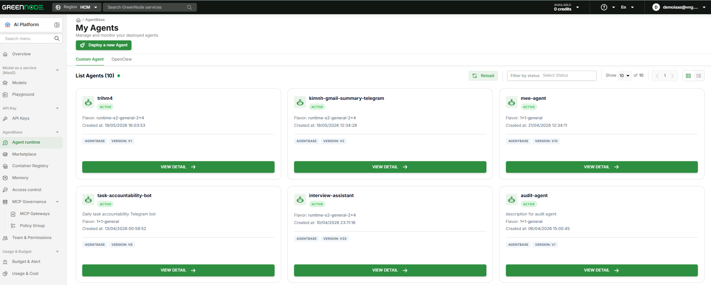
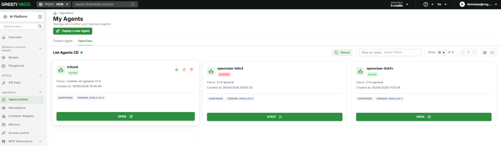

# Agent Runtime

Agent Runtime là nơi tập trung để triển khai, vận hành và kiểm soát vòng đời toàn bộ AI Agent của bạn trên GreenNode AgentBase — bao gồm cả Custom Agent do bạn tự build lẫn OpenClaw Agent từ Marketplace, quản lý trong cùng một giao diện.

---

## Tổng quan

Trang **My Agents** là màn hình chính của Agent Runtime — hiển thị toàn bộ agent đang chạy trong tổ chức, kèm nút **Deploy a new Agent** để tạo mới nhanh chóng. Danh sách agent hỗ trợ hai chế độ hiển thị: **Grid** (thẻ card) và **List** (bảng dạng hàng), chuyển đổi bằng nút toggle góc phải màn hình.

Agent được tổ chức thành hai tab riêng biệt:

### Tab Custom Agent

Liệt kê các agent bạn tự build và triển khai từ container image. Mỗi agent card hiển thị:

- **Tên agent** và trạng thái hiện tại
- **Flavor** — cấu hình tính toán (vCPU × RAM), ví dụ: `runtime-s2-general-2×4`
- **Ngày tạo** và **phiên bản** đang chạy (ví dụ: `VERSION: V10`)
- Nút **View Detail** → vào trang chi tiết để xem logs, metrics, Endpoint và quản lý phiên bản

### Tab OpenClaw

Liệt kê các agent OpenClaw triển khai từ Marketplace. Ngoài thông tin tương tự Custom Agent, mỗi card còn có các action nhanh:

- **OPEN** — mở giao diện chat của agent (khi đang `ACTIVE`)
- **START** — khởi động lại agent (khi đang `STOPPED`)
- **Upgrade version** — nâng cấp lên phiên bản OpenClaw mới nhất
- Icon chỉnh sửa / tắt / xóa agent ngay trên card

---

## Trạng thái Runtime

Hai loại Runtime có tập trạng thái khác nhau:

**Custom Agent:**

| Trạng thái | Ý nghĩa |
|---|---|
| `ACTIVE` | Đang chạy, sẵn sàng nhận request |
| `CREATING` | Đang được khởi tạo lần đầu |
| `UPDATING` | Đang triển khai phiên bản mới |
| `STARTING` | Đang khởi động lại sau khi dừng |
| `STOPPING` | Đang trong quá trình dừng |
| `STOPPED` | Đã dừng, không tốn chi phí tính toán |
| `DELETING` | Đang được xóa |
| `ERROR` | Khởi động thất bại — kiểm tra logs |

**OpenClaw:**

| Trạng thái | Ý nghĩa |
|---|---|
| `ACTIVE` | Đang chạy, sẵn sàng nhận request |
| `CREATING` | Đang được khởi tạo lần đầu |
| `STARTING` | Đang khởi động lại sau khi dừng |
| `STOPPING` | Đang trong quá trình dừng |
| `STOPPED` | Đã dừng, không tốn chi phí tính toán |
| `DELETING` | Đang được xóa |
| `DELETED` | Đã xóa hoàn toàn |
| `ERROR` | Khởi động thất bại — kiểm tra logs |

---

## Tính năng chính

### Dừng / Khởi động Runtime

Dừng Runtime khi không sử dụng để tiết kiệm chi phí, sau đó khởi động lại khi cần — cấu hình và Endpoint được giữ nguyên.

### Versioning và Rollback

Mỗi lần cập nhật container image tạo ra một **Version** mới bất biến. Endpoint mặc định tự động trỏ đến phiên bản mới nhất; bạn có thể tạo thêm Endpoint ghim vào phiên bản cụ thể để phục vụ canary hoặc rollback.

### Private VPC

Triển khai Runtime trong mạng nội bộ doanh nghiệp — không tiếp xúc với internet công cộng. Cấu hình tại thời điểm tạo Runtime. Xem [Private VPC](khoi-tao-runtime.md).

### Private Container Registry

Kéo image từ Container Registry của tổ chức bạn. Xem [Container Registry](../container-registry/README.md).

---

## Bắt đầu

| Tôi muốn... | Đến |
|---|---|
| Tạo Runtime mới từ container image | [Khởi tạo Runtime](khoi-tao-runtime.md) |
| Dừng, khởi động hoặc cập nhật Runtime | [Quản lý Runtime](quan-ly-runtime.md) |
| Sử dụng agent từ Marketplace | [Marketplace](../marketplace/README.md) |