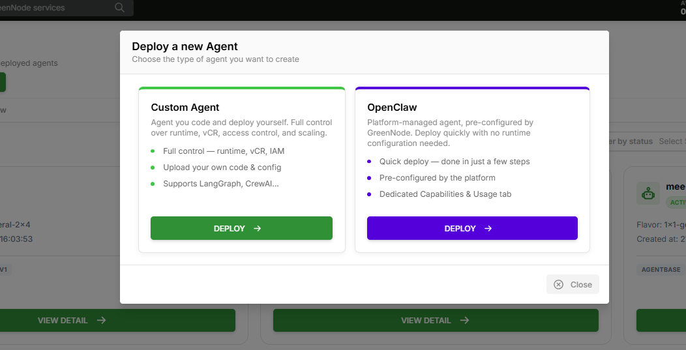

# Khởi tạo Runtime

> Hướng dẫn tạo Agent Runtime từ container image để chạy AI Agent của bạn trên GreenNode AgentBase.

---

## Điều kiện cần

- Tài khoản GreenNode với vai trò Root hoặc Admin
- Container image cho agent (registry công khai hoặc [private Container Registry](../container-registry/README.md))
- Identity đã tạo cho agent — xem [Access Control](../access-control/README.md)

---

## Triển khai nhanh với AgentBase Skills

Nếu bạn dùng **Claude Code**, **Cursor** hoặc Codex, GreenNode cung cấp bộ skills tại [github.com/vngcloud/greennode-agentbase-skills](https://github.com/vngcloud/greennode-agentbase-skills) — tập hợp slash commands tự động hóa toàn bộ quy trình từ scaffold đến deploy chỉ trong một workflow hướng dẫn.

**Cài đặt:**

```bash
# Clone skills vào project của bạn
git clone https://github.com/vngcloud/greennode-agentbase-skills .claude/skills/agentbase
```

**Sử dụng trong Claude Code / Cursor:**

| Skill | Chức năng |
|---|---|
| `/agentbase-wizard` | Workflow 9 bước đầy đủ: scaffold → configure → code → test → deploy → verify |
| `/agentbase-deploy` | Build container, push image và deploy lên Runtime |
| `/agentbase-monitor` | Xem logs, metrics và trạng thái Runtime |
| `/agentbase-identity` | Cấu hình IAM Identity cho agent |

Phù hợp với developer muốn tích hợp deploy vào quy trình AI-assisted coding mà không cần thao tác thủ công trên Portal.

---

## Tạo Runtime qua Portal

**Bước 1:** Mở trang [My Agents](https://aiplatform.console.vngcloud.vn/my-agents?tab=runtime) → nhấp **Deploy a new Agent**

Một popup hiện ra để bạn chọn loại agent:



| Loại | Mô tả |
|---|---|
| **Custom Agent** | Agent bạn tự code và triển khai — toàn quyền kiểm soát runtime, vCR, IAM, scaling |
| **OpenClaw** | Agent được GreenNode cấu hình sẵn, triển khai nhanh, không cần cấu hình runtime |

Nhấp **DEPLOY** trong card **Custom Agent** để tiếp tục.

**Bước 2:** Điền thông tin cơ bản

| Trường | Giá trị ví dụ | Ghi chú |
|---|---|---|
| **Name** | `my-order-agent` | Duy nhất, chữ thường, cho phép dấu gạch ngang |
| **Description** | `Production order agent` | Tùy chọn |
| **Image URL** | `vcr.vngcloud.vn/<repo>/my-agent:v1` | Đường dẫn image đầy đủ kèm tag |
| **Flavor** | `1x1-general` | 1 vCPU, 1 GB RAM |
| **Min Replicas** | `1` | Phạm vi: 1–10 |
| **Max Replicas** | `1` | Đặt >1 để bật autoscaling |
| **CPU Threshold** | `50` | Scale out khi CPU vượt % này (25–75) |
| **Memory Threshold** | `50` | Scale out khi RAM vượt % này (25–75) |
| **Registry Auth** | Bật nếu là private | Username = robot account `backendName` |
| **Environment Variables** | `KEY=value` | Chỉ cấu hình không nhạy cảm |

**Bước 3:** Cấu hình mạng (tùy chọn)

- **Private VPC**: bật để triển khai trong mạng nội bộ doanh nghiệp

**Bước 4:** Cấu hình Endpoint — AgentBase tự động tạo một Endpoint **DEFAULT**

**Bước 5:** Xem lại → nhấp **Create**

Runtime chuyển từ `CREATING` → `ACTIVE` khi container khởi động thành công.

---

## Tạo Runtime qua API

> Yêu cầu: `$TOKEN` — IAM bearer token. Xem [Bắt đầu](../getting-started.md#configure-authentication) để lấy token.

**Image từ registry công khai:**

```bash
curl -s -X POST "https://agentbase.api.vngcloud.vn/runtime/agent-runtimes" \
  -H "Authorization: Bearer $TOKEN" \
  -H "Content-Type: application/json" \
  -d '{
    "name": "my-order-agent",
    "description": "Production order agent",
    "imageUrl": "vcr.vngcloud.vn/<repo-backendName>/my-agent:v1.0.0",
    "command": [],
    "args": [],
    "environmentVariables": {
      "LOG_LEVEL": "info"
    },
    "flavorId": "1x1-general",
    "autoscaling": {
      "minReplicas": 1,
      "maxReplicas": 3,
      "cpuUtilization": 50,
      "memoryUtilization": 50
    }
  }' | jq .
```

**Image từ registry riêng tư (cần imageAuth):**

```bash
curl -s -X POST "https://agentbase.api.vngcloud.vn/runtime/agent-runtimes" \
  -H "Authorization: Bearer $TOKEN" \
  -H "Content-Type: application/json" \
  -d '{
    "name": "my-order-agent",
    "imageUrl": "vcr.vngcloud.vn/<repo-backendName>/my-agent:v1.0.0",
    "imageAuth": {
      "enabled": true,
      "username": "<robot-account-backendName>",
      "password": "<robot-account-secret>"
    },
    "command": [],
    "args": [],
    "environmentVariables": {},
    "flavorId": "1x1-general",
    "autoscaling": {
      "minReplicas": 1,
      "maxReplicas": 1,
      "cpuUtilization": 50,
      "memoryUtilization": 50
    }
  }' | jq .
```

**Kiểm tra trạng thái cho đến khi ACTIVE:**

```bash
RUNTIME_ID="<id-from-response>"
while true; do
  STATUS=$(curl -s "https://agentbase.api.vngcloud.vn/runtime/agent-runtimes/$RUNTIME_ID" \
    -H "Authorization: Bearer $TOKEN" | jq -r '.status')
  echo "Status: $STATUS"
  [ "$STATUS" = "ACTIVE" ] && break
  sleep 10
done
```

---

## Yêu cầu container (Service Contract)

Agent của bạn phải đáp ứng các yêu cầu sau để hoạt động với Runtime:

### Port và Health Check

| Yêu cầu | Giá trị | Ghi chú |
|---|---|---|
| Cổng lắng nghe | `8080` | Bắt buộc — không thể cấu hình |
| Health check | `GET /health` | Phải trả về HTTP 200 |

**Sử dụng greennode-agentbase SDK (khuyến nghị):**

```python
from greennode_agentbase import GreenNodeAgentBaseApp, RequestContext

app = GreenNodeAgentBaseApp()

@app.entrypoint
def handler(payload: dict, context: RequestContext) -> dict:
    return {"output": "Hello!"}

if __name__ == "__main__":
    import os
    app.run(host="0.0.0.0", port=int(os.environ.get("PORT", "8080")))
```

**Không dùng SDK (ví dụ FastAPI):**

```python
from fastapi import FastAPI

app = FastAPI()

@app.get("/health")
def health():
    return {"status": "ok"}

@app.post("/invoke")
def invoke(body: dict):
    return {"output": f"Echo: {body.get('input', '')}"}
```

### Biến môi trường tự động tiêm

Runtime tự động tiêm các biến sau vào mỗi container:

| Biến | Mô tả |
|---|---|
| `GREENNODE_CLIENT_ID` | IAM service account client ID |
| `GREENNODE_CLIENT_SECRET` | IAM service account client secret |
| `GREENNODE_AGENT_IDENTITY` | Tên agent identity |

### Request Header

Mỗi request đến agent kèm theo:

| Header | Mô tả |
|---|---|
| `X-GreenNode-AgentBase-User-Id` | ID người dùng cuối — dùng làm `actorId` cho thao tác memory |
| `X-GreenNode-AgentBase-Session-Id` | ID phiên — dùng làm `thread_id` cho LangGraph checkpointing |


Nếu agent sử dụng memory, hãy kiểm tra sự hiện diện của các header này và trả về lỗi nếu thiếu. Không dùng giá trị mặc định — sẽ gây trộn lẫn dữ liệu giữa các người dùng.


---

## Kết quả

| Tôi muốn... | Đến |
|---|---|
| Dừng, khởi động hoặc cập nhật Runtime | [Quản lý Runtime](quan-ly-runtime.md) |
| Gắn Policy Group vào Gateway | [Policy Groups](../mcp-governance/policy-groups/README.md) |