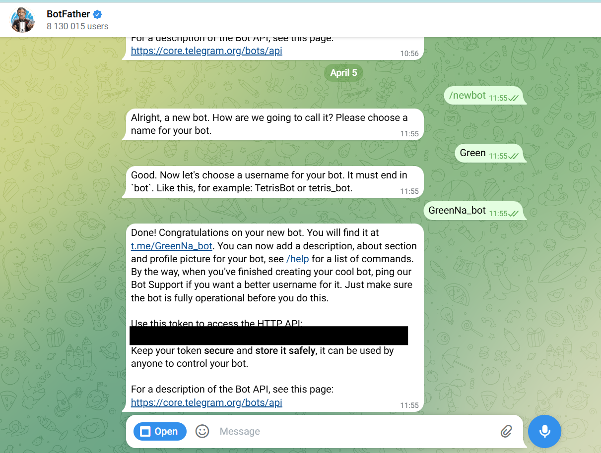
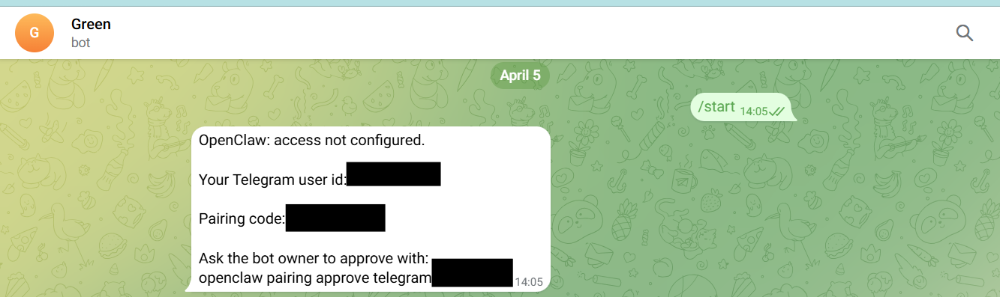

# Lấy Bot Token và Pairing

> Tài liệu này hướng dẫn lấy bot token và pairing để kết nối kênh chat với OpenClaw trên AgentBase. Nếu bạn chưa triển khai OpenClaw, xem trước: [Triển khai và Quản lý OpenClaw](trien-khai-openclaw-1-click.md).


**Lấy bot token trước khi deploy.** Trường **Bot Token** ở bước **Cấu hình Channel** lúc deploy không bắt buộc, nhưng bạn nên điền ngay tại đó. Nếu để trống rồi deploy xong mới muốn thêm, bạn phải nhờ agent trong OpenClaw tự cập nhật cấu hình channel — việc này khó thực hiện và dễ sai. Hãy làm **Phần 1** (Telegram) hoặc **Phần 3** (Zalo) trước, rồi dán token vào form deploy.



**Chỉ pairing khi instance đã Active.** Pairing yêu cầu OpenClaw instance đang chạy. Mở **My Agents** và xác nhận trạng thái là 🟢 **Active** trước khi gửi `/start` cho bot.


## Phần 1 — Lấy Bot Token từ Telegram

### Bước 1: Tạo bot mới trên BotFather

1. Mở Telegram, tìm và chat với **@BotFather** (có dấu kiểm xanh chính thức).
2. Gửi lệnh `/newbot`.
3. Nhập **tên hiển thị** của bot (ví dụ: `My OpenClaw Bot`).
4. Nhập **username** — bắt buộc kết thúc bằng `bot` (ví dụ: `my_openclaw_bot`).

<figure><figcaption></figcaption></figure>

### Bước 2: Lấy Bot Token

Sau khi tạo xong, BotFather trả về tin nhắn chứa token có dạng:

```
1234567890:ABCdefGHIjklMNOpqrsTUVwxyz
```

Sao chép token này và lưu vào nơi an toàn — bạn sẽ dán nó vào trường **Bot Token** ở bước **Cấu hình Channel** khi [deploy OpenClaw](trien-khai-openclaw-1-click.md).

> **Lưu ý:** Token là thông tin bí mật, không chia sẻ công khai.

***

## Phần 2 — Pairing tài khoản Telegram với OpenClaw

### Bước 1: Lấy Pairing Code

<figure><figcaption></figcaption></figure>

Xác nhận OpenClaw instance đang ở trạng thái 🟢 **Active** tại **My Agents** trước khi làm bước này.

1. Mở Telegram, tìm bot bạn vừa tạo (ví dụ: `@my_openclaw_bot`).
2. Nhấn **Start** hoặc gửi `/start`.
3. Bot phản hồi một **pairing code**, ví dụ:

```
Your pairing code is: ABC123DEF456

Please run this command in OpenClaw:
openclaw pairing approve telegram ABC123DEF456
```

### Bước 2: Approve Pairing trong OpenClaw Gateway

Truy cập **OpenClaw Gateway Dashboard** → tìm ô chat, sau đó nhập:

```
openclaw pairing approve telegram <pairing_code>
```

Thay `<pairing_code>` bằng code nhận được ở Bước 1.

### Kết quả

* Pairing thành công → bot bắt đầu nhận và trả lời tin nhắn của bạn trên Telegram.
* Nếu code hết hạn → gửi lại `/start` trên Telegram để lấy code mới.

<figure><figcaption></figcaption></figure>

***

## Phần 3 — Lấy Bot Token từ Zalo

> **Lưu ý:** Zalo channel hiện đang ở trạng thái **Experimental**. Direct Message (DM) hoạt động đầy đủ; tính năng group và media có thể không ổn định.

### Bước 1: Tạo bot trên Zalo Platform

1. Truy cập [https://bot.zaloplatforms.com](https://bot.zaloplatforms.com) và đăng nhập bằng tài khoản Zalo.
2. Tạo bot mới, đặt tên (ví dụ: `Hana OpenClaw Bot`) và cấu hình thông tin cơ bản.
3. Sau khi tạo xong, vào **bot settings** và sao chép **Bot Token**.

<figure><figcaption></figcaption></figure>

### Bước 2: Lấy Bot Token

Token Zalo có dạng `numeric_id:secret`, ví dụ:

```
1234567890123456789:abcXYZexampleTokenSecretKey123
```

Sao chép **toàn bộ** token (bao gồm cả phần sau dấu `:`) và dán vào trường **Bot Token** ở bước **Cấu hình Channel** khi [deploy OpenClaw](trien-khai-openclaw-1-click.md).

<figure><figcaption></figcaption></figure>

> **Lưu ý:** Token Zalo thường dài hơn Telegram — đảm bảo copy đầy đủ, không bỏ sót phần `:secret`.

***

## Phần 4 — Pairing tài khoản Zalo với OpenClaw

### Bước 1: Xác nhận OpenClaw instance đã Active

Mở **My Agents** và kiểm tra instance đang ở trạng thái 🟢 **Active**.


**Đừng gửi `/start` khi instance còn đang `Creating`.** Bot Zalo chỉ sinh được pairing code khi OpenClaw instance đã chạy. Nếu bạn nhắn `/start` lúc instance còn đang khởi tạo, bot **không trả về pairing code nào** — và tin nhắn đó cũng không được xử lý lại khi instance chuyển sang Active. Đợi tới khi trạng thái là **Active** rồi mới gửi `/start`.


### Bước 2: Lấy Pairing Code

1. Mở Zalo, tìm và nhắn tin cho bot vừa tạo.
2. Gửi `/start` hoặc `Xin chào`.
3. Bot phản hồi một **pairing code** (8 ký tự), ví dụ: `EXMP1234`. Code có hiệu lực trong **1 giờ**.

<figure><figcaption></figcaption></figure>

### Bước 3: Approve Pairing trong OpenClaw Gateway

Truy cập **OpenClaw Gateway Dashboard** → tìm ô chat, sau đó nhập:

```
openclaw pairing approve zalo <pairing_code>
```

Thay `<pairing_code>` bằng code nhận được ở Bước 2.

### Kết quả

* Pairing thành công → bot bắt đầu nhận và trả lời tin nhắn của bạn trên Zalo.
* Nếu code hết hạn → nhắn `/start` lại trên Zalo để lấy code mới.
* Nếu bot **không trả về code nào** → instance chưa Active, hoặc channel chưa có Bot Token. Kiểm tra trạng thái instance tại **My Agents** và cấu hình channel tại **Settings → Config**, rồi gửi lại `/start`.
