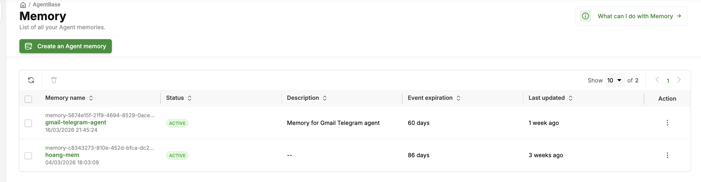

# Memory

> Dịch vụ Memory cung cấp cho agent khả năng ghi nhớ — xuyên suốt các lượt trong một cuộc hội thoại (short-term memory thông qua event) và xuyên suốt các session cùng thời gian (long-term memory thông qua memory record với semantic search).

***

## Các khái niệm cốt lõi (Core Concepts)

LLM vốn không có trạng thái — mỗi lần gọi API đều độc lập. Để một agent duy trì ngữ cảnh xuyên suốt cuộc hội thoại hoặc giữa các session, nó cần một kho lưu trữ memory bên ngoài. Module Memory của AgentBase cung cấp khả năng này dưới dạng dịch vụ được quản lý với hai tầng memory:

### Short-Term Memory (Lịch sử hội thoại)

Short-term memory lưu trữ **chuỗi tin nhắn theo thứ tự** trong một session hội thoại. Nó được phân vùng theo định danh session.

```
Session 1: user 1
─────────────────────────────────────────────────────────
Role        Content
human       "What's the weather like in Hanoi today?"
assistant   "Currently 28°C, partly cloudy in Hanoi."
human       "What about tomorrow?"
assistant   "Tomorrow: 31°C, sunny with light winds."
```

**Đặc điểm chính:**

* Được lưu trữ dưới dạng danh sách có thứ tự các cặp role/content
* Được đánh chỉ mục theo session ID
* Dữ liệu được duy trì khi container khởi động lại (được lưu trong dịch vụ Memory, không phải trong container)
* Hỗ trợ cấu hình độ dài lịch sử tối đa

### Long-Term Memory (Dữ kiện ngữ nghĩa)

Long-term memory lưu trữ **các dữ kiện bền vững về các thực thể** — người dùng, sản phẩm, sở thích, các tương tác trước đó — và truy xuất chúng thông qua **semantic similarity search** dựa trên truy vấn hiện tại.

```
User ID - Namespace
───────────────────────────────────────────────────────────────────────
fact_001   "User prefers delivery to home address"
fact_002   "User has a premium subscription"
fact_003   "User frequently orders electronics"
```

Khi agent nhận được một truy vấn mới, nó sẽ:

1. Tìm kiếm trong long-term memory các dữ kiện tương tự nhất với truy vấn hiện tại
2. Đưa các dữ kiện đó vào prompt dưới dạng ngữ cảnh

**Đặc điểm chính:**

* Được lưu trữ dưới dạng embedding vector cùng với văn bản gốc và metadata tùy chọn
* Được phân vùng theo namespace (ví dụ: user ID, entity ID)
* Được truy xuất thông qua semantic similarity search

Các dữ kiện được trích xuất từ event hội thoại bằng **Long-Term Memory Strategy (LTMS)**. Ba loại strategy được hỗ trợ:

| Loại              | Mô tả                                                             | Phù hợp cho                                             |
| ----------------- | ----------------------------------------------------------------- | ------------------------------------------------------- |
| `SEMANTIC`        | Trích xuất các dữ kiện chung từ cuộc hội thoại                    | Kiến thức tổng quát về người dùng hoặc lĩnh vực         |
| `USER_PREFERENCE` | Tập trung trích xuất sở thích và mẫu hành vi                      | Sở thích giao hàng, quan tâm sản phẩm, thói quen        |
| `CUSTOM`          | Logic trích xuất do người dùng tự định nghĩa qua prompt tùy chỉnh | Toàn quyền kiểm soát những gì được ghi nhớ và cách thức |

### Mô hình dữ liệu (Data Model)

| Khái niệm                            | Mô tả                                                                      | Vòng đời                               |
| ------------------------------------ | -------------------------------------------------------------------------- | -------------------------------------- |
| **Memory**                           | Container cấp cao nhất (memory store) chứa event và record                 | Vĩnh viễn cho đến khi bị xóa           |
| **Event**                            | Một lượt hội thoại đơn lẻ (role + message)                                 | Hết hạn sau `eventExpiryDuration` ngày |
| **Actor**                            | Định danh người tham gia — đại diện cho người dùng cuối (không phải agent) | Được tạo khi có event đầu tiên         |
| **Session**                          | Luồng hội thoại trong một actor                                            | Được tạo khi có event đầu tiên         |
| **Memory Record**                    | Dữ kiện long-term đã được chắt lọc từ event                                | Vĩnh viễn cho đến khi bị xóa           |
| **Long-Term Memory Strategy (LTMS)** | Quy tắc trích xuất để tạo memory record                                    | Được cấu hình khi tạo memory           |

### Namespace Template

Kiểm soát cách phân vùng memory record. Mặc định: `/strategies/{memoryStrategyId}/actors/{actorId}`

Các biến khả dụng: `{memoryStrategyId}`, `{actorId}`, `{sessionId}`

> **Lưu ý về `actorId`:** Đại diện cho **người dùng cuối** (ví dụ: `alice`, `user-123`), không phải agent. Điều này giúp phân vùng dữ kiện theo từng người dùng.

***

## Thiết lập — Tạo Memory Store

Trước khi sử dụng short-term hoặc long-term memory, bạn cần tạo một **Memory store** — container cấp cao nhất chứa tất cả event và memory record cho agent của bạn.

### Portal

#### Tạo Memory Store

1. Mở https://aiplatform.console.vngcloud.vn/memory
2. Nhấn **"Create Memory"**
3. Điền thông tin:
   * **Name**: ví dụ `customer-support-memory` (0–50 ký tự, `^[a-zA-Z0-9._-]*$`)
   * **Description**: tùy chọn
4. Cấu hình **Short-Term Memory**:
   * **Event Expiry Duration**: số ngày trước khi event hội thoại bị tự động xóa (1–365), ví dụ `30` ngày
5. Thêm một hoặc nhiều **Long-Term Memory Strategy** (tùy chọn, dành cho long-term memory):
   * **Strategy Name**: ví dụ `semantic-facts`
   * **Type**: `SEMANTIC`, `USER_PREFERENCE`, hoặc `CUSTOM`
   * **Namespace Template**: mặc định là `/strategies/{memoryStrategyId}/actors/{actorId}`
   * **Auto-generate records**: bật/tắt
   * **Custom Prompt** (chỉ cho loại `CUSTOM`): prompt trích xuất của bạn
6. Nhấn **Create**

#### Danh sách Memory Store

1. Mở https://aiplatform.console.vngcloud.vn/memory
2. Tất cả memory store được hiển thị với: Name, Status, Description, Event Expiry, Last updated



#### Xem chi tiết Memory Store

Từ trang danh sách memory → nhấn vào tên memory


#### Xóa Memory Store

> **Lưu ý:** Việc xóa không thể hoàn tác. Tất cả event, actor, session và memory record sẽ bị xóa vĩnh viễn.

1. Từ trang chi tiết memory → **Delete** → xác nhận


***

### RESTful API

> **�Điều kiện cần:** Tất cả các ví dụ API dưới đây sử dụng `$TOKEN` — một IAM bearer token. Xem [Cấu hình xác thực](../getting-started.md#configure-authentication) để biết cách lấy token.

#### Tạo Memory Store

**Với strategy SEMANTIC:**

```bash
curl -s -X POST "https://agentbase.api.vngcloud.vn/memory/memories" \
  -H "Authorization: Bearer $TOKEN" \
  -H "Content-Type: application/json" \
  -d '{
    "name": "customer-support-memory",
    "description": "Memory for customer support agent",
    "eventExpiryDuration": 30,
    "longTermMemoryStrategies": [
      {
        "name": "semantic-facts",
        "type": "SEMANTIC",
        "namespaceTemplate": "/strategies/{memoryStrategyId}/actors/{actorId}",
        "enableAutomaticMemoryRecordGeneration": true
      }
    ]
  }' | jq .
```

**Với nhiều strategy:**

```bash
curl -s -X POST "https://agentbase.api.vngcloud.vn/memory/memories" \
  -H "Authorization: Bearer $TOKEN" \
  -H "Content-Type: application/json" \
  -d '{
    "name": "customer-support-memory",
    "description": "Memory for customer support agent",
    "eventExpiryDuration": 30,
    "longTermMemoryStrategies": [
      {
        "name": "semantic-facts",
        "type": "SEMANTIC",
        "namespaceTemplate": "/strategies/{memoryStrategyId}/actors/{actorId}",
        "enableAutomaticMemoryRecordGeneration": true
      },
      {
        "name": "user-preferences",
        "type": "USER_PREFERENCE",
        "namespaceTemplate": "/strategies/{memoryStrategyId}/actors/{actorId}",
        "enableAutomaticMemoryRecordGeneration": true
      },
      {
        "name": "custom-orders",
        "type": "CUSTOM",
        "namespaceTemplate": "/strategies/{memoryStrategyId}/actors/{actorId}",
        "enableAutomaticMemoryRecordGeneration": false,
        "customFactExtractionPrompt": "Extract facts about customer orders, shipping preferences, and complaint history."
      }
    ]
  }' | jq .
```

**Phản hồi mẫu:**

```json
{
  "id": "mem-uuid-here",
  "name": "customer-support-memory",
  "status": "ACTIVE",
  "eventExpiryDuration": 30,
  "createdAt": "2026-03-18T09:00:00Z"
}
```

#### Danh sách Memory Store

```bash
curl -s "https://agentbase.api.vngcloud.vn/memory/memories?page=1&size=10" \
  -H "Authorization: Bearer $TOKEN" | jq .
```

#### Xem chi tiết Memory Store

```bash
MEMORY_ID="<memory-id>"

curl -s "https://agentbase.api.vngcloud.vn/memory/memories/$MEMORY_ID" \
  -H "Authorization: Bearer $TOKEN" | jq .

# Lấy danh sách long-term memory strategy
curl -s "https://agentbase.api.vngcloud.vn/memory/memories/$MEMORY_ID/long-term-memory-strategies" \
  -H "Authorization: Bearer $TOKEN" | jq .
```

#### Xóa Memory Store

```bash
curl -s -X DELETE "https://agentbase.api.vngcloud.vn/memory/memories/$MEMORY_ID" \
  -H "Authorization: Bearer $TOKEN"
```

***

### SDK

#### Tạo Memory Store

```python
from greennode_agentbase.memory import MemoryClient
from greennode_agentbase.memory.models import MemoryCreateRequest, LongTermMemoryStrategy
import asyncio

client = MemoryClient()

memory = asyncio.run(client.create_async(
    request=MemoryCreateRequest(
        name="customer-support-memory",
        description="Memory for customer support agent",
        eventExpiryDuration=30,
        longTermMemoryStrategies=[
            LongTermMemoryStrategy(
                name="semantic-facts",
                type="SEMANTIC",
                namespaceTemplate="/strategies/{memoryStrategyId}/actors/{actorId}",
                enableAutomaticMemoryRecordGeneration=True,
            ),
        ],
    )
))
print(f"Memory ID: {memory.id}, Status: {memory.status}")
```

#### Danh sách Memory Store

```python
result = asyncio.run(client.list_async(page=1, size=10))
for memory in result.list_data:
    print(f"{memory.id}: {memory.name} (status: {memory.status})")
```

#### Xem chi tiết Memory Store

```python
memory, strategies = asyncio.run(asyncio.gather(
    client.get_async(id=MEMORY_ID),
    client.listLongTermMemoryStrategies_async(id=MEMORY_ID),
))

print(f"Name: {memory.name}, Status: {memory.status}")
for s in strategies:
    print(f"  {s.get('name')} — Type: {s['type']}")
```

#### Xóa Memory Store

```python
asyncio.run(client.delete_async(id=MEMORY_ID))
```

***

## Bước 2 — Sử dụng Memory trong Agent của bạn

Sau khi Memory Store được tạo, agent của bạn đọc và ghi memory tại runtime. Chọn cách tiếp cận phù hợp với stack của bạn.

| Cách tiếp cận                   | Khi nào sử dụng                                                                                           |
| ------------------------------- | --------------------------------------------------------------------------------------------------------- |
| **A: Agentic Framework**        | Xây dựng với LangGraph hoặc LangChain — sử dụng checkpointer tích hợp cho short-term + tool cho long-term |
| **B: Trực tiếp SDK / REST API** | Bất kỳ stack nào khác, hoặc khi bạn cần toàn quyền kiểm soát thời điểm và cách thức đọc/ghi memory        |

> **Header bắt buộc:** Agent của bạn nhận `X-GreenNode-AgentBase-User-Id` (ánh xạ tới `actor_id`) và `X-GreenNode-AgentBase-Session-Id` (ánh xạ tới `thread_id` / `session_id`) trong mỗi request từ Runtime. Luôn kiểm tra chúng trước khi thực hiện các thao tác memory — không bao giờ sử dụng giá trị mặc định, vì giá trị mặc định ngầm sẽ gây trộn lẫn dữ liệu giữa các người dùng.

```python
@app.entrypoint
def handler(payload: dict, context: RequestContext) -> dict:
    if not context.user_id or not context.session_id:
        return {
            "status": "error",
            "error": "Missing required headers: X-GreenNode-AgentBase-User-Id and X-GreenNode-AgentBase-Session-Id"
        }
    # proceed ...
```

***

### Cách A: Agentic Framework (LangGraph / LangChain)

```bash
pip install "greennode-agent-bridge[langgraph]"
```

#### Short-Term Memory — LangGraph Checkpointer

Truyền `AgentBaseMemoryEvents` làm checkpointer khi biên dịch graph. LangGraph tự động ghi và tải lịch sử hội thoại sử dụng `thread_id` (được ánh xạ từ `session_id`).

```python
from greennode_agent_bridge import AgentBaseMemoryEvents

checkpointer = AgentBaseMemoryEvents(memory_id="<memory-id>")

graph = builder.compile(checkpointer=checkpointer)

result = graph.invoke(
    {"messages": [("human", "What is my order status?")]},
    config={
        "configurable": {
            "thread_id": context.session_id,
	    "actor_id": context.user_id,
        }
    }
)
```

#### Long-Term Memory — Cách tiếp cận dựa trên Tool

Định nghĩa `remember` và `recall` làm agent tool được hỗ trợ bởi `MemoryClient`. `actor_id` và `strategy_id` được lấy từ cấu hình runtime — chúng **không được** để LLM truy cập dưới dạng tham số.

```python
from greennode_agentbase.memory import MemoryClient
from greennode_agentbase.memory.models import MemoryRecordSearchRequest
from langchain_core.tools import tool
from langgraph.config import get_config
import asyncio, os

MEMORY_ID = os.environ["MEMORY_ID"]
MEMORY_STRATEGY_ID = os.environ["MEMORY_STRATEGY_ID"]
memory_client = MemoryClient()

@tool
def remember(fact: str) -> str:
    """Store a fact directly into long-term memory."""
    config = get_config()
    actor_id = config["configurable"]["actor_id"]
    namespace = f"/strategies/{MEMORY_STRATEGY_ID}/actors/{actor_id}"

    asyncio.run(memory_client.insertMemoryRecordsDirectly_async(
        id=MEMORY_ID,
        namespace=namespace,
        body=[fact],
    ))
    return f"Stored: {fact}"

@tool
def recall(query: str) -> str:
    """Search long-term memory for facts relevant to the query."""
    config = get_config()
    actor_id = config["configurable"]["actor_id"]
    namespace = f"/strategies/{MEMORY_STRATEGY_ID}/actors/{actor_id}"

    results = asyncio.run(memory_client.searchMemoryRecords_async(
        id=MEMORY_ID,
        namespace=namespace,
        request=MemoryRecordSearchRequest(query=query, limit=5, scoreThreshold=0.5),
    ))
    return "\n".join(f"- {r.memory}" for r in results) if results else "No relevant memories found."
```

Truyền `actor_id` qua `configurable` để tool có thể lấy nó từ `get_config()`. Không bao giờ để `actor_id` hoặc `strategy_id` làm tham số tool mà LLM có thể truy cập.

#### Ví dụ đầy đủ: LangGraph Agent với cả hai loại Memory

```python
import os
from greennode_agentbase import GreenNodeAgentBaseApp, RequestContext, PingStatus, requires_api_key
from greennode_agent_bridge import AgentBaseMemoryEvents
from langgraph.prebuilt import create_react_agent
from langchain_openai import ChatOpenAI

MEMORY_ID = os.environ["MEMORY_ID"]

app = GreenNodeAgentBaseApp()
checkpointer = AgentBaseMemoryEvents(memory_id=MEMORY_ID)

@app.ping
def health() -> PingStatus:
    return PingStatus.HEALTHY

@app.entrypoint
@requires_api_key(provider_name="aip-key")
def handler(payload: dict, context: RequestContext, aip_key: str) -> dict:
    if not context.user_id or not context.session_id:
        return {
            "status": "error",
            "error": "Missing required headers: X-GreenNode-AgentBase-User-Id and X-GreenNode-AgentBase-Session-Id",
        }

    llm = ChatOpenAI(
        api_key=aip_key,
        base_url="https://maas-llm-aiplatform-hcm.api.vngcloud.vn/v1",
        model=os.environ.get("LLM_MODEL", "<model-path>"),
    )

    agent = create_react_agent(llm, tools=[remember, recall], checkpointer=checkpointer)

    result = agent.invoke(
        {"messages": [("human", payload.get("input", ""))]},
        config={
            "configurable": {
                "thread_id": context.session_id,
                "actor_id": context.user_id,
            }
        },
    )

    return {"output": result["messages"][-1].content}

if __name__ == "__main__":
    app.run(host="0.0.0.0", port=int(os.environ.get("PORT", "8080")))
```

***

### Cách B: Trực tiếp SDK / REST API

#### Short-Term Memory

Ghi và đọc event hội thoại trực tiếp qua API tại runtime. Mỗi event đại diện cho một lượt hội thoại.

**Ghi một event (RESTful API):**

```bash
MEMORY_ID="<memory-id>"
ACTOR_ID="user-123"
SESSION_ID="session-abc"

curl -s -X POST "https://agentbase.api.vngcloud.vn/memory/memories/$MEMORY_ID/actors/$ACTOR_ID/sessions/$SESSION_ID/events" \
  -H "Authorization: Bearer $TOKEN" \
  -H "Content-Type: application/json" \
  -d '{
    "payload": {
      "type": "CONVERSATIONAL",
      "role": "user",
      "message": "I need help with my order #12345"
    }
  }' | jq .
```

**Tải lịch sử hội thoại (RESTful API):**

```bash
curl -s "https://agentbase.api.vngcloud.vn/memory/memories/$MEMORY_ID/actors/$ACTOR_ID/sessions/$SESSION_ID/events?page=1&size=20" \
  -H "Authorization: Bearer $TOKEN" | jq .
```

#### Long-Term Memory

Long-term record được tạo từ event hội thoại, sau đó được truy xuất qua semantic search tại runtime.

**Tạo record từ một session (RESTful API):**

```bash
STRATEGY_ID="<strategy-id-from-memory-detail>"

curl -s -X POST "https://agentbase.api.vngcloud.vn/memory/memories/$MEMORY_ID/memory-records:generate-from-session?actorId=$ACTOR_ID&sessionId=$SESSION_ID&longTermMemoryStrategyId=$STRATEGY_ID" \
  -H "Authorization: Bearer $TOKEN" | jq .
```

**Semantic search (RESTful API):**

```bash
NAMESPACE_ENCODED="%2Fstrategies%2F${STRATEGY_ID}%2Factors%2F${ACTOR_ID}"

curl -s -X POST "https://agentbase.api.vngcloud.vn/memory/memories/$MEMORY_ID/memory-records:search?namespace=$NAMESPACE_ENCODED" \
  -H "Authorization: Bearer $TOKEN" \
  -H "Content-Type: application/json" \
  -d '{
    "query": "customer shipping preferences",
    "limit": 10,
    "scoreThreshold": 0.5
  }' | jq .
```

**Phản hồi mẫu:**

```json
[
  {"score": 0.92, "memory": "Customer prefers delivery to office address"},
  {"score": 0.85, "memory": "Customer has complained about delayed shipments twice"}
]
```

**Tạo record từ một session (SDK):**

```python
asyncio.run(client.generateMemoryRecordsFromSession_async(
    id=MEMORY_ID,
    actorId=ACTOR_ID,
    sessionId=SESSION_ID,
    longTermMemoryStrategyId=STRATEGY_ID,
))
```

**Semantic search (SDK):**

```python
from greennode_agentbase.memory.models import MemoryRecordSearchRequest

results = asyncio.run(client.searchMemoryRecords_async(
    id=MEMORY_ID,
    namespace=f"/strategies/{STRATEGY_ID}/actors/{ACTOR_ID}",
    request=MemoryRecordSearchRequest(
        query="customer shipping preferences",
        limit=10,
        scoreThreshold=0.5,
    ),
))

for record in results:
    print(f"[{record.score:.2f}] {record.memory}")
```

***

## Tham khảo: Duyệt và quản lý dữ liệu Memory

Sử dụng các thao tác này để kiểm tra dữ liệu memory — hữu ích cho việc gỡ lỗi, kiểm toán, hoặc xây dựng công cụ quản trị.

### Danh sách Actor

```bash
curl -s "https://agentbase.api.vngcloud.vn/memory/memories/$MEMORY_ID/actors?page=1&size=10" \
  -H "Authorization: Bearer $TOKEN" | jq .
```

### Duyệt Memory Record

```bash
NAMESPACE_ENCODED="%2Fstrategies%2F${STRATEGY_ID}%2Factors%2F${ACTOR_ID}"

curl -s "https://agentbase.api.vngcloud.vn/memory/memories/$MEMORY_ID/memory-records?namespace=$NAMESPACE_ENCODED&limit=100" \
  -H "Authorization: Bearer $TOKEN" | jq .
```

***

## Giới hạn dịch vụ Memory (Memory Service Limits)

| Tham số                            | Giá trị    | Ghi chú                        |
| ---------------------------------- | ---------- | ------------------------------ |
| Phạm vi `eventExpiryDuration`      | 1–365 ngày | Đặt khi tạo memory store       |
| Độ dài tối đa tên Memory           | 50 ký tự   | Mẫu: `^[a-zA-Z0-9._-]*$`       |
| Phạm vi `limit` semantic search    | 5–200      | Mỗi request tìm kiếm           |
| `scoreThreshold` semantic search   | 0–1 float  | Càng cao = càng khớp chính xác |
| `from` tối đa cho phân trang event | 5000       | Dựa trên offset                |

***

## Xử lý sự cố (Troubleshooting)

| Lỗi                         | Nguyên nhân                                 | Cách khắc phục                                          |
| --------------------------- | ------------------------------------------- | ------------------------------------------------------- |
| 401 Unauthorized            | IAM token hết hạn                           | Lấy lại token                                           |
| Memory not found            | Sai memory ID                               | Kiểm tra bằng danh sách `GET /memories`                 |
| Không có record trả về      | Sai namespace hoặc trễ do xử lý bất đồng bộ | Record được tạo bất đồng bộ — chờ và thử lại            |
| Event không hiển thị        | Event đã hết hạn                            | Kiểm tra `eventExpiryDuration`                          |
| Tự động tạo không hoạt động | Strategy bị cấu hình sai                    | Kiểm tra `enableAutomaticMemoryRecordGeneration: true`  |
| "Missing required headers"  | Request thiếu User-Id hoặc Session-Id       | Đính kèm cả hai header trong mọi request sử dụng memory |

***
