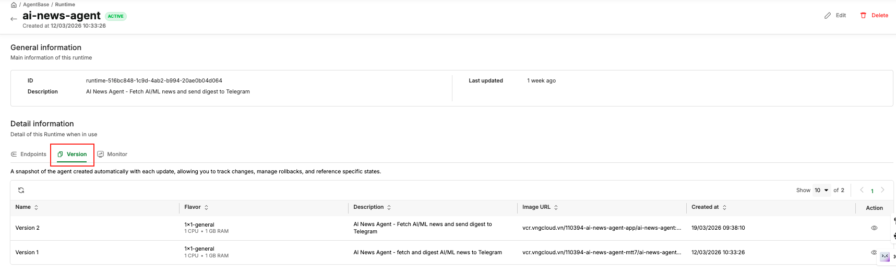

# Runtime

> Runtime quản lý toàn bộ vòng đời của môi trường tính toán cho agent của bạn — triển khai container, autoscaling, quản lý phiên bản, và endpoint.

***

## Khái niệm cơ bản (Core Concepts)

### Runtime

Một **Runtime** là môi trường tính toán được quản lý, chạy agent đã được đóng gói trong container của bạn. Nó trừu tượng hóa việc lập lịch container, kiểm tra sức khỏe, autoscaling, và định tuyến HTTP.

**Các trạng thái Runtime:**

| Trạng thái | Mô tả                                                                           |
| ---------- | ------------------------------------------------------------------------------- |
| `CREATING` | Runtime đang được tạo; các container đang khởi động                             |
| `ACTIVE`   | Tất cả các bản sao tối thiểu đều hoạt động tốt; endpoint đang phục vụ lưu lượng |
| `UPDATING` | Đang triển khai phiên bản mới                                                   |
| `ERROR`    | Một hoặc nhiều bản sao bắt buộc không thể khởi động (kiểm tra log)              |
| `DELETING` | Runtime đang được xóa                                                           |

### Phiên bản (Versions)

Mỗi khi bạn triển khai một container image mới cho runtime, AgentBase tạo một **Version** mới. Các phiên bản là bất biến — image và cấu hình của phiên bản không bao giờ thay đổi sau khi tạo.

### Endpoint

Một **Endpoint** là URL mà client gọi để tương tác với agent của bạn. Một runtime có thể có nhiều endpoint và nhiều phiên bản — đây là các khái niệm độc lập. Endpoint **default** tự động theo dõi phiên bản mới nhất mỗi khi một phiên bản mới được deploy. Bạn có thể chỉ định bất kỳ endpoint nào là default, và tạo các endpoint bổ sung được ghim vào các phiên bản cụ thể (ví dụ, cho lưu lượng canary hoặc staging).

### Compute Flavor

Một **Compute Flavor** xác định CPU và RAM được cấp phát cho mỗi bản sao của agent.

### Autoscaling

Runtime Service hỗ trợ autoscaling dựa trên mức sử dụng CPU hoặc RAM. Bạn xác định:

* `minReplicas`: Mức sàn — luôn chạy (phạm vi: 1–10)
* `maxReplicas`: Mức trần — giới hạn sử dụng tài nguyên (phạm vi: 1–10)
* `cpuUtilization` và `memoryUtilization`: Ngưỡng (25–75%) kích hoạt việc scale-out

Khi tải giảm, AgentBase thu hẹp số bản sao về `minReplicas`.

### Hợp đồng dịch vụ (Service Contract)

Container agent của bạn phải đáp ứng các yêu cầu sau để hoạt động đúng với Runtime Service:

1. **Lắng nghe trên cổng 8080** — cổng bắt buộc; `app.run(host="0.0.0.0", port=8080)`
2. **Endpoint kiểm tra sức khỏe**: `GET /health` phải trả về HTTP 200 để vượt qua kiểm tra sẵn sàng
3. **Không trạng thái (Stateless)**: Không lưu trữ trạng thái phiên trong bộ nhớ tiến trình — sử dụng Memory Service thay thế

**Biến môi trường được tự động tiêm** (có sẵn trong tất cả các container agent đã triển khai):

| Biến                       | Mô tả                             |
| -------------------------- | --------------------------------- |
| `GREENNODE_CLIENT_ID`      | IAM service account client ID     |
| `GREENNODE_CLIENT_SECRET`  | IAM service account client secret |
| `GREENNODE_AGENT_IDENTITY` | Tên agent identity                |

***

## Tổng quan (Overview)

**Cấu trúc Runtime:**

```
Runtime: my-order-agent
│
├── Versions
│   ├── Version 1  (image: my-agent:v1.0.0)
│   └── Version 2  (image: my-agent:v2.0.0)  ← latest
│
├── Endpoints
│   ├── DEFAULT  → https://<default-url>   (auto-tracks latest version)
│   └── canary   → https://<canary-url>    (pinned to Version 1)
│
└── Autoscaling: min=1, max=3, CPU threshold=50%
```

**Những điều quan trọng:**

* Mỗi `PATCH /agent-runtimes/{id}` tạo một **version** mới — phiên bản và endpoint là các khái niệm độc lập trong một runtime
* Endpoint **default** tự động theo dõi phiên bản mới nhất mỗi khi một phiên bản mới được deploy
* Một runtime có thể có nhiều endpoint — bạn chọn endpoint nào là default
* Bạn có toàn quyền kiểm soát tất cả các endpoint — tạo, cập nhật, hoặc xóa

***

## Quản lý Runtime (Manage Runtimes)

### Portal

#### Tạo một Runtime

1. Mở https://aiplatform.console.vngcloud.vn/runtime
2. Nhấn **"Create Runtime"**
3. Điền thông tin

| Trường                    | Giá trị ví dụ                        | Ghi chú                                                                                                                               |
| ------------------------- | ------------------------------------ | ------------------------------------------------------------------------------------------------------------------------------------- |
| **Name**                  | `my-order-agent`                     | Duy nhất, chữ thường, cho phép dấu gạch ngang                                                                                         |
| **Description**           | `Production order agent`             | Tùy chọn                                                                                                                              |
| **Image URL**             | `vcr.vngcloud.vn/<repo>/my-agent:v1` | Đường dẫn image đầy đủ bao gồm tag                                                                                                    |
| **Flavor**                | `1x1-general`                        | 1 CPU, 1 GB RAM                                                                                                                       |
| **Min Replicas**          | `1`                                  | Phạm vi: 1–10                                                                                                                         |
| **Max Replicas**          | `1`                                  | Đặt >1 để bật autoscaling                                                                                                             |
| **CPU Threshold**         | `50`                                 | Scale out khi CPU vượt quá % này (25–75)                                                                                              |
| **Memory Threshold**      | `50`                                 | Scale out khi RAM vượt quá % này (25–75)                                                                                              |
| **Registry Auth**         | Bật nếu là private                   | Username = robot account `backendName` (xem [Supporting Services — Robot Accounts](../supporting-services.md#create-a-robot-account)) |
| **Environment Variables** | `KEY=value`                          | Chỉ cấu hình không nhạy cảm                                                                                                           |

5. Nhấn **Create**
6. Runtime xuất hiện với trạng thái `CREATING`, sau đó chuyển sang `ACTIVE`

#### Xem danh sách Runtime

Tất cả các runtime được hiển thị trong bảng phân trang với: Tên, Trạng thái, Mô tả, Phiên bản cuối, Cập nhật cuối

#### Xem chi tiết Runtime

Nhấn vào tên runtime để xem: trạng thái, image, flavor, autoscaling, biến môi trường, endpoint


#### Cập nhật một Runtime

1. Mở trang chi tiết runtime → **"Edit"**
2. Thay đổi image URL, flavor, autoscaling, hoặc biến môi trường → **Save**

#### Xóa một Runtime

> **Lưu ý:** Xóa là không thể khôi phục. Thao tác này xóa vĩnh viễn runtime và tất cả các endpoint của nó.

Trong trang chi tiết Runtime, tìm runtime → **Delete** → xác nhận

***

### RESTful API

> **�Điều kiện cần:** Tất cả các ví dụ API dưới đây sử dụng `$TOKEN` — một IAM bearer token. Xem [Configure Authentication](../getting-started.md#configure-authentication) để biết cách lấy token.

#### Tạo một Runtime

**Image từ registry công khai:**

```bash
curl -s -X POST "https://agentbase.api.vngcloud.vn/runtime/agent-runtimes" \
  -H "Authorization: Bearer $TOKEN" \
  -H "Content-Type: application/json" \
  -d '{
    "name": "my-order-agent",
    "description": "Production order agent",
    "imageUrl": "vcr.vngcloud.vn/<repo-backendName>/my-agent:v1.0.0",
    "command": [],
    "args": [],
    "environmentVariables": {
      "LOG_LEVEL": "info"
    },
    "flavorId": "1x1-general",
    "autoscaling": {
      "minReplicas": 1,
      "maxReplicas": 3,
      "cpuUtilization": 50,
      "memoryUtilization": 50
    }
  }' | jq .
```

**Image từ registry riêng tư (cần imageAuth):**

```bash
curl -s -X POST "https://agentbase.api.vngcloud.vn/runtime/agent-runtimes" \
  -H "Authorization: Bearer $TOKEN" \
  -H "Content-Type: application/json" \
  -d '{
    "name": "my-order-agent",
    "imageUrl": "vcr.vngcloud.vn/<repo-backendName>/my-agent:v1.0.0",
    "imageAuth": {
      "enabled": true,
      "username": "<robot-account-backendName>",
      "password": "<robot-account-secret>"
    },
    "command": [],
    "args": [],
    "environmentVariables": {},
    "flavorId": "1x1-general",
    "autoscaling": {
      "minReplicas": 1,
      "maxReplicas": 1,
      "cpuUtilization": 50,
      "memoryUtilization": 50
    }
  }' | jq .
```

**Kiểm tra cho đến khi ACTIVE:**

```bash
RUNTIME_ID="<id-from-response>"
while true; do
  STATUS=$(curl -s "https://agentbase.api.vngcloud.vn/runtime/agent-runtimes/$RUNTIME_ID" \
    -H "Authorization: Bearer $TOKEN" | jq -r '.status')
  echo "Status: $STATUS"
  [ "$STATUS" = "ACTIVE" ] && break
  sleep 10
done
```

**Các trạng thái có thể:** `CREATING` → `ACTIVE` (thành công) hoặc `ERROR` (thất bại)

#### Xem danh sách Runtime

```bash
curl -s "https://agentbase.api.vngcloud.vn/runtime/agent-runtimes?page=1&size=20" \
  -H "Authorization: Bearer $TOKEN" | jq .
```

**Cấu trúc phản hồi:**

```json
{
  "listData": [...],
  "page": 1,
  "pageSize": 20,
  "totalPage": 1,
  "totalItem": 3
}
```

#### Xem chi tiết Runtime

```bash
curl -s "https://agentbase.api.vngcloud.vn/runtime/agent-runtimes/$RUNTIME_ID" \
  -H "Authorization: Bearer $TOKEN" | jq .
```

#### Cập nhật một Runtime

Mỗi lần cập nhật tạo một **version** mới. Endpoint `DEFAULT` tự động trỏ đến phiên bản mới nhất.

> **Lưu ý:** Tất cả các trường (trừ `imageAuth`) là bắt buộc trong body PATCH.

```bash
curl -s -X PATCH "https://agentbase.api.vngcloud.vn/runtime/agent-runtimes/$RUNTIME_ID" \
  -H "Authorization: Bearer $TOKEN" \
  -H "Content-Type: application/json" \
  -d '{
    "description": "Production order agent v2",
    "imageUrl": "vcr.vngcloud.vn/<repo-backendName>/my-agent:v2.0.0",
    "imageAuth": {
      "enabled": true,
      "username": "<robot-backendName>",
      "password": "<robot-secret>"
    },
    "command": [],
    "args": [],
    "environmentVariables": {"LOG_LEVEL": "info"},
    "flavorId": "1x1-general",
    "autoscaling": {
      "minReplicas": 1,
      "maxReplicas": 3,
      "cpuUtilization": 50,
      "memoryUtilization": 50
    }
  }' | jq .
```

#### Xóa một Runtime

> **Lưu ý:** Xóa là không thể khôi phục.

```bash
curl -s -X DELETE "https://agentbase.api.vngcloud.vn/runtime/agent-runtimes/$RUNTIME_ID" \
  -H "Authorization: Bearer $TOKEN"
```

#### Đặt lại Service Account

Nếu thông tin đăng nhập IAM service account bị thay đổi hoặc bị thu hồi, đặt lại chúng để khôi phục runtime:

```bash
curl -s -X PATCH "https://agentbase.api.vngcloud.vn/runtime/agent-runtimes/$RUNTIME_ID/reset-service-account" \
  -H "Authorization: Bearer $TOKEN" | jq .
```

> **Lưu ý:** Thao tác này tạo lại `GREENNODE_CLIENT_ID` và `GREENNODE_CLIENT_SECRET`. Runtime sẽ khởi động lại với credential mới.

***

## Quản lý Endpoint (Manage Endpoints)

Mỗi runtime có một endpoint `DEFAULT` được tạo tự động. Bạn có thể tạo các endpoint bổ sung trỏ đến các phiên bản cụ thể.

### Portal

#### Xem danh sách Endpoint

1. Mở trang chi tiết runtime → tab **"Endpoints"**

#### Tạo Endpoint

1. Trên trang chi tiết runtime → tab **"Endpoints"** → **"Create Endpoint"**
2. Điền **Name** và **Version** → **Create**

#### Cập nhật phiên bản Endpoint

1. Trên tab **"Endpoints"** → nhấn vào một endpoint → **"Edit"**
2. Thay đổi **Version** → **Save**

***

### RESTful API

#### Xem danh sách Endpoint

```bash
curl -s "https://agentbase.api.vngcloud.vn/runtime/agent-runtimes/$RUNTIME_ID/endpoints?page=1&size=20" \
  -H "Authorization: Bearer $TOKEN" | jq .
```

**Các trường Endpoint:** `id`, `agentRuntimeId`, `name`, `version`, `url`, `status`, `createdAt`, `updatedAt`

#### Tạo Endpoint

```bash
curl -s -X POST "https://agentbase.api.vngcloud.vn/runtime/agent-runtimes/$RUNTIME_ID/endpoints" \
  -H "Authorization: Bearer $TOKEN" \
  -H "Content-Type: application/json" \
  -d '{"name": "canary", "version": 2}' | jq .
```

#### Cập nhật phiên bản Endpoint

```bash
curl -s -X PATCH "https://agentbase.api.vngcloud.vn/runtime/agent-runtimes/$RUNTIME_ID/endpoints/$ENDPOINT_ID?version=3" \
  -H "Authorization: Bearer $TOKEN" | jq .
```

#### Xóa Endpoint

```bash
curl -s -X DELETE "https://agentbase.api.vngcloud.vn/runtime/agent-runtimes/$RUNTIME_ID/endpoints/$ENDPOINT_ID" \
  -H "Authorization: Bearer $TOKEN"
```

***

## Phiên bản Runtime (Runtime Versions)

Mỗi `PATCH` trên một runtime tạo một phiên bản bất biến mới. Sử dụng phiên bản để quay lại bằng cách trỏ một endpoint đến số phiên bản cũ hơn.

### Portal

1. Mở trang chi tiết runtime → tab **"Versions"**



***

### RESTful API

#### Xem danh sách phiên bản

```bash
curl -s "https://agentbase.api.vngcloud.vn/runtime/agent-runtimes/$RUNTIME_ID/versions?page=1&size=20" \
  -H "Authorization: Bearer $TOKEN" | jq .
```

**Các trường Version:** `agentRuntimeId`, `version` (số nguyên), `imageUrl`, `flavorId`, `autoscaling`, `createdAt`

#### Quay lại phiên bản cũ (Rollback)

Trỏ endpoint `DEFAULT` đến một phiên bản cũ hơn:

```bash
ENDPOINT_ID=$(curl -s "https://agentbase.api.vngcloud.vn/runtime/agent-runtimes/$RUNTIME_ID/endpoints?page=1&size=10" \
  -H "Authorization: Bearer $TOKEN" | jq -r '.listData[] | select(.name=="DEFAULT") | .id')

curl -s -X PATCH "https://agentbase.api.vngcloud.vn/runtime/agent-runtimes/$RUNTIME_ID/endpoints/$ENDPOINT_ID?version=1" \
  -H "Authorization: Bearer $TOKEN" | jq .
```

***

## Hợp đồng dịch vụ Runtime (Runtime Service Contract)

Container agent của bạn phải đáp ứng các yêu cầu sau:

### Port và Health Check

| Yêu cầu                     | Giá trị       | Ghi chú                       |
| --------------------------- | ------------- | ----------------------------- |
| Cổng lắng nghe              | `8080`        | Bắt buộc — không thể cấu hình |
| Đường dẫn kiểm tra sức khỏe | `GET /health` | Phải trả về HTTP 200          |

**Sử dụng greennode-agentbase SDK (khuyến nghị):**

```python
from greennode_agentbase import GreenNodeAgentBaseApp, RequestContext, PingStatus

app = GreenNodeAgentBaseApp()

@app.entrypoint
def handler(payload: dict, context: RequestContext) -> dict:
    return {"output": "Hello!"}

if __name__ == "__main__":
    import os
    app.run(host="0.0.0.0", port=int(os.environ.get("PORT", "8080")))
```

**Không sử dụng SDK (ví dụ FastAPI):**

```python
from fastapi import FastAPI

app = FastAPI()

@app.get("/health")
def health():
    return {"status": "ok"}

@app.post("/invoke")
def invoke(body: dict):
    return {"output": f"Echo: {body.get('input', '')}"}
```

### Biến môi trường tự động (Auto-Injected Environment Variables)

Runtime tự động tiêm các biến sau vào mỗi container:

| Biến                       | Mô tả                                     |
| -------------------------- | ----------------------------------------- |
| `GREENNODE_CLIENT_ID`      | IAM service account client ID cho runtime |
| `GREENNODE_CLIENT_SECRET`  | IAM service account client secret         |
| `GREENNODE_AGENT_IDENTITY` | Tên agent identity                        |

### Request Header

Các request đến agent của bạn bao gồm:

| Header                             | Mô tả                                                              |
| ---------------------------------- | ------------------------------------------------------------------ |
| `X-GreenNode-AgentBase-User-Id`    | ID người dùng cuối (sử dụng làm `actorId` cho các thao tác memory) |
| `X-GreenNode-AgentBase-Session-Id` | ID phiên (sử dụng làm `thread_id` cho LangGraph checkpointing)     |

> **Quan trọng:** Nếu agent của bạn sử dụng memory, hãy xác thực rằng các header này có mặt và trả về lỗi nếu thiếu. Không sử dụng giá trị mặc định — các giá trị mặc định ngầm sẽ gây ra việc trộn lẫn dữ liệu giữa các người dùng.

***
